# UJG traversal issues

Logged October 7, 2026. [GitHub tracker #39](https://github.com/nmsimons/arcade/issues/39) records the scope and order of 21 detailed implementation and evaluation issues from the [critical traversal review](jumping-traversal-review.md). This index provides direct issue links and dependencies. Each issue includes its evidence status, reproduction or investigation scope, source links, implementation guidance, constraints, and observable success criteria. GitHub is the current status record for each issue.

## Issue inventory

| Issue | Priority | Evidence |
| --- | --- | --- |
| [#40 UJG: make pushing body motion follow support and weight transfer](https://github.com/nmsimons/arcade/issues/40) | High (P1) | Reproduced animation defect |
| [#41 UJG: establish a staggered bracing stance when pushing begins](https://github.com/nmsimons/arcade/issues/41) | High (P1) | Reproduced stance defect |
| [#42 UJG: show pushing effort and resistance in the upper body](https://github.com/nmsimons/arcade/issues/42) | High (P1) | Reproduced visual quality issue |
| [#43 UJG: establish visible palm contact before the object starts moving](https://github.com/nmsimons/arcade/issues/43) | High (P1) | Reproduced contact timing defect |
| [#44 UJG: replace low-object squat shuffling with a supported working gait](https://github.com/nmsimons/arcade/issues/44) | Medium (P2) | Rendered visual quality issue |
| [#45 UJG: keep crouched pushing head and torso outside the object](https://github.com/nmsimons/arcade/issues/45) | High (P1) | Reproduced visible penetration |
| [#46 UJG: resolve visible prone-body clearance beside terrain and objects](https://github.com/nmsimons/arcade/issues/46) | High (P1) | Reproduced visible penetration |
| [#47 UJG: transition moving fall recovery into a supported locomotion pose](https://github.com/nmsimons/arcade/issues/47) | High (P1) | Reproduced support and animation mismatch |
| [#48 UJG: show braking and turning before mirroring a moving run](https://github.com/nmsimons/arcade/issues/48) | Medium (P2) | Reproduced abrupt visual reversal |
| [#49 UJG: allow reconsidering tall automatic steps before commitment](https://github.com/nmsimons/arcade/issues/49) | Medium (P2) | Reproduced loss of player agency |
| [#50 UJG: initialize and settle into a readable relaxed idle stance](https://github.com/nmsimons/arcade/issues/50) | Medium (P2) | Reproduced overlapping idle silhouette |
| [#51 UJG: make Down action priority and lower-then-drop behavior predictable](https://github.com/nmsimons/arcade/issues/51) | Medium (P2) | Confirmed control contract with a discoverability problem |
| [#52 UJG: explain and animate ledge jump-away and fresh-press departures](https://github.com/nmsimons/arcade/issues/52) | Medium (P2) | Reproduced launch orientation and confirmed input semantics |
| [#53 UJG: make water instructions and acceptance tests match actual controls](https://github.com/nmsimons/arcade/issues/53) | Medium (P2) | Confirmed mismatch between labels and motor/bindings |
| [#54 UJG: teach acquisition and solidity rules through clear first encounters](https://github.com/nmsimons/arcade/issues/54) | Medium (P2) | Confirmed rule differences; teaching audit required |
| [#55 UJG: give airborne phases distinct readable athlete poses](https://github.com/nmsimons/arcade/issues/55) | Medium (P2) | Rendered visual quality issue; artistic tuning required |
| [#56 UJG: evaluate and strengthen balance cues during fast steep sliding](https://github.com/nmsimons/arcade/issues/56) | Medium (P2) | Visual evaluation task, not an established physics defect |
| [#57 UJG: validate controller and phone traversal feel with real devices](https://github.com/nmsimons/arcade/issues/57) | Medium (P2) | Outstanding hardware playtesting and parity audit |
| [#58 UJG: verify fast-approach readability and tune framing only where needed](https://github.com/nmsimons/arcade/issues/58) | Medium (P2) | Narrow-screen scale, short-room placement and running-jump preview addressed; broad context/route acceptance remains incomplete |
| [#59 UJG: playtest complete traversal routes and audit medals with current controls](https://github.com/nmsimons/arcade/issues/59) | Medium (P2) | Outstanding route enjoyment/recovery review and current-control timing audit |
| [#60 UJG: resolve the nine unverified traversal browser cases without weakening checks](https://github.com/nmsimons/arcade/issues/60) | Medium (P2) | Observed browser timeouts/loading failure; movement defects not established |

## Implementation order and evaluation

Correct crouched-push and prone clearance and moving recovery first. Build pushing around a supported stance, weight transfer, effort, and visible palm contact; coordinate those issues rather than introducing separate competing gait states. Then address turns, idle, automatic steps, and control teaching. Resolve incomplete browser cases independently and use device, visibility, and complete-route evidence to judge final feel.

Every visual change needs before/after footage at ordinary gameplay scale and an enlarged view, under the same geometry, input, framing, and playback speed. Regression assertions establish contact, motion, and control safety; they do not alone establish natural animation. Preserve responsive controls, fixed limb lengths, actual supporting contacts, momentum, the physical root, and gravity/transport contracts.

Confirmed defects and outstanding evaluations are identified separately in the issue bodies. Hardware feel, camera adequacy, complete-route enjoyment, and current-control medal timing require their specified evidence. Keep those tasks open if that evidence remains unavailable. Follow AGENTS.md and the linked level-design/schema/physics documents before changing authored levels or medal times.

## Dependencies and coordination

| Work | Coordinate with |
| --- | --- |
| Push stance #41 and weight transfer #40 | Share a support-driven presentation state; no conflicting root or gait ownership. Establish the stance before tuning load. |
| Push effort #42, onset #43, and low posture #44 | Use the stance/weight-transfer work and retain final clearance from #45. Contact blend, travel phase, and load are separate concepts. |
| Body clearance #45 and #46 | Share suitable final-geometry checks while retaining distinct crouch/prone postures and existing physics hulls. |
| Recovery #47 and airborne presentation #55 | Preserve #46 clearance and responsive control while changing presentation precedence. |
| Dry turn #48 and ledge departure #52 | Share transient visual orientation without delaying mechanical facing or changing impulses. |
| Tall-step cancellation #49 and Down priority #51 | Document geometry-based commitment and supported cancellation before showing available actions. |
| Water wording #53 and contact teaching #54 | Teach actual bindings and acquisition rules; do not invent propulsion or change solidity. |
| Hardware input #57 and camera #58 | Supply device/viewport evidence for final route and medal evaluation #59. |
| Browser gaps #60 | Investigate independently now; rerun affected cases after relevant movement/animation fixes. |

All child issues are standalone enough for implementation from their body. This table prevents conflicting animation state ownership and identifies where combined before/after evaluation is needed.

## First implementation pass

October 7, 2026, on `codex/ujg-traversal-fixes`. This pass begins #40, #41, #42, #45, and #46. It does not establish that their entire visual acceptance matrix is complete.

- **#40:** Pelvis balance follows the actual short step and its planted partner. Chest and head follow with a small lag, and the adjustment is eased and bounded to prevent uphill jerks. A one-second moving-crate sample now varies pelvis Y by 0.864 units and shoulder X by 0.402, compared with 0.011 and 0.0013 before. These measurements establish participation; the complete step still needs visual judgment.
- **#41:** A blocked push takes a small rear-foot step to establish a staggered base instead of leaving both feet almost coincident. The normal fixture settles into a 12-unit anchor separation and retains those anchors during another ten seconds of input.
- **#42:** Body loading now distinguishes hand contact from applied effort and resisted locomotion. The load eases into bent knees and a forward chest. On the same blocked crate, full input lowers the pelvis 3.2 units more than 20% input and advances the chest approximately 0.899 units. Existing static-wall arm reach is preserved.
- **#45:** Crouching lowers the working palms from 43 toward 28 units. The final head clearance runs after palm reach and torso balance. The established motor face is retained, including on tilted objects. Three-second crouched-push checks cover head/spine clearance, fixed limb lengths, and palm contact in both directions.
- **#46:** The existing geometric body and limb clearance is shared with prone flight. Thirty-frame checks cover head, spine, arms, legs, and hand outlines in both directions and gravity frames. Drawing remains read-only and uses the established physical hull.

The [baseline pose sheet](images/jumping-pushing-poses.png), [first-pass pose sheet](images/jumping-pushing-first-pass.png), and loops below use the same fixture inputs, framing, scale, and playback speed. The loop boundary is a replay reset. Low-object squat shuffling (#44) and hands arriving after object motion (#43) remain visible and need their own work.

Baseline:

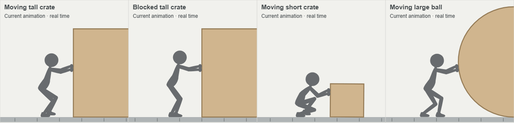

First pass:

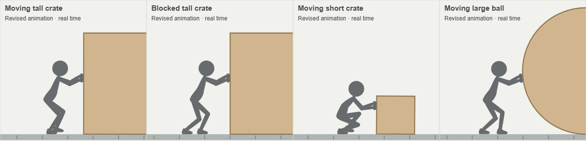

Validation: five new permanent simulation regressions pass, as do five production-browser checks using actual keyboard controls. The full UJG run passes 1,354 of 1,359 checks. Its five existing failures are the unrecorded `Untitled level.jump-level.json` catalog entry, three development-file tests blocked by sandbox permissions, and a Windows symlink-permission failure. All recorded route checks pass. Type checking, lint for changed files, and an isolated production build pass. Built-in and local authored levels were not edited in this pass.

**#47 remains unimplemented.** A moving-recovery prototype removed the long slide but failed continuity checks when movement began 0.05 seconds into recovery: advancing foot targets and the gathering legs produced abrupt knee transitions. It was not retained. The next implementation should coordinate gathering with a stable support handoff, avoid replaying ordinary landing compression as a second squat, and count locomotion separately from landing impact and carrier transport. Test movement introduced at 0.05, 0.3, 0.6, and 0.8 seconds into recovery, alongside held-before-landing input.

Remaining acceptance work for this pass includes broader corners/polygons, ceilings, narrow footing, moving carriers and dynamic solids, and gameplay-scale review of full push transitions. No issue is marked complete on the strength of coordinate ranges alone.

## Second implementation pass

October 7, 2026. This pass implements the core changes for #43, #44, #47, and #50 and expands the clearance work for #45 and #46.

- **Contact onset (#43):** The existing contact/load blend still advances once per solved tick. A separate ready pose establishes prop palms on the first force-bearing frame. An exposed-object approach reach prepares the arms between 72 and 38 units without feeding the motor or prop solver. A body sweep rejects preparation through intervening solids. Fresh 30/80-unit box and ball encounters in both directions, running approaches, release/recontact, and keyboard checks retain fixed palms and responsive physics. In the original 33 ms sample, the object travels 0.880 units and palm error is now below 0.001 units instead of the earlier visible gap.
- **Low props (#44):** The low working posture uses a stronger hip hinge and only three units of additional pelvis dip instead of fifteen. Both support legs participate, the advancing ankle passes its partner, and the working pelvis stays above 23 units. The matched clip makes the difference visible: the short-object figure uses bent working legs rather than staying folded in a full squat. Real crouching retains its distinct low posture.
- **Moving get-up (#47):** Meaningful resolved horizontal travel starts a spring toward the current supported gait. The transition advances from the preceding rig and bounds joint travel in three dimensions to prevent the knee reversal found in the discarded prototype. The seed trace reaches the ordinary support gait in approximately 0.1 seconds while retaining the same 410-unit/second motor and 82-unit travel over 0.2 seconds. The full stationary sequence remains. Tests introduce movement at 0.05, 0.3, 0.6, and 0.8 seconds, cover both directions, crouching, polygon support, mirrored gravity, fresh jumps, and a real moving carrier. Carrier transport never starts the spring. The status reads Recovering during the handoff; running step cues wait for the visible gait. The continuity bound is five local units per 1/120-second step, including depth, during this handoff; ordinary running continues to use the established contact gait.
- **Prone clearance (#46):** Final head/spine and limb clearance now also applies throughout grounded recovery. It folds limbs through depth rather than drawing the knees through the floor. Rendering stays read-only.
- **Idle (#50):** The first playable and preview frames initialize feet from prepared geometry without a simulation tick. Quiet arms have a small asymmetric resting angle, enough for the wrists to clear the torso silhouette at gameplay scale. The ledge-climb endpoint eases into that same rest pose. Unsupported starts retain airborne presentation.
- **Expanded crouched clearance (#45):** A permanent 48-encounter matrix checks head and spine outlines, fixed limb lengths, 30/80/140-unit boxes and balls, initial box tilts, both directions, and a low ceiling. It also checks the final mirrored silhouettes.

The following clips show the reviewed baseline and this pass at 1× and 2.6×, with identical inputs, framing, geometry, and real-time playback. The moving floor ticks expose travel; the loop boundary resets the encounter.

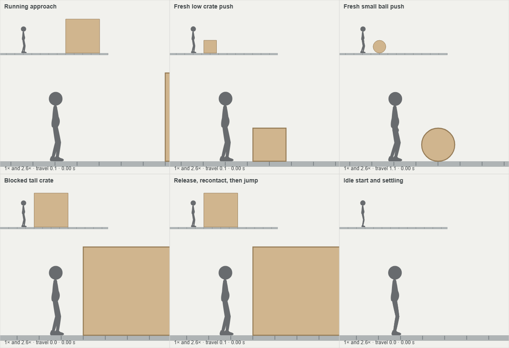

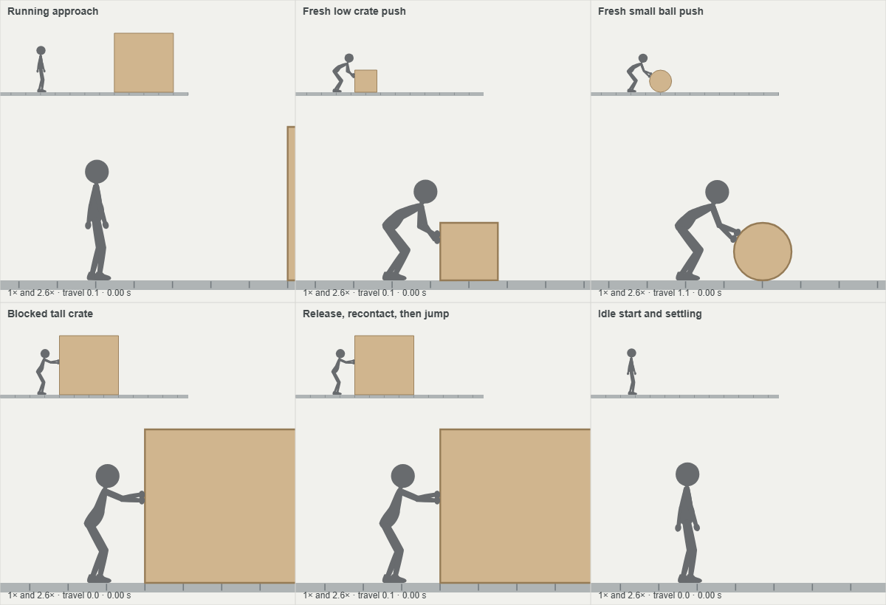

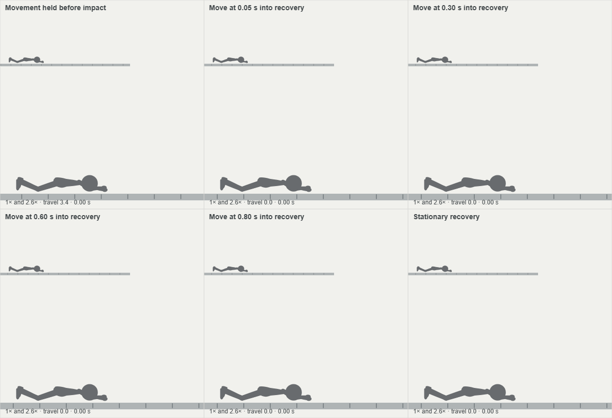

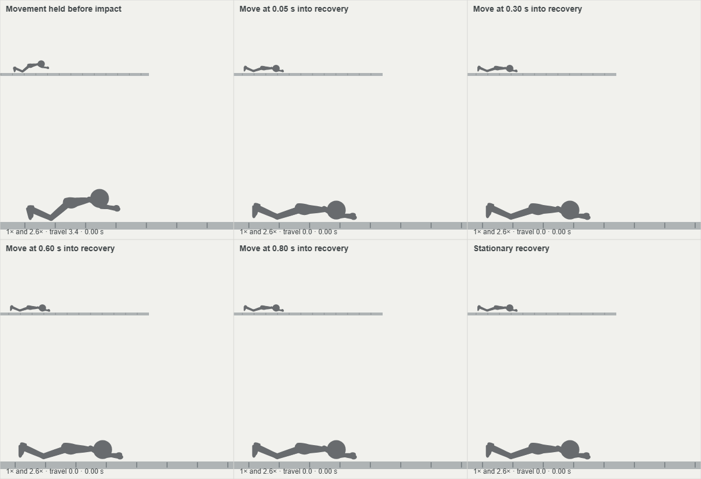

Validation: all 14 traversal presentation regressions pass, including the expanded matrix; 39 combined animation/ledge/presentation checks pass. All seven production-browser motion checks pass. The full UJG run passes 1,338 of 1,343 checks with the same five catalog/permission failures recorded above; all recorded route checks pass. Type checking, changed-file lint, and the isolated production build pass. The initial browser high-fall fixture exceeded its declared level height; it was corrected to a valid high platform departed with normal keyboard input before the final passing run.

The clips support the core visual changes but do not complete every issue's acceptance matrix. Outstanding combined cases include recovery reversals and cramped passages, push transitions on slopes and narrow footing, passive-rest contexts, and the final device and route review. The remaining controls, turning, airborne animation, slide balance, camera, teaching, browser gaps, and route/medal issues still require work. Authored levels and medal times remain unchanged.

## Tall-step cancellation pass

October 7, 2026. The core change for #49 lets opposite movement, Down/lower, or explicit detach reverse a 40/60-unit automatic step along its captured entry curve. Twenty-unit stairs retain their immediate stepping behavior. Commitment requires both final sole contacts on actual grippable top geometry; reaching an elapsed frame alone does not commit the tall pull-up. A completed step hands contact back normally. A new obstruction still goes through the ordinary body sweep and interrupts at the last clear body instead of teleporting to the captured source.

The return restores the captured gait, feet, and push pose. A queued jump launches once when the source is supported; pausing clears it even during a return. Permanent checks cover separate opposite/Down/detach requests at early, middle, and late progress, both directions, both gravity frames, and an object collider entering the return path. The exact rig retraces the entry samples; ordinary gait settling at the source stays within one world unit. All 21 step regressions pass, alongside two production keyboard checks. Type checking, changed-file lint, and diff checks pass.

These matched clips show 40/60-unit steps with reversal requested 0.05, 0.15, or 0.25 seconds after entry, at real-time playback and identical 1×/2.6× framing. The baseline carries every request onto the top. The revised rig visibly returns through the preceding supported reach or step, then resumes movement away. The tall late return plants the hands again while the trailing leg comes back below the lip. The loop boundary resets the encounter.

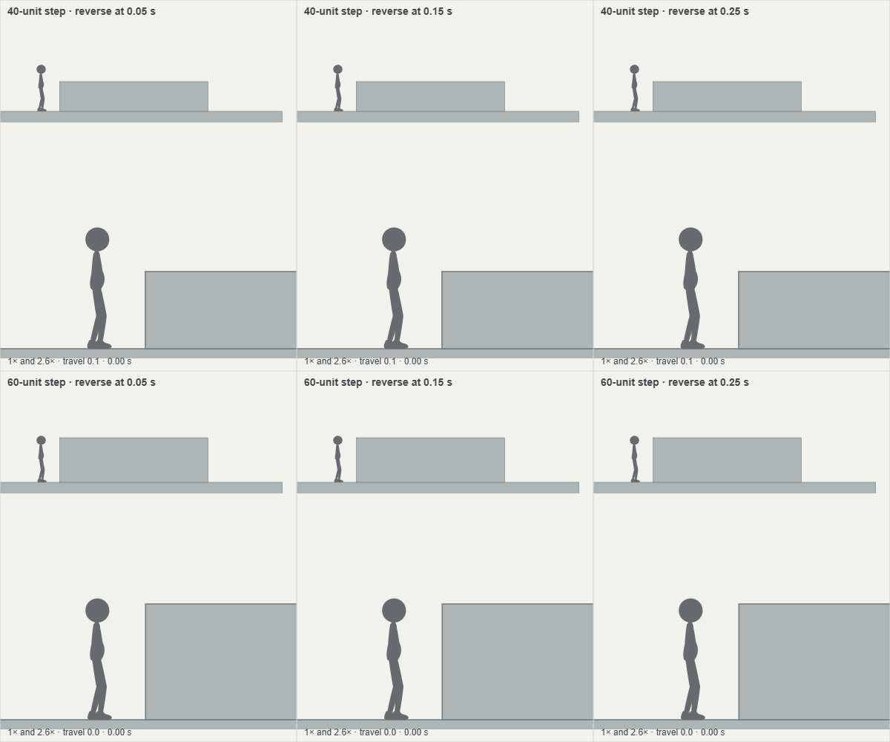

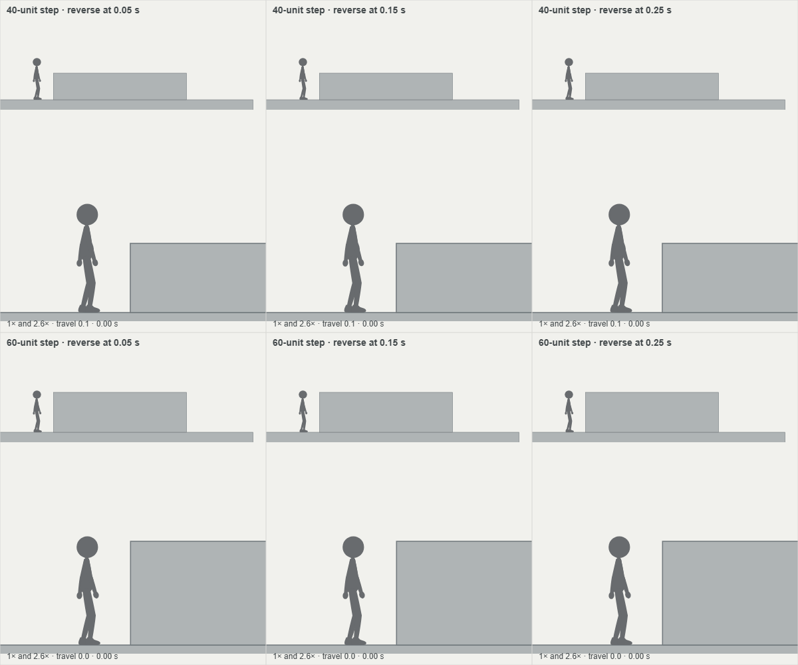

The combined live moving-prop interference and full route/device acceptance remain outstanding; this pass does not close #49 or the tracker. In the unchanged isolated browser-gap run (#60), seven of nine cases passed and both small-box/ball squeeze cases still exceeded their 30-second limits. Profiling attributes most of their cost to full-screen emission/ambient image composition. Forcing all canvases onto software rendering reduced the instrumented two-second sample only from 15.0 to 13.9 seconds and was not adopted. The original gameplay traces, assertions, and deadlines remain intact.

## Browser rendering investigation

October 7, 2026. For #60, daylight readability emissions now use conservative artwork bounds for robot indicators/headlights and the exit marker. Empty foot-booster artwork does not force a full layer. Unknown artwork and the night player-contrast pass retain the full composition. The coverage pass collects bounds without painting, then replays the normal artwork into a smaller emission buffer; all ordinary foreground occlusion remains in that replay. Rendering remains separate from simulation and input.

Simply cropping the image-copy rectangle did not help: the browser still read back the full 1280×800 source canvas. Using an actual 537×76 emission buffer in the measured squeeze scene reduced the same instrumented two-second run from 14.824 to 7.484 wall seconds, retaining 125 rendered frames. The expensive final emission composite fell from 4.221 seconds to 0.171 seconds. Ambient composition and other work remain measurable costs. These timings describe this local headless browser, not a promise of a specific gameplay frame rate.

A permanent development-browser comparison verifies every RGBA pixel against the original full-viewport composition across 48 combinations of fractional camera/zoom, resizing, offscreen sources, rotated/mirrored robots, occlusion, EMP, goal/headlight/booster artwork, and day/night mode. Its final run passes with zero differing channels. The 53 targeted lighting/air-booster regressions, type checks, changed-file lint, and isolated production build pass. Testing guidance now distinguishes UJG's 50 ms frame cap from Hard Vacuum's 100 ms batching helper, so future tests cannot silently discard half of UJG's simulation time.

The fresh complete nine-case run passed seven cases; both squeeze cases still exceeded their original limits. No timeout, input duration, animation-sample assertion, or frame cadence was relaxed; #60 remains open pending the original checks and slower-machine repeatability.

## Dry turning and grip departure pass

October 7, 2026. The core animation change for #48 captures the preceding rig while mechanical facing and steering change immediately. Opposed momentum keeps the visible body in its outgoing direction, reduces sprint extension, and transfers through depth toward a supported brake. Once momentum changes, a 0.14-second turn establishes the incoming direction. Repeated input changes continue from the actual preceding pose. Planted shoes retain their motor ankle, facing, heel roll, and toe bend; swing shoes turn normally. Caught ledge, climbable, and step poses retain this presentation snapshot, and an actual gravity-contact turn or restart clears it.

The seed full-speed reversal moves the head approximately 2.816 world units on its first tick, versus the baseline's approximately 16.1. The regression limit is six units for that first tick and eight throughout the ordinary turn matrix, measured in world space at 1/120 second. This permits the normal 3.42-unit root travel and body balance while rejecting the original mirror. It is not a universal teleport/collision bound. A real force-bearing prop contact owns the existing reachable brace immediately; the free turn cannot postpone its palms or drag its support shoes.

The shared handoff also begins #52's ledge jump-away animation. It captures the real hanging rig, clears the released hands around the actual lip, and turns toward the outgoing motion. The outward 260-unit impulse, eager mechanical facing, consumed catch press, and fresh-press departure remain unchanged. Rope gravity turns and inherited momentum retain their separate mechanics.

Five new permanent regressions cover both directions, walk/run/partial input, repeated reversals, neutral stop/turn, three slopes, both gravity frames, unsupported air turns, restart, ledge fresh-press departures, and turns meeting 30/80-unit boxes and balls. They check real planted shoe material, fixed three-dimensional limb lengths, world head continuity, force-bearing palms, head clearance, and released hand outlines. All 65 combined turn, animation, step, ledge, and traversal-presentation checks pass. Two production-browser checks exercise keyboard reversal and deliberate lower-then-jump-away; both pass. The reversal fixture initially encountered its default exit and was corrected to put the exit outside the measured path. Type checks, changed-file lint, and the isolated production build pass.

These clips use the same six encounters, inputs, geometry, framing, and real-time playback at 1× and 2.6×. The flight camera follows the physical root so the airborne rig remains visible. Full-speed braking reads as a shorter supported gait before the figure changes direction; repeated reversals retain the preceding support rather than flipping the whole sprint. The ledge departure unfolds from the grip instead of immediately substituting a backward-facing flight rig. The loop boundary restarts each encounter.

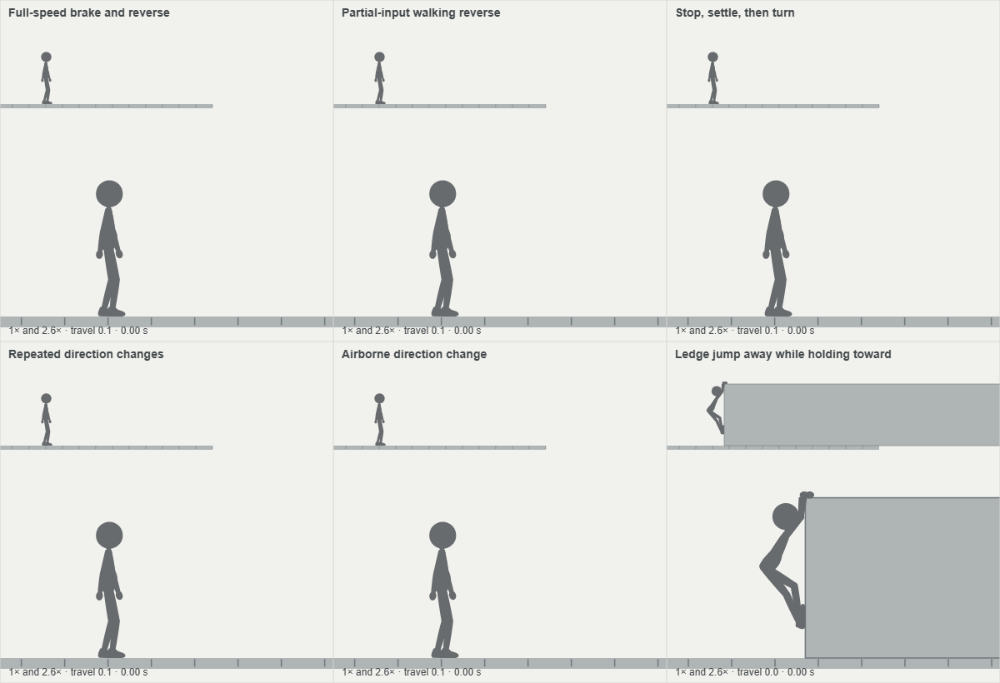

The control teaching, broader catch/departure binding matrix, crowded contact transitions, live route review, and physical-device acceptance remain outstanding. This pass does not close #48, #52, or the tracker. Authored levels and medal times remain unchanged.

## Contextual controls and water wording pass

October 7, 2026. This pass implements the core feedback work for #51 and #53 and the departure teaching for #52. The visible cue distinguishes a clear lip from ordinary crouching using the motor's actual exposed-edge and complete-path check. A blocked lowering path keeps crouch available. Vertical climbable acquisition uses the same exclusions in execution and feedback. Hanging cues distinguish pull-up, outward Jump, explicit detach, and release/repress after a consumed Jump or a deliberate lowering. These cues describe current actions and do not advance simulation or alter input.

The keyboard/controller/touch reference now explains diving, passive ascent, submerged-floor crouching, surface jumping, loose-prop pushing and deliberate grip, and automatic terrain-bank catches. It no longer advertises powered swimming upward or an independently selectable upright bottom hold. Controls help opens at the first binding, with Back fixed below a scrollable instruction area. Visual inspection caught the initial expanded help scrolling straight to Back and hiding the bindings; the corrected layout is verified through PageDown, which uses the same scroll target as controller navigation.

A real reverse-gravity defect emerged during this audit: holding Up to lower from ceiling support immediately queued the following pull-up. It could then repeat the lowering/pull-up cycle. The lowering now consumes that original held Up until release, leaving a stable hang. A fresh Up pulls up; Down or explicit detach can release. Ordinary Down lowering retains its established safe drop lock. A lowering that transfers directly onto a ladder or rope retains that mechanism's descent controls. The action-priority table and this gravity distinction are documented in [Jumping game contacts](jumping-physics.md#vertical-actions-and-departures).

Five permanent regressions cover prediction versus the next Down at clear/blocked/threshold/ceiling cases, read-only feedback, controller lower/hold/release/drop/detach/pull-up on both sides and both gravity frames, touch lowering and separate drop gestures, ladder-versus-rope acquisition priority, and pool-floor crouch followed by ascent through the actual controller translator. Released Down and held Up give identical final water position and velocity. The 166 targeted turn, action, ledge, rope-gravity, water, and step checks pass. The full UJG run passes 1,377 of 1,382 checks with the same five user-catalog/permission failures; all recorded routes pass. Type checks, changed-file lint, diff checks, and the isolated production build pass.

All four production keyboard feedback checks pass: normal lower/held-hang/separate drop, reverse-gravity lower/held-hang/fresh pull-up, blocked-path crouch, and pool-floor crouch/buoyant ascent/help. The water fixture was corrected from an unsupported underwater spawn to a valid floor spawn; the inverted fixture was corrected to start the challenge through a normal input before waiting for field motion. The final help-only rerun also passes after the scrolling fix. Evidence is retained separately in `.tmp/ujg-traversal-fixes/feedback-evidence` and `feedback-help-evidence`, so the targeted rerun does not erase the other screenshots.

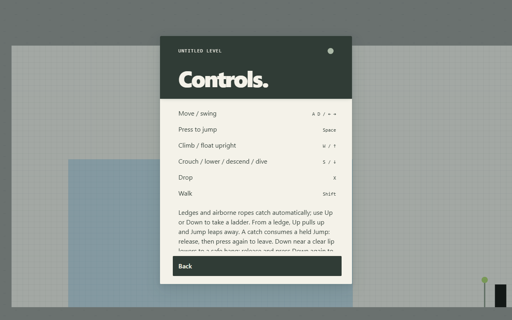

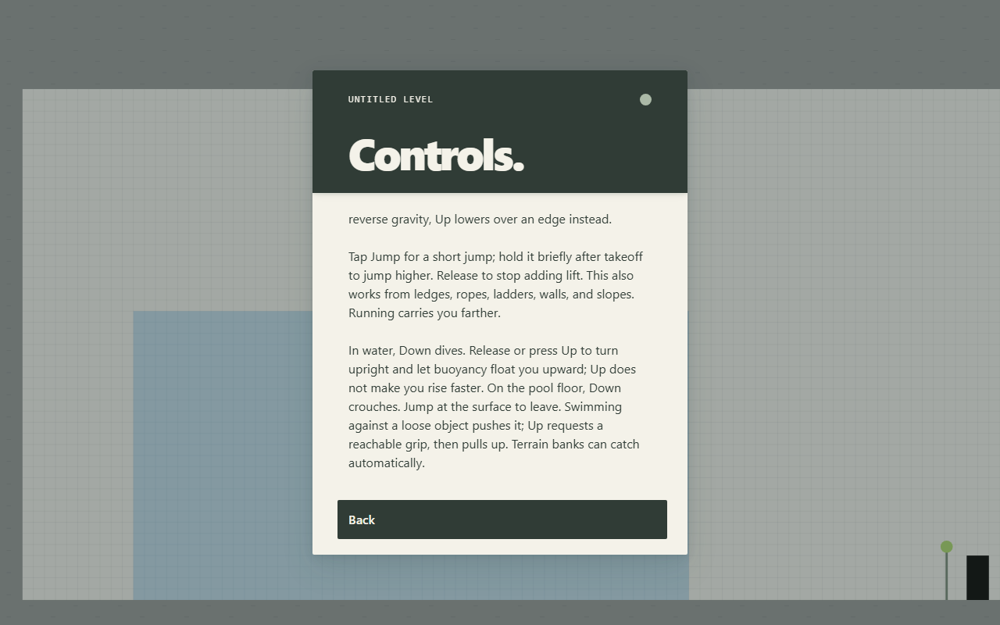

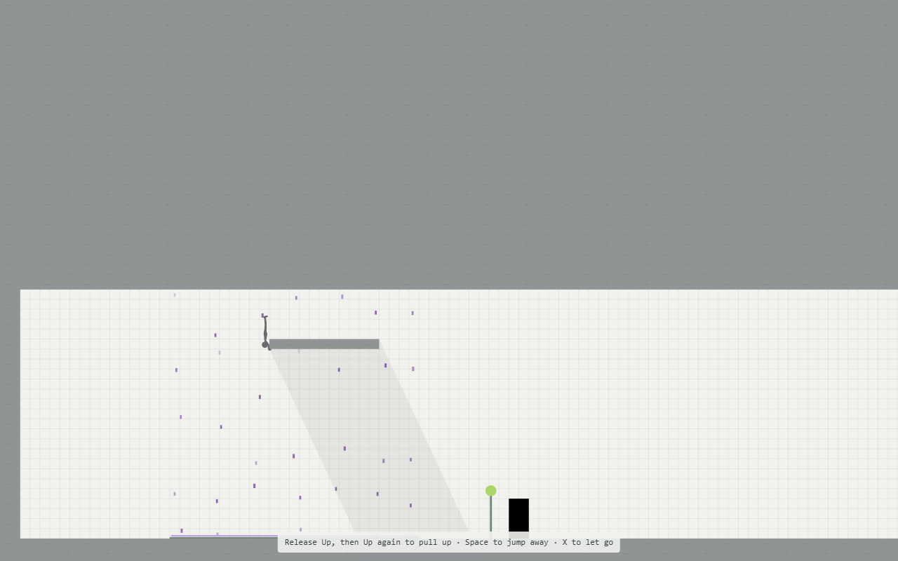

The following 390×844 keyboard-layout check verifies that the cue stays inside the viewport and wraps legibly. It is not a physical phone playtest.

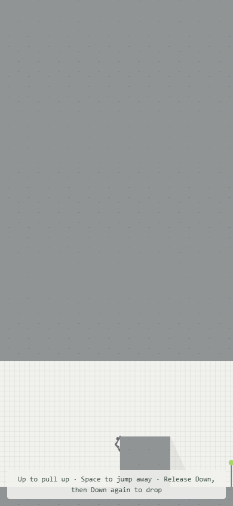

**New concrete evidence for #58:** This valid 600-unit-high lip fixture shows roughly seventy percent empty space above the level in portrait, while the camera is at its 0.42 minimum zoom. The 62-unit standing hull is only about 26 pixels high at that zoom. `gameCamera` selects challenge zoom using width divided by up to 1,800 world units, then anchors short levels to the viewport bottom. Review a larger narrow-screen scale together with vertical centering of levels shorter than the view. Compare useful approach visibility, wall-text reading, catches, tall route previews, water framing, and inverted support at matched inputs before choosing a fix; changing zoom alone must not hide the necessary next landing. The camera remains unchanged in this pass, and portrait readability is not accepted on the strength of cue bounds alone.

Fresh-player prediction, the remaining catch/departure and water sequences across bindings, real-device feel, and route/enjoyment acceptance are still outstanding. No issue is closed in this pass. Authored levels and medal times remain unchanged.

## Fifth implementation pass: airborne balance and real landing preparation

October 8, 2026. The core change for #55 gives takeoff, apex, descent and sustained fall different upper-body balance. Takeoff opens the elbows ahead of the body; the apex gathers the legs and counterbalances with the rear arm; descent opens the leading elbow; an approaching support sweeps the arms back before impact. The curl near zero vertical speed also requires height above the actual takeoff point. A ball removing falling speed therefore does not become a false jump apex. Arms follow the existing eased air amount slightly later on takeoff and retain descending balance while that amount settles on contact. Applied lift and steering make small adjustments; held input without an actual force creates none.

Landing preparation sweeps the current standing or crouched hull through the next 0.16 seconds of projected motion against the current collision world. It excludes ceilings and unavailable landings behind blocking walls. Preparation fades with approach time and the upward component of the contact normal, so the curved side of a rolling ball does not switch the pose on and off. It remains a read-only presentation query and acquires neither support nor a grip. Free-flight arms clear the actual geometry before the existing push, ledge, wall and slide contact owners establish their grips and balance. Real planted feet and the grounded impact absorption retain their motor contracts.

The selected long-fall interpretation is a **controlled, braced fall**. It retains the existing belly-down transition and impact/recovery mechanics, with one arm open for balance and the other folded below the chest. This matches the continued air steering and real foot thrust without inventing uncontrolled flailing or a new flight mechanic. The hands move toward the existing recovery position as real support approaches. The symmetric glide and a tighter fold were rendered with the same real simulation frame and scales; the tighter fold was rejected because its palms merged with the head silhouette.

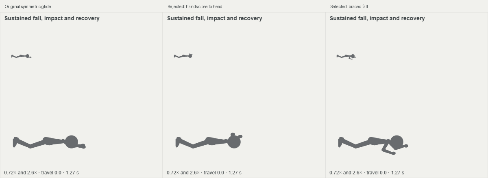

The following recordings compare the original reviewed commit with this pass at the same inputs, geometry, framing, and normal playback speed. The smaller rig uses 0.72 pixels per world unit, approximately the 1,280-pixel desktop challenge scale; the enlarged detail uses 2.6. Each three-second sequence includes a tap from rest, a hold from rest, a running hold, an airborne brake after a tap, a short drop, and a sustained fall with impact/recovery. The view follows the physical root so the flight rig stays visible; the floor appears as it approaches. Exhaust uses the actual foot-booster renderer. The loop boundary restarts each encounter.

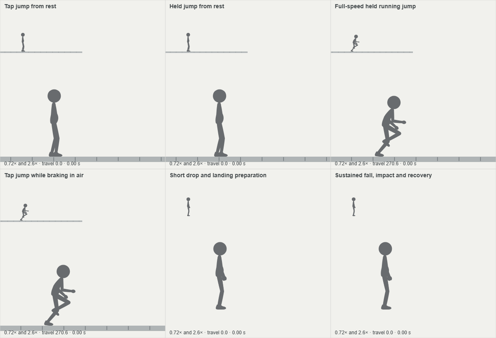

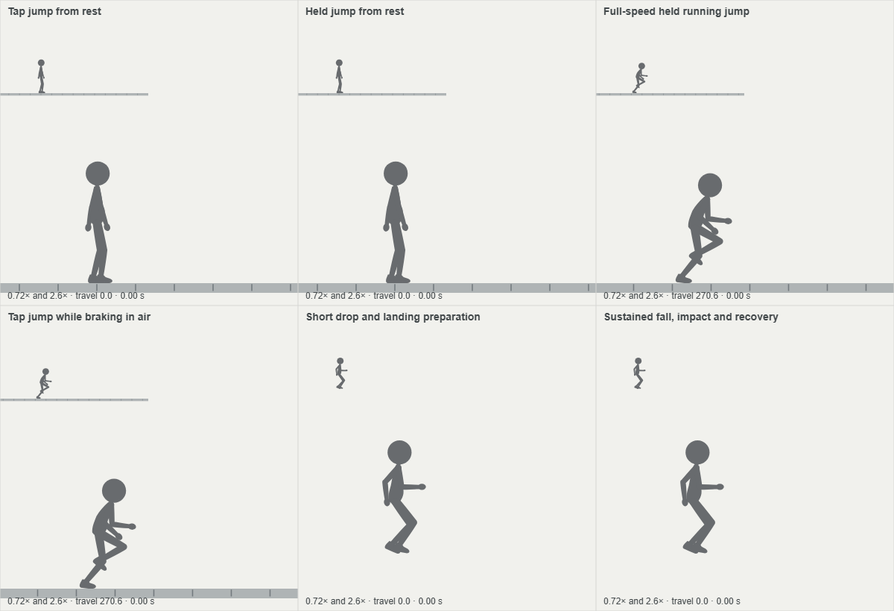

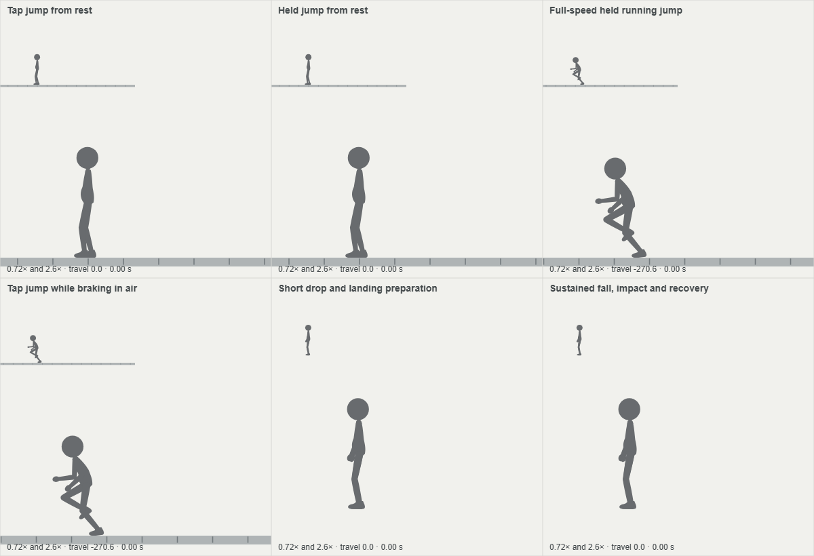

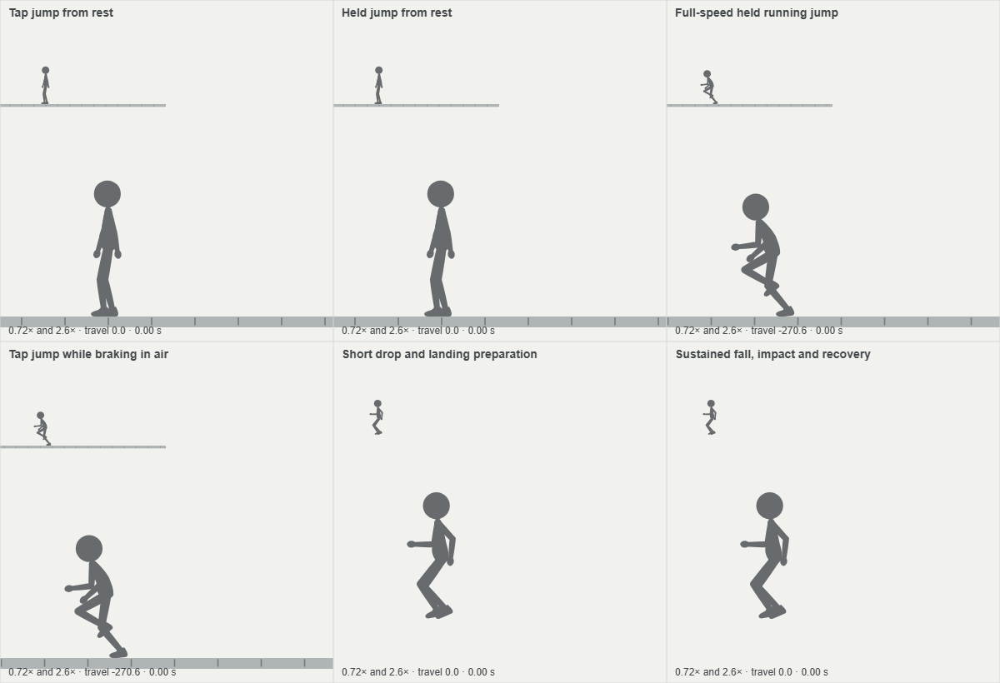

The reviewed frames show a compact apex, a more open descending figure, a rearward arm sweep approaching support, and an asymmetric sustained fall. Takeoff continues immediately; the tap's brief extension blends through its short arc, while the held jump retains its longer extension and force-driven exhaust. The rear arm remains close to the silhouette at the apex at small scales, so the portrait camera's undersized character remains a separate readability problem; numeric arm separation alone does not settle #58.

These 1,280×800 production captures show the held jump near its apex under real keyboard controls, using the game's actual camera and lighting. They supplement the matched rig comparisons above rather than substituting a still frame for a movement review.

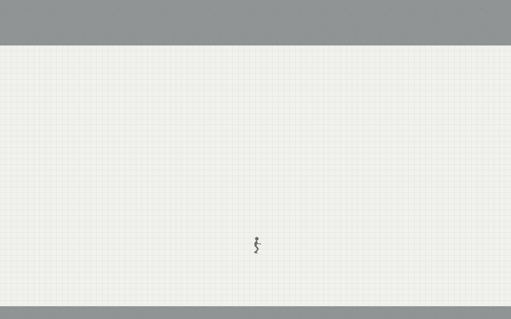

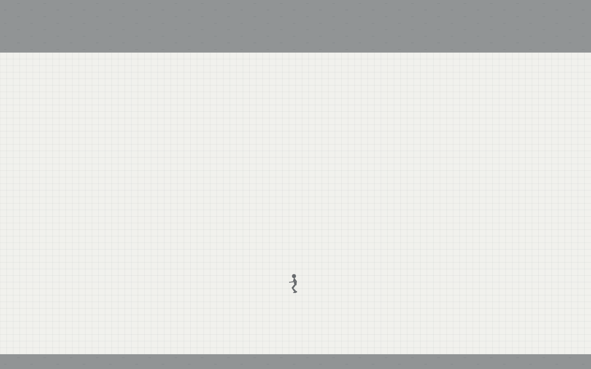

Two related transition corrections keep the new dry poses in their proper context. The first simulation tick initializes a missing gait from actual support, preserving an unsupported ready pose instead of blending from imaginary ground. A pool-floor release retains its water contact endpoint rather than letting the new dry apex curl take over that endpoint. The existing pool-floor transition checks exposed and verify that boundary. Wall-brace bones and intermittent ball-contact continuity retain their original assertions.

Permanent coverage replaces the former artistic requirement that both arms reach forward throughout flight with phase-specific assertions and retained limb-length/continuity checks. `tests/jumping-airborne-presentation.test.mjs` additionally covers sixteen actual tap/hold/run/drop trajectories across facing and gravity, real pre-contact preparation, slope and concave support, gaps/ceilings/walls, palm clearance, read-only queries, true jet attachment, applied-force balance and the selected sustained-fall silhouette. `tests/browser/jumpingFlight.spec.mjs` uses real keyboard controls for tap and held jumps in both directions, checks their original height ranges and planted landing, and retains apex and resting screenshots. No player state is injected by those browser cases.

Verification: the complete UJG regression set ran as 1,364 module cases plus the 22 main controller cases: **1,381 passed out of 1,386**, with the same five previously documented catalog/environment failures. The catalog failure is the user's added `Untitled level.jump-level.json` lacking a medal audit entry; the other failures are sandbox Git initialization and Windows symlink permissions. The accepted module log is `.tmp/ujg-traversal-fixes/full-flight-accepted-ujg.log`; the 22 controller results are in `flight-main-model.log`. All four production keyboard cases passed on the final build in `flight-browser-accepted.log`, with screenshots retained in `flight-browser-accepted/`. Type checking, affected-file lint, the isolated production build and whitespace checks passed. Existing jump timing, buffering, ceiling, wall/rope launch, water, gravity, contact and recorded-route regressions were retained.

This pass does not complete the physical-device feel, first-encounter teaching, portrait/fast-approach visibility, remaining browser performance gaps, or current route/enjoyment/medal acceptance. Those remain in #54 and #57–#60. Authored levels and medal times remain unchanged.

## Sixth implementation pass: narrow-screen framing and a night-rendering gap

The portrait defect in #58 is addressed in `camera.ts`: challenge zoom has a 0.60 minimum, so the 62-unit standing hull occupies about 37 CSS pixels rather than 26. A fitting short room shares unused vertical space above and below instead of putting almost all of it overhead. Taller rooms preserve 32-pixel padding at both enclosing contacts. The fitted-room and following policies meet continuously on resize, and the existing water camera anchor and gravity-facing body center remain in use. The original renderer accepts the same supplied view as the lit renderer.

The scale comparison below uses the same 390×844 viewport, figure, low crate, upcoming lip and wall text. At 0.65 the upcoming lip disappears from the rest view; 0.60 retains it and makes the figure and hint larger. This is a conservative readability floor, not acceptance of every authored hint or route at every size.

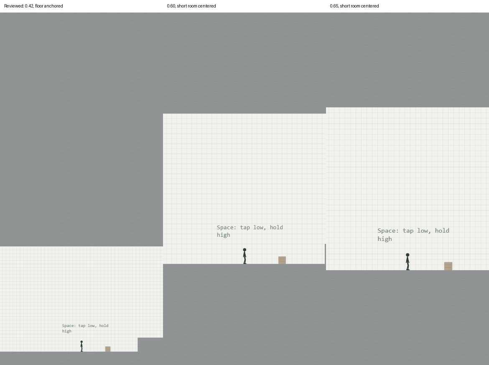

Increasing scale also reduces forward world coverage. The motor's held running jump covers roughly 430 units, while a centered 320-pixel view at 0.60 shows only 267 units ahead. `GameCamera` therefore adds lead only when the visible half-span is below 480 units. Its target uses actual outgoing velocity above walking speed, is capped at 200 units, blends over 0.12 seconds and has an 800-unit/second rate limit. Another cap keeps at least 72 world units behind the player. Input/facing alone does not flip the view; precision walking stays centered. View state is separate from the player, resets for a fresh player/level and freezes while paused. Room-end clamping still takes precedence.

In the production keyboard fixture, the player reaches vx410 before pressing Space, with the destination lip 406.3 units away. The following distances are taken from the native canvas transform before that press, with no player-state injection:

| Viewport | Forward world coverage | Destination lip distance | Largest rendered horizontal camera increment in the full jump/turn |
| --- | ---: | ---: | ---: |
| 320×740 | 443.4 | 406.3 | 11.8 CSS pixels |
| 390×844 | 463.8 | 406.3 | 11.5 CSS pixels |
| 844×390 | 703.3 | 406.3 | 4.1 CSS pixels |
| 1280×800 | 900.0 | 406.3 | 4.9 CSS pixels |

The visible strip of destination footing is at least one body width before commitment. The normal 180-ms held press crosses the gap and lands on that platform at y600. The subsequent real reversal and release settle back to centered framing. Ground stopping is about 30 units; this test also exposes the landing before the longer airborne commitment instead of judging visibility only against ground braking.

These four-second, normal-speed clips isolate the camera change: both columns use the current motor/rig, identical geometry and controls, and the same 390×844 viewport. Only the left column's camera is loaded from the original reviewed commit. The first clip covers a standing held jump, running, reversal and rest in a short room; the second covers a running gap jump, landing, reversal and rest. The loop boundary resets the encounter. These are native world-render captures; the keyboard tests separately verify the live app's framing.

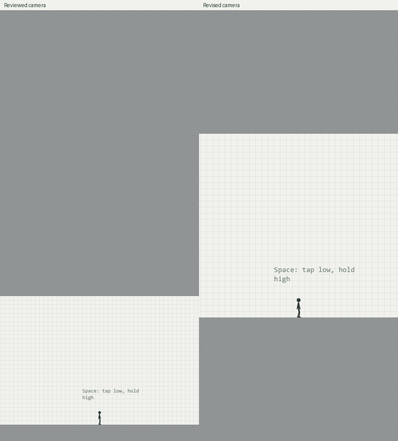
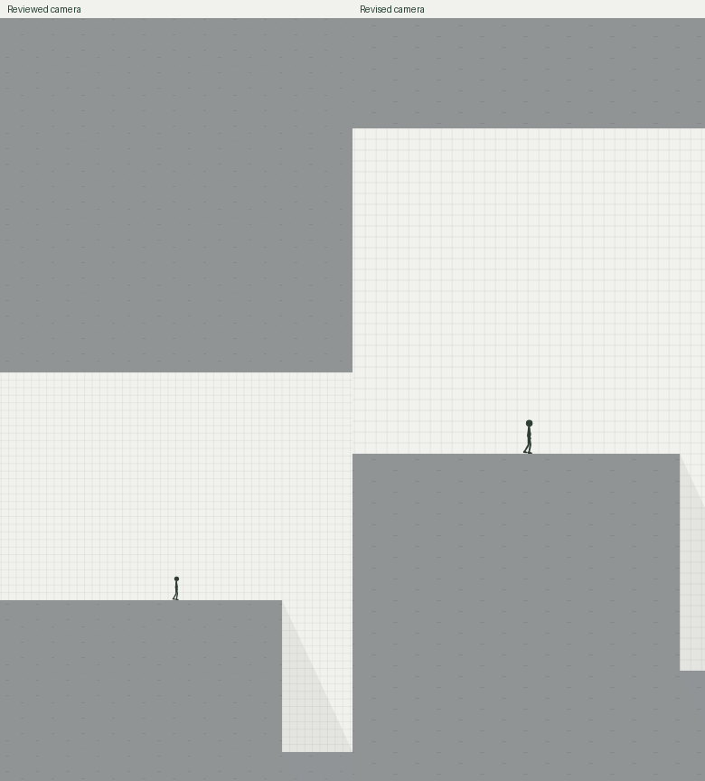

Five permanent camera regressions cover readable scale, short-room stability, ceiling/floor padding, fitting-room resize continuity, actual gap traversal, calm walking, full reversal, room ends and a fresh-player reset. They run alongside the existing water-bob camera checks. Nine production browser cases pass with the original 30-second deadlines: the same jump/turn at four sizes in day/night mode, plus a real gravity reversal to inverted ceiling support in a fixed portrait short-room view. A separate development-browser comparison covers 48 original/lit framing combinations, including pixel-density changes, water anchoring and inverted support. Canvas rounds its two transform APIs at different stages; the comparison bounds that difference below .001 backing pixel rather than mistaking numerical roundoff for a view change.

The new desktop night case exposed a repeatable performance margin problem: all movement checks could finish, but the case exceeded its deadline at 31.2 seconds. When there are no active lights, the night light field is constant ambient; both structural correction masks are black and the beam/haze layers are empty. `LightingRenderer` now omits those empty passes while retaining its original full composition as a reference. A dedicated 48-frame comparison checks every RGBA channel through resizing, fractional framing, occlusion, emissions, power transitions, exit fading and Canvas/GPU requests. The earlier 48-combination emission comparison also retains the original night path as its reference. The optimized desktop night case completes in 18.9 seconds with the same controls, duration, render cadence and assertions.

The full UJG regression run after the camera change reports **1,391 tests: 1,386 pass and the same five known failures** (the user's indexed Untitled level still needs a medal audit; sandbox restrictions prevent a temporary Git setup and Windows symlink creation). The subsequent 49 affected camera/water/lighting checks pass after the empty-night-pass optimization. Type checks, changed-file lint and the isolated production build pass. The known full-suite failures are retained explicitly.

This establishes the narrow-screen scale/short-room fix and this running-jump preview, not the whole #58 acceptance matrix. First approaches in tall authored routes, both-direction commitment examples, rope/ladder catches, cargo/gate encounters, water exits and active night lighting still need their combined route review. The original two daylight squeeze performance gaps in #60, physical-device feel in #57, teaching in #54 and current route/medal acceptance in #59 remain open. User-authored levels and medal times are preserved.

