# UJG traversal issues

Logged October 7, 2026. [GitHub tracker #39](https://github.com/nmsimons/arcade/issues/39) records the scope and order of 21 detailed implementation and evaluation issues from the [critical traversal review](jumping-traversal-review.md). This index provides direct issue links and dependencies. Each issue includes its evidence status, reproduction or investigation scope, source links, implementation guidance, constraints, and observable success criteria. GitHub is the current status record for each issue.

## Issue inventory

| Issue | Priority | Evidence |
| --- | --- | --- |
| [#40 UJG: make pushing body motion follow support and weight transfer](https://github.com/nmsimons/arcade/issues/40) | High (P1) | Acceptance complete: support-driven weight transfer, creep/crate/90-speed ball cadence, slopes, crouch, carrier-relative gait and stable blocked effort |
| [#41 UJG: establish a staggered bracing stance when pushing begins](https://github.com/nmsimons/arcade/issues/41) | High (P1) | Acceptance complete: one-time supported brace, narrow/concave/slope footing, brief recontact, both advancing legs and carried blocked stance |
| [#42 UJG: show pushing effort and resistance in the upper body](https://github.com/nmsimons/arcade/issues/42) | High (P1) | Acceptance complete: distinct partial/moving/blocked load, eased effort and release, maintained palms/clearance and no voluntary load from passive displacement |
| [#43 UJG: establish visible palm contact before the object starts moving](https://github.com/nmsimons/arcade/issues/43) | High (P1) | Acceptance complete: exposed approach reach, palms by first force-bearing movement, changing faces, release/recontact/turn/jump and first keyboard press after restart |
| [#44 UJG: replace low-object squat shuffling with a supported working gait](https://github.com/nmsimons/arcade/issues/44) | Medium (P2) | Acceptance complete: working hinge, alternating drive, low downhill reach, explicit crouch, blocked effort and native/browser review |
| [#45 UJG: keep crouched pushing head and torso outside the object](https://github.com/nmsimons/arcade/issues/45) | High (P1) | Acceptance complete: final drawn skin, anchored palms, tilted-face reach, continuous crouch/release and both gravity frames |
| [#46 UJG: resolve visible prone-body clearance beside terrain and objects](https://github.com/nmsimons/arcade/issues/46) | High (P1) | Acceptance complete: full prone skin, continuous corner/catch/slide/recovery handoffs and unchanged physical traces |
| [#47 UJG: transition moving fall recovery into a supported locomotion pose](https://github.com/nmsimons/arcade/issues/47) | High (P1) | Acceptance complete: prompt supported recovery, retained stationary sequence, continuous first opposite press and repeated turns, unchanged motor and jump availability |
| [#48 UJG: show braking and turning before mirroring a moving run](https://github.com/nmsimons/arcade/issues/48) | Medium (P2) | Acceptance complete: immediate steering, supported braking, crowded release/reach, repeated turns, and full-body contact continuity |
| [#49 UJG: allow reconsidering tall automatic steps before commitment](https://github.com/nmsimons/arcade/issues/49) | Medium (P2) | Acceptance complete: geometric cancellation, full returning skin, moving props, reversed gravity, and pause/restart |
| [#50 UJG: initialize and settle into a readable relaxed idle stance](https://github.com/nmsimons/arcade/issues/50) | Medium (P2) | Acceptance complete: supported ready/settled stance, distinct quiet arms including crouch, ten-second planted rest and actual passive carrier transport |
| [#51 UJG: make Down action priority and lower-then-drop behavior predictable](https://github.com/nmsimons/arcade/issues/51) | Medium (P2) | Confirmed control contract with a discoverability problem |
| [#52 UJG: explain and animate ledge jump-away and fresh-press departures](https://github.com/nmsimons/arcade/issues/52) | Medium (P2) | Reproduced launch orientation and confirmed input semantics |
| [#53 UJG: make water instructions and acceptance tests match actual controls](https://github.com/nmsimons/arcade/issues/53) | Medium (P2) | Confirmed mismatch between labels and motor/bindings |
| [#54 UJG: teach acquisition and solidity rules through clear first encounters](https://github.com/nmsimons/arcade/issues/54) | Medium (P2) | First ladder and rope guidance implemented and playtested; force-field and broader first-encounter acceptance remains incomplete |
| [#55 UJG: give airborne phases distinct readable athlete poses](https://github.com/nmsimons/arcade/issues/55) | Medium (P2) | Acceptance complete: distinct flight phases, controlled braced fall, real landing anticipation, and force-driven jets |
| [#56 UJG: evaluate and strengthen balance cues during fast steep sliding](https://github.com/nmsimons/arcade/issues/56) | Medium (P2) | Fast balance, entry/turn/landing continuity, shoe load and steep-face clearance addressed; dynamic and brief-contact acceptance remains incomplete |
| [#57 UJG: validate controller and phone traversal feel with real devices](https://github.com/nmsimons/arcade/issues/57) | Medium (P2) | Verified production release available for the user's iPhone and controller; actual device feel record remains pending |
| [#58 UJG: verify fast-approach readability and tune framing only where needed](https://github.com/nmsimons/arcade/issues/58) | Medium (P2) | Narrow-screen scale, short-room placement and running-jump preview addressed; broad context/route acceptance remains incomplete |
| [#59 UJG: playtest complete traversal routes and audit medals with current controls](https://github.com/nmsimons/arcade/issues/59) | Medium (P2) | Current-control Gold witnesses for First Leap, A Little Swing and Level Five; collection-wide route, recovery and timing acceptance remains incomplete |
| [#60 UJG: resolve the nine unverified traversal browser cases without weakening checks](https://github.com/nmsimons/arcade/issues/60) | Medium (P2) | Resolved: all nine cases pass twice under both normal production-project settings and 2× CPU throttling, including cleanup and confirmed fresh bundles |

## Implementation order and evaluation

Correct crouched-push and prone clearance and moving recovery first. Build pushing around a supported stance, weight transfer, effort, and visible palm contact; coordinate those issues rather than introducing separate competing gait states. Then address turns, idle, automatic steps, and control teaching. Resolve incomplete browser cases independently and use device, visibility, and complete-route evidence to judge final feel.

Every visual change needs before/after footage at ordinary gameplay scale and an enlarged view, under the same geometry, input, framing, and playback speed. Regression assertions establish contact, motion, and control safety; they do not alone establish natural animation. Preserve responsive controls, fixed limb lengths, actual supporting contacts, momentum, the physical root, and gravity/transport contracts.

Confirmed defects and outstanding evaluations are identified separately in the issue bodies. Hardware feel, camera adequacy, complete-route enjoyment, and current-control medal timing require their specified evidence. Keep those tasks open if that evidence remains unavailable. Follow AGENTS.md and the linked level-design/schema/physics documents before changing authored levels or medal times.

## Dependencies and coordination

| Work | Coordinate with |
| --- | --- |
| Push stance #41 and weight transfer #40 | Share a support-driven presentation state; no conflicting root or gait ownership. Establish the stance before tuning load. |
| Push effort #42, onset #43, and low posture #44 | Use the stance/weight-transfer work and retain final clearance from #45. Contact blend, travel phase, and load are separate concepts. |
| Body clearance #45 and #46 | Share suitable final-geometry checks while retaining distinct crouch/prone postures and existing physics hulls. |
| Recovery #47 and airborne presentation #55 | Preserve #46 clearance and responsive control while changing presentation precedence. |
| Dry turn #48 and ledge departure #52 | Share transient visual orientation without delaying mechanical facing or changing impulses. |
| Tall-step cancellation #49 and Down priority #51 | Document geometry-based commitment and supported cancellation before showing available actions. |
| Water wording #53 and contact teaching #54 | Teach actual bindings and acquisition rules; do not invent propulsion or change solidity. |
| Hardware input #57 and camera #58 | Supply device/viewport evidence for final route and medal evaluation #59. |
| Browser gaps #60 | Investigate independently now; rerun affected cases after relevant movement/animation fixes. |

All child issues are standalone enough for implementation from their body. This table prevents conflicting animation state ownership and identifies where combined before/after evaluation is needed.

## Additional crowded-push finding

October 8, 2026, at `afb30b7`. #48 remains open for reversals between two
blocked nearby props. A stationary brace has no locomotion speed, so it does
not capture the existing dry-turn snapshot. Incoming force then owns an
immediately mirrored rig. An upright 80-unit crate produces a 13.158-unit
first-tick head jump. With 30-unit crates it is 30.321 units; crouched examples
produce 20.754/23.585 units for sizes 30/80. The corresponding ball cases are
13.325, 29.864, 21.947 and 23.802 units. These include actual root movement:
less than 0.0002 units for crates and 0.225/0.792 for the balls.

The exact sixteen-case fixture, measurements, constraints, implementation
direction and required evaluation are recorded in
[the updated #48 issue](https://github.com/nmsimons/arcade/issues/48).
Simply retaining the head would stretch its neck or lose incoming palms in
the short/crouched cases. The preceding short-crate pose requires at least
14.460 units of head relocation to meet the new wrists with fixed arms and
its existing neck length. This is a constraint to repair through working
posture/contact geometry, not a naturalness acceptance threshold. A prototype
helped the tall upright example but failed the full matrix and was retained
only as a diagnostic patch. No part of that prototype is in the live code.

Evidence: `.tmp/ujg-traversal-fixes/opposed-baseline-measure.jsonl`,
`opposed-baseline-measure.mjs`, `opposed-draft.patch`, `opposed-unit.log` and
`opposed-prototype.log`. The implementation still needs a complete supported
transfer, repeated-reversal/release/jump regressions, unchanged physical traces
and matched real-time footage before this acceptance can be completed.

## First implementation pass

October 7, 2026, on `codex/ujg-traversal-fixes`. This pass begins #40, #41, #42, #45, and #46. It does not establish that their entire visual acceptance matrix is complete.

- **#40:** Pelvis balance follows the actual short step and its planted partner. Chest and head follow with a small lag, and the adjustment is eased and bounded to prevent uphill jerks. A one-second moving-crate sample now varies pelvis Y by 0.864 units and shoulder X by 0.402, compared with 0.011 and 0.0013 before. These measurements establish participation; the complete step still needs visual judgment.
- **#41:** A blocked push takes a small rear-foot step to establish a staggered base instead of leaving both feet almost coincident. The normal fixture settles into a 12-unit anchor separation and retains those anchors during another ten seconds of input.
- **#42:** Body loading now distinguishes hand contact from applied effort and resisted locomotion. The load eases into bent knees and a forward chest. On the same blocked crate, full input lowers the pelvis 3.2 units more than 20% input and advances the chest approximately 0.899 units. Existing static-wall arm reach is preserved.
- **#45:** Crouching lowers the working palms from 43 toward 28 units. The final head clearance runs after palm reach and torso balance. The established motor face is retained, including on tilted objects. Three-second crouched-push checks cover head/spine clearance, fixed limb lengths, and palm contact in both directions.
- **#46:** The existing geometric body and limb clearance is shared with prone flight. Thirty-frame checks cover head, spine, arms, legs, and hand outlines in both directions and gravity frames. Drawing remains read-only and uses the established physical hull.

The [baseline pose sheet](images/jumping-pushing-poses.png), [first-pass pose sheet](images/jumping-pushing-first-pass.png), and loops below use the same fixture inputs, framing, scale, and playback speed. The loop boundary is a replay reset. Low-object squat shuffling (#44) and hands arriving after object motion (#43) remain visible and need their own work.

Baseline:

First pass:

Validation: five new permanent simulation regressions pass, as do five production-browser checks using actual keyboard controls. The full UJG run passes 1,354 of 1,359 checks. Its five existing failures are the unrecorded `Untitled level.jump-level.json` catalog entry, three development-file tests blocked by sandbox permissions, and a Windows symlink-permission failure. All recorded route checks pass. Type checking, lint for changed files, and an isolated production build pass. Built-in and local authored levels were not edited in this pass.

**#47 remains unimplemented.** A moving-recovery prototype removed the long slide but failed continuity checks when movement began 0.05 seconds into recovery: advancing foot targets and the gathering legs produced abrupt knee transitions. It was not retained. The next implementation should coordinate gathering with a stable support handoff, avoid replaying ordinary landing compression as a second squat, and count locomotion separately from landing impact and carrier transport. Test movement introduced at 0.05, 0.3, 0.6, and 0.8 seconds into recovery, alongside held-before-landing input.

Remaining acceptance work for this pass includes broader corners/polygons, ceilings, narrow footing, moving carriers and dynamic solids, and gameplay-scale review of full push transitions. No issue is marked complete on the strength of coordinate ranges alone.

## Second implementation pass

October 7, 2026. This pass implements the core changes for #43, #44, #47, and #50 and expands the clearance work for #45 and #46.

- **Contact onset (#43):** The existing contact/load blend still advances once per solved tick. A separate ready pose establishes prop palms on the first force-bearing frame. An exposed-object approach reach prepares the arms between 72 and 38 units without feeding the motor or prop solver. A body sweep rejects preparation through intervening solids. Fresh 30/80-unit box and ball encounters in both directions, running approaches, release/recontact, and keyboard checks retain fixed palms and responsive physics. In the original 33 ms sample, the object travels 0.880 units and palm error is now below 0.001 units instead of the earlier visible gap.
- **Low props (#44):** The low working posture uses a stronger hip hinge and only three units of additional pelvis dip instead of fifteen. Both support legs participate, the advancing ankle passes its partner, and the working pelvis stays above 23 units. The matched clip makes the difference visible: the short-object figure uses bent working legs rather than staying folded in a full squat. Real crouching retains its distinct low posture.
- **Moving get-up (#47):** Meaningful resolved horizontal travel starts a spring toward the current supported gait. The transition advances from the preceding rig and bounds joint travel in three dimensions to prevent the knee reversal found in the discarded prototype. The seed trace reaches the ordinary support gait in approximately 0.1 seconds while retaining the same 410-unit/second motor and 82-unit travel over 0.2 seconds. The full stationary sequence remains. Tests introduce movement at 0.05, 0.3, 0.6, and 0.8 seconds, cover both directions, crouching, polygon support, mirrored gravity, fresh jumps, and a real moving carrier. Carrier transport never starts the spring. The status reads Recovering during the handoff; running step cues wait for the visible gait. The continuity bound is five local units per 1/120-second step, including depth, during this handoff; ordinary running continues to use the established contact gait.
- **Prone clearance (#46):** Final head/spine and limb clearance now also applies throughout grounded recovery. It folds limbs through depth rather than drawing the knees through the floor. Rendering stays read-only.
- **Idle (#50):** The first playable and preview frames initialize feet from prepared geometry without a simulation tick. Quiet arms have a small asymmetric resting angle, enough for the wrists to clear the torso silhouette at gameplay scale. The ledge-climb endpoint eases into that same rest pose. Unsupported starts retain airborne presentation.
- **Expanded crouched clearance (#45):** A permanent 48-encounter matrix checks head and spine outlines, fixed limb lengths, 30/80/140-unit boxes and balls, initial box tilts, both directions, and a low ceiling. It also checks the final mirrored silhouettes.

The following clips show the reviewed baseline and this pass at 1× and 2.6×, with identical inputs, framing, geometry, and real-time playback. The moving floor ticks expose travel; the loop boundary resets the encounter.

Validation: all 14 traversal presentation regressions pass, including the expanded matrix; 39 combined animation/ledge/presentation checks pass. All seven production-browser motion checks pass. The full UJG run passes 1,338 of 1,343 checks with the same five catalog/permission failures recorded above; all recorded route checks pass. Type checking, changed-file lint, and the isolated production build pass. The initial browser high-fall fixture exceeded its declared level height; it was corrected to a valid high platform departed with normal keyboard input before the final passing run.

The clips support the core visual changes but do not complete every issue's acceptance matrix. Outstanding combined cases include recovery reversals and cramped passages, push transitions on slopes and narrow footing, passive-rest contexts, and the final device and route review. The remaining controls, turning, airborne animation, slide balance, camera, teaching, browser gaps, and route/medal issues still require work. Authored levels and medal times remain unchanged.

## Tall-step cancellation pass

October 7, 2026. The core change for #49 lets opposite movement, Down/lower, or explicit detach reverse a 40/60-unit automatic step along its captured entry curve. Twenty-unit stairs retain their immediate stepping behavior. Commitment requires both final sole contacts on actual grippable top geometry; reaching an elapsed frame alone does not commit the tall pull-up. A completed step hands contact back normally. A new obstruction still goes through the ordinary body sweep and interrupts at the last clear body instead of teleporting to the captured source.

The return restores the captured gait, feet, and push pose. A queued jump launches once when the source is supported; pausing clears it even during a return. Permanent checks cover separate opposite/Down/detach requests at early, middle, and late progress, both directions, both gravity frames, and an object collider entering the return path. The exact rig retraces the entry samples; ordinary gait settling at the source stays within one world unit. All 21 step regressions pass, alongside two production keyboard checks. Type checking, changed-file lint, and diff checks pass.

These matched clips show 40/60-unit steps with reversal requested 0.05, 0.15, or 0.25 seconds after entry, at real-time playback and identical 1×/2.6× framing. The baseline carries every request onto the top. The revised rig visibly returns through the preceding supported reach or step, then resumes movement away. The tall late return plants the hands again while the trailing leg comes back below the lip. The loop boundary resets the encounter.

The combined live moving-prop interference and full route/device acceptance remain outstanding; this pass does not close #49 or the tracker. In the unchanged isolated browser-gap run (#60), seven of nine cases passed and both small-box/ball squeeze cases still exceeded their 30-second limits. Profiling attributes most of their cost to full-screen emission/ambient image composition. Forcing all canvases onto software rendering reduced the instrumented two-second sample only from 15.0 to 13.9 seconds and was not adopted. The original gameplay traces, assertions, and deadlines remain intact.

## Browser rendering investigation

October 7, 2026. For #60, daylight readability emissions now use conservative artwork bounds for robot indicators/headlights and the exit marker. Empty foot-booster artwork does not force a full layer. Unknown artwork and the night player-contrast pass retain the full composition. The coverage pass collects bounds without painting, then replays the normal artwork into a smaller emission buffer; all ordinary foreground occlusion remains in that replay. Rendering remains separate from simulation and input.

Simply cropping the image-copy rectangle did not help: the browser still read back the full 1280×800 source canvas. Using an actual 537×76 emission buffer in the measured squeeze scene reduced the same instrumented two-second run from 14.824 to 7.484 wall seconds, retaining 125 rendered frames. The expensive final emission composite fell from 4.221 seconds to 0.171 seconds. Ambient composition and other work remain measurable costs. These timings describe this local headless browser, not a promise of a specific gameplay frame rate.

A permanent development-browser comparison verifies every RGBA pixel against the original full-viewport composition across 48 combinations of fractional camera/zoom, resizing, offscreen sources, rotated/mirrored robots, occlusion, EMP, goal/headlight/booster artwork, and day/night mode. Its final run passes with zero differing channels. The 53 targeted lighting/air-booster regressions, type checks, changed-file lint, and isolated production build pass. Testing guidance now distinguishes UJG's 50 ms frame cap from Hard Vacuum's 100 ms batching helper, so future tests cannot silently discard half of UJG's simulation time.

The fresh complete nine-case run passed seven cases; both squeeze cases still exceeded their original limits. No timeout, input duration, animation-sample assertion, or frame cadence was relaxed; #60 remains open pending the original checks and slower-machine repeatability.

## Dry turning and grip departure pass

October 7, 2026. The core animation change for #48 captures the preceding rig while mechanical facing and steering change immediately. Opposed momentum keeps the visible body in its outgoing direction, reduces sprint extension, and transfers through depth toward a supported brake. Once momentum changes, a 0.14-second turn establishes the incoming direction. Repeated input changes continue from the actual preceding pose. Planted shoes retain their motor ankle, facing, heel roll, and toe bend; swing shoes turn normally. Caught ledge, climbable, and step poses retain this presentation snapshot, and an actual gravity-contact turn or restart clears it.

The seed full-speed reversal moves the head approximately 2.816 world units on its first tick, versus the baseline's approximately 16.1. The regression limit is six units for that first tick and eight throughout the ordinary turn matrix, measured in world space at 1/120 second. This permits the normal 3.42-unit root travel and body balance while rejecting the original mirror. It is not a universal teleport/collision bound. A real force-bearing prop contact owns the existing reachable brace immediately; the free turn cannot postpone its palms or drag its support shoes.

The shared handoff also begins #52's ledge jump-away animation. It captures the real hanging rig, clears the released hands around the actual lip, and turns toward the outgoing motion. The outward 260-unit impulse, eager mechanical facing, consumed catch press, and fresh-press departure remain unchanged. Rope gravity turns and inherited momentum retain their separate mechanics.

Five new permanent regressions cover both directions, walk/run/partial input, repeated reversals, neutral stop/turn, three slopes, both gravity frames, unsupported air turns, restart, ledge fresh-press departures, and turns meeting 30/80-unit boxes and balls. They check real planted shoe material, fixed three-dimensional limb lengths, world head continuity, force-bearing palms, head clearance, and released hand outlines. All 65 combined turn, animation, step, ledge, and traversal-presentation checks pass. Two production-browser checks exercise keyboard reversal and deliberate lower-then-jump-away; both pass. The reversal fixture initially encountered its default exit and was corrected to put the exit outside the measured path. Type checks, changed-file lint, and the isolated production build pass.

These clips use the same six encounters, inputs, geometry, framing, and real-time playback at 1× and 2.6×. The flight camera follows the physical root so the airborne rig remains visible. Full-speed braking reads as a shorter supported gait before the figure changes direction; repeated reversals retain the preceding support rather than flipping the whole sprint. The ledge departure unfolds from the grip instead of immediately substituting a backward-facing flight rig. The loop boundary restarts each encounter.

The control teaching, broader catch/departure binding matrix, crowded contact transitions, live route review, and physical-device acceptance remain outstanding. This pass does not close #48, #52, or the tracker. Authored levels and medal times remain unchanged.

## Contextual controls and water wording pass

October 7, 2026. This pass implements the core feedback work for #51 and #53 and the departure teaching for #52. The visible cue distinguishes a clear lip from ordinary crouching using the motor's actual exposed-edge and complete-path check. A blocked lowering path keeps crouch available. Vertical climbable acquisition uses the same exclusions in execution and feedback. Hanging cues distinguish pull-up, outward Jump, explicit detach, and release/repress after a consumed Jump or a deliberate lowering. These cues describe current actions and do not advance simulation or alter input.

The keyboard/controller/touch reference now explains diving, passive ascent, submerged-floor crouching, surface jumping, loose-prop pushing and deliberate grip, and automatic terrain-bank catches. It no longer advertises powered swimming upward or an independently selectable upright bottom hold. Controls help opens at the first binding, with Back fixed below a scrollable instruction area. Visual inspection caught the initial expanded help scrolling straight to Back and hiding the bindings; the corrected layout is verified through PageDown, which uses the same scroll target as controller navigation.

A real reverse-gravity defect emerged during this audit: holding Up to lower from ceiling support immediately queued the following pull-up. It could then repeat the lowering/pull-up cycle. The lowering now consumes that original held Up until release, leaving a stable hang. A fresh Up pulls up; Down or explicit detach can release. Ordinary Down lowering retains its established safe drop lock. A lowering that transfers directly onto a ladder or rope retains that mechanism's descent controls. The action-priority table and this gravity distinction are documented in [Jumping game contacts](jumping-physics.md#vertical-actions-and-departures).

Five permanent regressions cover prediction versus the next Down at clear/blocked/threshold/ceiling cases, read-only feedback, controller lower/hold/release/drop/detach/pull-up on both sides and both gravity frames, touch lowering and separate drop gestures, ladder-versus-rope acquisition priority, and pool-floor crouch followed by ascent through the actual controller translator. Released Down and held Up give identical final water position and velocity. The 166 targeted turn, action, ledge, rope-gravity, water, and step checks pass. The full UJG run passes 1,377 of 1,382 checks with the same five user-catalog/permission failures; all recorded routes pass. Type checks, changed-file lint, diff checks, and the isolated production build pass.

All four production keyboard feedback checks pass: normal lower/held-hang/separate drop, reverse-gravity lower/held-hang/fresh pull-up, blocked-path crouch, and pool-floor crouch/buoyant ascent/help. The water fixture was corrected from an unsupported underwater spawn to a valid floor spawn; the inverted fixture was corrected to start the challenge through a normal input before waiting for field motion. The final help-only rerun also passes after the scrolling fix. Evidence is retained separately in `.tmp/ujg-traversal-fixes/feedback-evidence` and `feedback-help-evidence`, so the targeted rerun does not erase the other screenshots.

The following 390×844 keyboard-layout check verifies that the cue stays inside the viewport and wraps legibly. It is not a physical phone playtest.

**New concrete evidence for #58:** This valid 600-unit-high lip fixture shows roughly seventy percent empty space above the level in portrait, while the camera is at its 0.42 minimum zoom. The 62-unit standing hull is only about 26 pixels high at that zoom. `gameCamera` selects challenge zoom using width divided by up to 1,800 world units, then anchors short levels to the viewport bottom. Review a larger narrow-screen scale together with vertical centering of levels shorter than the view. Compare useful approach visibility, wall-text reading, catches, tall route previews, water framing, and inverted support at matched inputs before choosing a fix; changing zoom alone must not hide the necessary next landing. The camera remains unchanged in this pass, and portrait readability is not accepted on the strength of cue bounds alone.

Fresh-player prediction, the remaining catch/departure and water sequences across bindings, real-device feel, and route/enjoyment acceptance are still outstanding. No issue is closed in this pass. Authored levels and medal times remain unchanged.

## Fifth implementation pass: airborne balance and real landing preparation

October 8, 2026. The core change for #55 gives takeoff, apex, descent and sustained fall different upper-body balance. Takeoff opens the elbows ahead of the body; the apex gathers the legs and counterbalances with the rear arm; descent opens the leading elbow; an approaching support sweeps the arms back before impact. The curl near zero vertical speed also requires height above the actual takeoff point. A ball removing falling speed therefore does not become a false jump apex. Arms follow the existing eased air amount slightly later on takeoff and retain descending balance while that amount settles on contact. Applied lift and steering make small adjustments; held input without an actual force creates none.

Landing preparation sweeps the current standing or crouched hull through the next 0.16 seconds of projected motion against the current collision world. It excludes ceilings and unavailable landings behind blocking walls. Preparation fades with approach time and the upward component of the contact normal, so the curved side of a rolling ball does not switch the pose on and off. It remains a read-only presentation query and acquires neither support nor a grip. Free-flight arms clear the actual geometry before the existing push, ledge, wall and slide contact owners establish their grips and balance. Real planted feet and the grounded impact absorption retain their motor contracts.

The selected long-fall interpretation is a **controlled, braced fall**. It retains the existing belly-down transition and impact/recovery mechanics, with one arm open for balance and the other folded below the chest. This matches the continued air steering and real foot thrust without inventing uncontrolled flailing or a new flight mechanic. The hands move toward the existing recovery position as real support approaches. The symmetric glide and a tighter fold were rendered with the same real simulation frame and scales; the tighter fold was rejected because its palms merged with the head silhouette.

The following recordings compare the original reviewed commit with this pass at the same inputs, geometry, framing, and normal playback speed. The smaller rig uses 0.72 pixels per world unit, approximately the 1,280-pixel desktop challenge scale; the enlarged detail uses 2.6. Each three-second sequence includes a tap from rest, a hold from rest, a running hold, an airborne brake after a tap, a short drop, and a sustained fall with impact/recovery. The view follows the physical root so the flight rig stays visible; the floor appears as it approaches. Exhaust uses the actual foot-booster renderer. The loop boundary restarts each encounter.

The reviewed frames show a compact apex, a more open descending figure, a rearward arm sweep approaching support, and an asymmetric sustained fall. Takeoff continues immediately; the tap's brief extension blends through its short arc, while the held jump retains its longer extension and force-driven exhaust. The rear arm remains close to the silhouette at the apex at small scales, so the portrait camera's undersized character remains a separate readability problem; numeric arm separation alone does not settle #58.

These 1,280×800 production captures show the held jump near its apex under real keyboard controls, using the game's actual camera and lighting. They supplement the matched rig comparisons above rather than substituting a still frame for a movement review.

Two related transition corrections keep the new dry poses in their proper context. The first simulation tick initializes a missing gait from actual support, preserving an unsupported ready pose instead of blending from imaginary ground. A pool-floor release retains its water contact endpoint rather than letting the new dry apex curl take over that endpoint. The existing pool-floor transition checks exposed and verify that boundary. Wall-brace bones and intermittent ball-contact continuity retain their original assertions.

Permanent coverage replaces the former artistic requirement that both arms reach forward throughout flight with phase-specific assertions and retained limb-length/continuity checks. `tests/jumping-airborne-presentation.test.mjs` additionally covers sixteen actual tap/hold/run/drop trajectories across facing and gravity, real pre-contact preparation, slope and concave support, gaps/ceilings/walls, palm clearance, read-only queries, true jet attachment, applied-force balance and the selected sustained-fall silhouette. `tests/browser/jumpingFlight.spec.mjs` uses real keyboard controls for tap and held jumps in both directions, checks their original height ranges and planted landing, and retains apex and resting screenshots. No player state is injected by those browser cases.

Verification: the complete UJG regression set ran as 1,364 module cases plus the 22 main controller cases: **1,381 passed out of 1,386**, with the same five previously documented catalog/environment failures. The catalog failure is the user's added `Untitled level.jump-level.json` lacking a medal audit entry; the other failures are sandbox Git initialization and Windows symlink permissions. The accepted module log is `.tmp/ujg-traversal-fixes/full-flight-accepted-ujg.log`; the 22 controller results are in `flight-main-model.log`. All four production keyboard cases passed on the final build in `flight-browser-accepted.log`, with screenshots retained in `flight-browser-accepted/`. Type checking, affected-file lint, the isolated production build and whitespace checks passed. Existing jump timing, buffering, ceiling, wall/rope launch, water, gravity, contact and recorded-route regressions were retained.

This pass does not complete the physical-device feel, first-encounter teaching, portrait/fast-approach visibility, remaining browser performance gaps, or current route/enjoyment/medal acceptance. Those remain in #54 and #57–#60. Authored levels and medal times remain unchanged.

## Sixth implementation pass: narrow-screen framing and a night-rendering gap

The portrait defect in #58 is addressed in `camera.ts`: challenge zoom has a 0.60 minimum, so the 62-unit standing hull occupies about 37 CSS pixels rather than 26. A fitting short room shares unused vertical space above and below instead of putting almost all of it overhead. Taller rooms preserve 32-pixel padding at both enclosing contacts. The fitted-room and following policies meet continuously on resize, and the existing water camera anchor and gravity-facing body center remain in use. The original renderer accepts the same supplied view as the lit renderer.

The scale comparison below uses the same 390×844 viewport, figure, low crate, upcoming lip and wall text. At 0.65 the upcoming lip disappears from the rest view; 0.60 retains it and makes the figure and hint larger. This is a conservative readability floor, not acceptance of every authored hint or route at every size.

Increasing scale also reduces forward world coverage. The motor's held running jump covers roughly 430 units, while a centered 320-pixel view at 0.60 shows only 267 units ahead. `GameCamera` therefore adds lead only when the visible half-span is below 480 units. Its target uses actual outgoing velocity above walking speed, is capped at 200 units, blends over 0.12 seconds and has an 800-unit/second rate limit. Another cap keeps at least 72 world units behind the player. Input/facing alone does not flip the view; precision walking stays centered. View state is separate from the player, resets for a fresh player/level and freezes while paused. Room-end clamping still takes precedence.

In the production keyboard fixture, the player reaches vx410 before pressing Space, with the destination lip 406.3 units away. The following distances are taken from the native canvas transform before that press, with no player-state injection:

| Viewport | Forward world coverage | Destination lip distance | Largest rendered horizontal camera increment in the full jump/turn |
| --- | ---: | ---: | ---: |
| 320×740 | 443.4 | 406.3 | 11.8 CSS pixels |
| 390×844 | 463.8 | 406.3 | 11.5 CSS pixels |
| 844×390 | 703.3 | 406.3 | 4.1 CSS pixels |
| 1280×800 | 900.0 | 406.3 | 4.9 CSS pixels |

The visible strip of destination footing is at least one body width before commitment. The normal 180-ms held press crosses the gap and lands on that platform at y600. The subsequent real reversal and release settle back to centered framing. Ground stopping is about 30 units; this test also exposes the landing before the longer airborne commitment instead of judging visibility only against ground braking.

These four-second, normal-speed clips isolate the camera change: both columns use the current motor/rig, identical geometry and controls, and the same 390×844 viewport. Only the left column's camera is loaded from the original reviewed commit. The first clip covers a standing held jump, running, reversal and rest in a short room; the second covers a running gap jump, landing, reversal and rest. The loop boundary resets the encounter. These are native world-render captures; the keyboard tests separately verify the live app's framing.

Five permanent camera regressions cover readable scale, short-room stability, ceiling/floor padding, fitting-room resize continuity, actual gap traversal, calm walking, full reversal, room ends and a fresh-player reset. They run alongside the existing water-bob camera checks. Nine production browser cases pass with the original 30-second deadlines: the same jump/turn at four sizes in day/night mode, plus a real gravity reversal to inverted ceiling support in a fixed portrait short-room view. A separate development-browser comparison covers 48 original/lit framing combinations, including pixel-density changes, water anchoring and inverted support. Canvas rounds its two transform APIs at different stages; the comparison bounds that difference below .001 backing pixel rather than mistaking numerical roundoff for a view change.

The new desktop night case exposed a repeatable performance margin problem: all movement checks could finish, but the case exceeded its deadline at 31.2 seconds. When there are no active lights, the night light field is constant ambient; both structural correction masks are black and the beam/haze layers are empty. `LightingRenderer` now omits those empty passes while retaining its original full composition as a reference. A dedicated 48-frame comparison checks every RGBA channel through resizing, fractional framing, occlusion, emissions, power transitions, exit fading and Canvas/GPU requests. The earlier 48-combination emission comparison also retains the original night path as its reference. The optimized desktop night case completes in 18.9 seconds with the same controls, duration, render cadence and assertions.

The full UJG regression run after the camera change reports **1,391 tests: 1,386 pass and the same five known failures** (the user's indexed Untitled level still needs a medal audit; sandbox restrictions prevent a temporary Git setup and Windows symlink creation). The subsequent 49 affected camera/water/lighting checks pass after the empty-night-pass optimization. Type checks, changed-file lint and the isolated production build pass. The known full-suite failures are retained explicitly.

This establishes the narrow-screen scale/short-room fix and this running-jump preview, not the whole #58 acceptance matrix. First approaches in tall authored routes, both-direction commitment examples, rope/ladder catches, cargo/gate encounters, water exits and active night lighting still need their combined route review. The original two daylight squeeze performance gaps in #60, physical-device feel in #57, teaching in #54 and current route/medal acceptance in #59 remain open. User-authored levels and medal times are preserved.

## Seventh implementation pass: stable daylight scratch storage

October 8, 2026. The daylight emission canvas was resized from its small
emission rectangle to the whole viewport for ambient correction, then back
again on the next frame. The measured two-second crowded-object sequence
therefore assigned canvas dimensions 500 times across 125 rendered frames.
Daylight now uses the already allocated haze surface for ambient correction;
night keeps its source haze intact. Emission storage rounds up to 32-pixel
buckets within the existing viewport budget. Its view and copied source
rectangle retain the exact original dimensions, so padding never becomes
visible artwork. Daylight also omits the athlete shadow outline calculation
that only the night contrast correction uses.

The same native keyboard sequence records zero dimension assignments after
warming the final storage scheme. Absolute timings varied substantially across
separate runs, so they are not evidence of a large speedup. An alternating
comparison in one browser, with identical motor/art state and equal forced
completion of deferred drawing, measures 145 settled Canvas frame pairs:
4,795.8 ms for the original storage versus 4,508.9 ms for reused storage,
approximately six percent less time. This is a local render benchmark, not an
accepted game frame rate or a slower-machine pass.

Permanent browser comparisons cover 14 frames per Canvas/GPU request, including
fractional view changes and repeated lit day/night transitions. Every RGBA
channel matches the reference; optimized storage performs zero steady-frame
resizes against 40 reference assignments, with the same reported buffer budget.
The existing 48-frame emission and 48-frame unlit-night comparisons also pass
with zero differences. All 57 affected lighting/booster regressions, type
checking, changed-file lint and the isolated production build pass.

**#60 remains open.** The nine-case diagnostic run using the bucketed storage
reports six passes and three failures, without changing deadlines, controls,
render cadence or assertions. Retained traces classify the remaining failures:

- The normal squeeze case times out during the final 500 ms release/settle
  advance. Its two-second advances take roughly 7.7–8.2 wall seconds. The
  sampled body-continuity assertions complete; the final case still does not.
- The reversed squeeze case reaches its screenshot after the held-contact
  assertions and exceeds the 30-second whole-test limit. Two-second advances
  take roughly 7.8–8.5 wall seconds. This remains a performance failure rather
  than proof of an animation discontinuity.
- The right-bank water case completes its movement checks and bank-cleared
  screenshot, then exceeds its existing 90-second context-teardown limit.
  Its trace shows the long teardown fixture; classify that separately from
  bank traversal and from the original loading failure.

The 18-unit pull-up, both pinned-ball approaches, both inverted-rope departures
and left-bank water case complete their original checks. Trace summaries are
retained in `.tmp/ujg-traversal-fixes/gap-trace-classification.jsonl`; the native
paired timings are in `renderer-paired.json`. Further work must profile the live
game loop and diagnostic overhead as well as full-frame composition, investigate
context cleanup, and demonstrate the complete original matrix under the
repository browser projects and a slower machine. The modest allocation fix
does not satisfy that acceptance by itself.

## Eighth implementation pass: first ladder and rope encounters

The current 23-file ordered collection has these first relevant encounters:

| Rule | First built-in encounter | Teaching and recovery | Remaining acceptance |
| --- | --- | --- | --- |
| Ladder needs vertical input | First Leap, `00.json`; ladder x560, y1200–1600 | A compact “Hold up / to climb” hint sits in the clear gap. A missed approach lands on the continuous floor; Up acquires the ladder and returns to the starting bank. | Broader bindings and fresh-player review remain part of #57. |
| Airborne rope catches automatically | A Little Swing, `02.json`; anchor (840,700), length 390 | “Jump into the rope. / It catches you.” is readable on the approach. The live cue explains release/new press after the catch. A miss reaches the floor and the same recovery ladder. | Other rope, wall-rappel and transfer contexts retain their separate acceptance. |
| Terrain bank versus loose float grip | None in the current built-in collection | Existing water/action fixtures demonstrate terrain catches and conditional Up grip on props; no authored first encounter is claimed. | Audit the first authored water encounter when present, including a missed prop grip and a usable exit. |
| Field blocks/supports the player but has no grip lip; props pass through | Drain, `Drain.json`; vertical field x200, y3000–3200 | The reversed coin switch at (230,3015) removes the field at 45 coins. The field is introduced beside a crowded ball/gravity shaft without local explanatory text. | Playtest the approach, visible prop passage, unsuccessful grip, valid departure and recovery with current controls before choosing local guidance or layout changes. |
| EMP activates on collection and changes supports/power | None in the current built-in collection | No current authored first encounter or recovery is claimed. | Review an actual EMP encounter, its five-second consequences and recovery before accepting this teaching requirement. |

First Leap's previous “Press A” graffiti is replaced by “Run up. / Hold jump.”
so the instruction describes the action across devices. The existing controller
joke is retained. The recovery hint initially extended behind the opposite bank;
the reviewed portrait screenshot exposed the clipping. Its final two-line,
180-unit area fits inside the clear gap. A Little Swing gains the automatic-catch
hint and the same compact recovery cue. Geometry, mechanisms and medal times
are unchanged. The design brief now records this contact-contrast teaching
principle and the need to review guidance from real approach/recovery positions.

The matched 390×844 ready views use the same current motor/camera and normal
rendering; only the authored guidance changes:

[First Leap before](images/jumping-introduction-first-before.png) and
[after](images/jumping-introduction-first-after.png);
[A Little Swing before](images/jumping-introduction-rope-before.png) and
[after](images/jumping-introduction-rope-after.png).

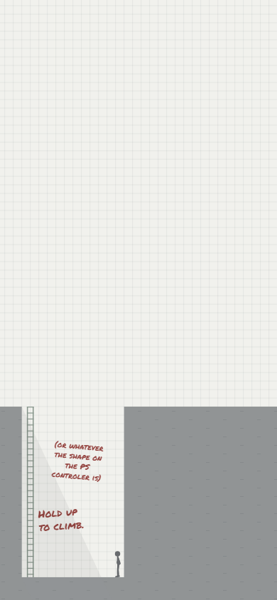

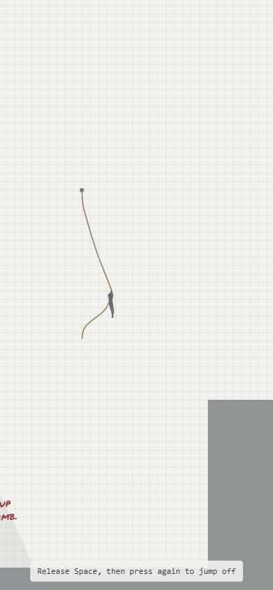

Four permanent fixed-step recordings use only current move, climb and press/hold
inputs against the runtime JSON. First Leap's direct route scores 2.608 seconds
against Gold 3.5; A Little Swing scores 6.267 against Gold 7. Their complete
fall/ladder/return routes score 9.025 and 12.508 seconds respectively, earning
Bronze. These are demonstrated routes, not a collection-wide medal audit.
Historical recordings are retained unchanged. All four new regressions pass.

Four production keyboard checks pass at ordinary render cadence in portrait:
the held running jump, both missed-approach ladder recoveries, and automatic
rope catch/climb/swing/fresh-press departure through the doorway. Both direct
routes receive Gold in the live app; the rope witness shown below scores 6.23
seconds. The tests advance through the existing 80 ms HUD publication boundary
before checking a changed action cue; waiting on a frozen clock alone cannot
publish that cue. Screenshots were reviewed for readability, occlusion, camera
framing and contact explanation rather than treating completion as visual proof.

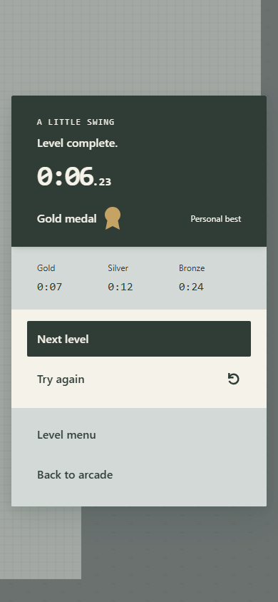

The full current UJG suite reports **1,395 checks: 1,393 pass and two fail**.
Both failures occur when the security fixtures request Windows file symlinks
and receive EPERM, including in the unrestricted test run. Temporary Git and
the current catalog audit pass. The complete log is
`.tmp/ujg-traversal-fixes/introduction-full-ujg.log`. Level validation checks all
23 current assets; type checking, affected lint and the isolated build pass.

This pass establishes the two introductory teaching/recovery routes and their
portrait readability. It does not settle the force-field/EMP/water teaching,
physical-device feel, fast steep sliding, the broader camera/interaction
matrix, collection-wide enjoyment/medals, or original browser performance
acceptance. No issue is closed on the strength of this batch.

## Ninth pass: fast slide balance and actual limb clearance

October 8, 2026. Normal movement into the shared regression terrain in
`tests/helpers/jumping-slide.mjs` establishes walking and running entries on
46.3°, 46.5°, 55° and 70° faces. The whole encounter is mirrored for the other
direction. Inverted runs start on the floor and acquire the ceiling through an
always-on upward gravity field; they do not inject an inverted player state.
Uphill, downhill and released input are evaluated after first contact. The
sliding motor continues to integrate gravity and friction; held direction alone
does not manufacture a force or animation load.

At ordinary gameplay scale the previous 55° fast slide still read as a relaxed
upright person with low arms. The existing speed term changed the hands, but
not enough to explain balancing at 600–1,300 units/second. Three native versions
were compared with identical geometry, inputs, framing and 30 Hz playback:
the previous rig, a modest counterbalance, and a stronger chest/arm version.
The modest version was selected. The stronger version's raised hand and chest
lean read as a gesture rather than restrained balance.

The [previous pose sheet](images/jumping-slide-baseline.png),
[selected pose sheet](images/jumping-slide-current.png), and
[stronger variant](images/jumping-slide-v2.png) retain the same samples.
The native gameplay camera appears on the left of each loop, with a three-times
detail view on the right. The loop boundary is a fresh replay reset.

Previous 55° walking entry through landing:

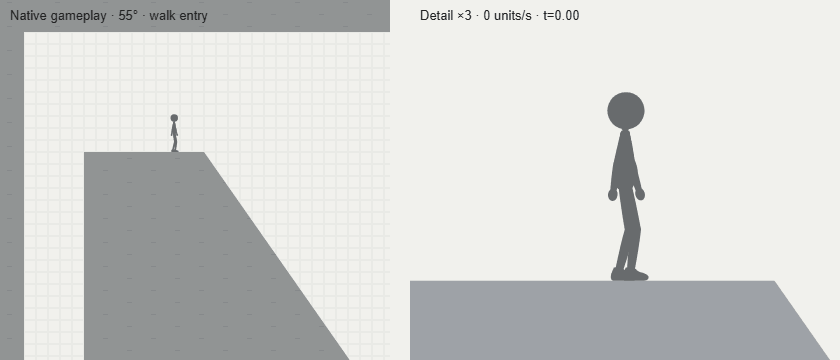

Selected 55° walking entry through landing:

Previous 70° running entry through landing:

Selected 70° running entry through landing:

Matched [inverted before](images/jumping-slide-55-run-inverted-settle-baseline.gif)
and [inverted after](images/jumping-slide-55-run-inverted-settle-current.gif),
plus [jump departure before](images/jumping-slide-55-run-normal-jump-baseline.gif)
and [jump departure after](images/jumping-slide-55-run-normal-jump-current.gif),
retain the original root and control traces as well.

The selected rig retains the existing calm pose below 130 units/second. As
resolved slip gathers, the chest and head counterbalance the feet, one forearm
lifts toward waist/chest height, and the other stays lower. The pelvis does not
introduce a new deep crouch. An 80 ms presentation response to resolved tangent
speed prevents a collision from instantly converting the raised arm into a
hanging arm. This value never feeds the friction, traction, collision or jump
motor and is discarded with the slide state. Direct zero-slip and slow-reversal
checks still retain their strict rest/continuity requirements.

The review also reproduced actual silhouette penetration on a 70° face:
the front knee entered terrain by as much as 8.35 world units and a palm by
6.57. Clearing the free-flight arms before the slide was insufficient because
the slide subsequently replaced their targets. The final slide now clears its
own arms and folds obstructed knees/elbows through depth while retaining both
bone lengths and the sliding soles. Corrections use each joint's actual nearest
solid face. The root's contact point can already be on the landing plateau while
its retained slip angle still belongs to the steep face; extending that tangent
over the plateau over-folded a clear knee in the first prototype. That prototype
was replaced with the actual-geometry correction.

The native outline regressions allow the outline flattener's 0.2-unit tolerance;
the remaining sampled heel contour overlap is below 0.13 units. Deep leg and
hand penetration is absent in the checked runs. The body query, fixed 3D bone
lengths and actual sole contacts are verified during the whole slide and its
release, in both directions and gravity frames. The new 70° clearance cases
fail in all four direction/gravity combinations against the previous rig.

Walking and running 55° traces contain 359 and 229 fixed steps respectively.
Their physical X/Y, velocity, grounded state and facing agree exactly with the
previous version at every step. Repeated render/debug queries also leave the
normal uphill/downhill input traces unchanged. All **143 affected regression
checks pass**, covering slide/friction, animation, prone and pushing presentation,
dry turns, airborne balance, wall braces/jumps, gravity rendering, water/ball
contacts, terrain ordering and rope/object slopes. Types, affected lint and the
isolated production build pass; the build validates 23 built-in levels.

All **six production keyboard checks pass** at ordinary render cadence and
390×844 framing: walking entries followed by fast neutral slides and a fresh
jump in both directions; both inverted 70° slides; and both grippable 46.3°
walking approaches. The walking-entry test observes the actual first slip before
releasing movement. Its initial fixed-duration attempt released just before
contact and correctly remained standing on the plateau; that was an incorrect
test input trace, not evidence of a traversal failure.

### Remaining #56 transition defects and exact next steps

**#56 remains open.** The whole-clip review and per-step 3D rig audit expose
three boundaries that steady-state balance/clearance tests cannot establish:

- **Walking/running departure from the plateau:** using the shared fixture,
  start normally with move=1, then release movement on the first active slide.
  On the 55° face, at fixed-step index 26 (0.2167 seconds), the front knee changes
  by 11.92 world units relative to the root in one tick; the 46.5° version changes
  by 9.37. These magnitudes are also present in the previous rig. Contact clears
  `p.footwork` and the free airborne leg construction loses the last supported
  rig before the slide's 0.12-second blend has acquired weight. Preserve the
  actual outgoing foot/leg pose through this support handoff, with fixed bones
  and real clearance. Increasing the blend duration alone cannot restore an
  already-discarded source pose. Prove smooth entry with both Shift-walk and run,
  both directions, and gravity reflection; keep fresh-press jump response.
- **Automatic canted-wall facing change:** in the 70° version of the same
  neutral trace, `settleWallBrace` changes facing from +1 to -1 at index 41
  (0.3417 seconds), while slide weight is about 0.625 and input is zero. A hand
  changes by about 20 units relative to the root in a single tick (the previous
  rig changes by 19.4). `captureDryTurn` currently captures requested reversals
  and grip departures, so this contact-selected facing change has no outgoing
  rig. Capture and transfer that visual orientation without delaying mechanical
  facing or moving a loaded grip. Check the mirrored and inverted encounter,
  held uphill/downhill intent and a jump during the handoff.
- **Steep face into the flat landing:** the retained slope normal, nearest
  contact point and eventual flat support change on successive ticks. The
  fast body then changes to slow balance while each foot clears the corner.
  The new speed response addresses instant arm unloading, but local knee/foot
  changes can still exceed eight units, and held-input variants exceed ten.
  Use the actual outgoing solved rig and the new reachable landing contacts
  for a bounded support transfer. Maintain 15/14.5-unit leg bones, 10/9-unit arm
  bones, safe knee opening, real soles and the current root/velocity trace.
  Do not rotate the whole athlete to the new ground angle or relax clearance
  assertions to hide the corner.

For those fixes, preserve a per-tick record in the player's gravity frame and
compare 3D joint positions relative to the physical root, including bend depth
and mechanical-facing reflection. A proposed visible continuity target is no
more than five world units per 1/120-second tick through these handoffs. Physical
root travel at high slip speed is evaluated separately; it must not be clamped
to achieve a presentation limit. Inspect native gameplay and enlarged playback
of the complete approach, contact, reversal/jump and landing, and retain the
existing brief-contact, ball-side and narrow-gap regressions.

Evidence and diagnostics are saved under `.tmp/ujg-traversal-fixes/`:
`slide-regressions-baseline.log`, `slide-affected-final.log`,
`slide-browser-final.log`, and the paired
`slide-motion-{baseline,current}.jsonl` records. These remaining transition
defects are part of the existing #56 acceptance, rather than additional claims
that the passing steady-state tests have resolved it.

The original nine browser cases were rerun with their original inputs, deadlines,
normal render cadence and frame/continuity assertions. **Seven pass and two exceed
their 30-second deadlines** in 4.2 minutes: both squeeze cases remain incomplete.
The normal-order case reports its timeout during a held-body screenshot; the
reversed-order trace is still retrieving motion history when the deadline ends.
Two simulated seconds of normal rendering cost roughly 7.7–8.7 wall-clock
seconds. There is no recorded failed movement assertion, and this is not an
acceptance pass. Both pool banks complete in this run, including right-bank
teardown; the previous teardown timeout still requires repeatability review.
The unchanged-case log and trace classification are
`browser-gaps-slide.log` and `gap-trace-slide.jsonl`. #60 remains open for the
two deadlines, repeatability and slower-machine evidence.

## Tenth pass: retain outgoing slide support and contact-selected turns

October 8, 2026. This pass addresses the entry and automatic-facing defects in
#56, while preserving the ninth pass's fast counterbalance. The landing-corner
handoff remains open.

**Entry fix.** The last supported rig now transfers into the actual current rig
over 120 ms. A detached snapshot preserves its shoes, gait and body before the
motor discards footwork. The outgoing pose is solved only when a slip starts;
ordinary supported movement does not perform an extra pose query. The handoff
survives a one-tick slip followed by temporarily lost contact. The first
prototype kept the source only inside `p.sliding`, which merely moved the
11.92-unit snap from the first contact to the following tick. The retained
`slideEntry` state fixes that boundary, then expires. A zero-weight fall timer
does not discard it; an actual prone pose, grip, water state, real loaded palms,
cancellation, gravity reorientation or respawn owns its appropriate transition.

**Facing fix.** An airborne sweep can acquire a canted brace after a frame with
neither sliding nor bracing. A lazy pre-step snapshot now supplies the outgoing
rig when that contact chooses a new facing. Capturing only already-active
slides missed the slow 70° walking case, which still mirrored a hand by 19.08
units at step 72. Mechanical facing and fresh jump response remain immediate.
The visible slide turn takes 160 ms; ordinary dry turns retain 140 ms. Bend depth
follows elapsed handoff time and settles before completion. Using the changing
per-tick interpolation fraction as the depth phase loaded a knee late and then
dropped that depth on the last tick.

**Clearance fix.** Moving a shoe out of terrain retains its nearest existing
3D knee bend instead of rebuilding a planar knee on the opposite side. Sliding
turns retain this approach even if the actual contact briefly disappears. Knee
clearance uses the real solid geometry and fixed endpoints. Ankle and hand
angles use the shorter rotation across the wrap boundary. During these
transfers, clearance also samples the drawn heel and forefoot curves, including
the upper contour and the independently flexed toe hinge. Sole-only probes
missed a rotated toe entering the plateau crease. Rendering and those probes
share the same curve definitions; the existing steady-slide sole contact
requirements remain in force.

The transfer also gathers the feet through depth early enough to retain a 45°
knee opening without moving their visible targets into terrain. When a shoe
needs depth to remain reachable, knee clearance rotates its bend around the
actual 3D endpoint axis, preserving both bone lengths. The full suite caught
the intermediate overfold; its strict knee assertion remains in the regressions.

Six new permanent regressions exercise **72 normal-control entry/turn
encounters**: walking/running, 46.5°/55°/70°, both directions, both gravity frames,
and released/uphill/downhill intent. Every 1/120-second step through the first
50 steps after slip checks the 3D joints relative to the physical root, including
mechanical-facing reflection and bend depth. The five-unit continuity limit,
fixed 15/14.5 leg and 10/9 arm lengths, safe knee opening, and native silhouette
clearance are retained. All six fail against the previous `ea19328` rig and pass
with this handoff. A seventh regression checks immediate fresh jumps one and
20 steps after first slip across walking/running, direction and gravity frames.

All **151 affected checks pass**. A separate comparison of all 72 complete
movement traces against `ea19328` agrees exactly in X/Y, velocity, grounded
state, mechanical facing and slide state at every step. Additional render and
debug queries remain read-only. Types, affected lint and the isolated build
pass; the build validates 23 built-in assets.

The complete UJG suite reports **1,416 passes out of 1,418 checks**, with no
movement or animation failures. The other two checks fail when Windows denies
creation of their security-test symlinks (`EPERM`); they remain unverified.
The final complete log is `slide-transfer-full-ujg-final.log`.

The production keyboard matrix runs at normal render cadence in a 390×844
viewport. The earlier ten-case run passed; the final build's run reports
**nine passes and one loading timeout**. That case remains in the Loading game
dialog past its unchanged five-second chooser deadline, before receiving any
movement input. This is a repeatability concern for #60, not a passed movement
case. The matrix includes the original six slide checks and four slow 70°
approaches that release movement, wait for the real contact-selected brace,
check projected joint continuity, and press Space during that turn. Every
press in the completed cases launches immediately. Their screenshots and motion witnesses are in
`.tmp/ujg-traversal-fixes/slide-browser/`; the complete log is
`slide-transfer-browser-safe.log`.
The unchanged loading-timeout case passes on an isolated repeat in 4.6 seconds,
including the entire brace transfer, continuity checks and fresh Space launch.
That separate log is `slide-transfer-browser-loading-repeat.log`; the failed
full-run trace is preserved. This does not establish loading repeatability.

Matched native playback retains the same controls, physical traces, camera and
30 Hz timing. Each loop starts a fresh replay. The gameplay camera appears on
the left and the three-times detail on the right. Adjacent-frame sheets were
also inspected across the whole entry and turning window: the running leg
continues its outgoing step before gathering, and the steep-face turn no
longer replaces the limb orientation in one frame.

Mirrored 55° running approach with uphill intent:
[before](images/jumping-slide-transfer-55-run-left-normal-uphill-before.gif) /
[after](images/jumping-slide-transfer-55-run-left-normal-uphill-after.gif).

Slow 70° walking approach and automatic brace turn:

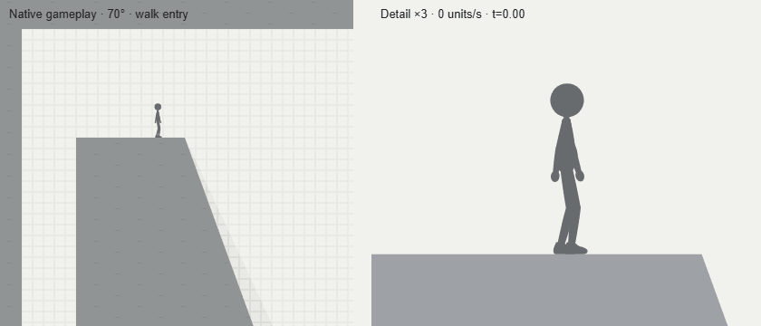

The matched
[inverted before](images/jumping-slide-transfer-70-walk-right-inverted-neutral-before.gif) /
[inverted after](images/jumping-slide-transfer-70-walk-right-inverted-neutral-after.gif),
and
[jump-during-turn before](images/jumping-slide-transfer-70-run-right-normal-jump-before.gif) /
[jump-during-turn after](images/jumping-slide-transfer-70-run-right-normal-jump-after.gif)
retain the same scene and physical motion as well.

**Remaining #56 acceptance:** the steep-to-flat landing still changes its
contact point, slope and reachable shoes on successive ticks. The ninth pass's
8–13-unit knee/foot discontinuities are not repaired by this entry/turn batch.
Preserve the outgoing solved rig through that corner, anticipate reachable
flat support early enough to keep the drawn skin clear, and apply the same
five-unit relative-joint target without clamping the physical root. Verify
both walking/running approaches, both directions/gravity frames, neutral and
held intent, a fresh jump at the corner, actual soles and complete native
playback. Broader dynamic-object/brief-contact interaction and the existing
original-browser performance gaps also remain separate acceptance gates.
No GitHub issue is closed by this pass.

## Eleventh pass: gather for connected landing and retain braking orientation

October 8, 2026. The steep-to-flat corner in #56 now has a retained handoff;
its remaining visible support problem is quantified below. No issue is closed.

The wider normal-control audit reproduces a greater-than-five-unit relative
joint change in **69 of 72** approaches in the previous `b4d16b5` rig. It covers
46.5°/55°/70°, walking/running, both directions and gravity frames, and neutral,
uphill and downhill intent. The worst knee change is 12.73 units. Success is
measured relative to the unchanged physical root, including 3D bend depth.

**Connected landing.** A real adjacent grippable face now supplies up to 100 ms
of advance notice. Only an edge matching the current slip face and lying near
its actual contact can advertise that support; an unrelated parallel slope
cannot supply a landing cue. The visual rig gathers toward the incoming face
while the collision motor keeps its exact slope, contact, velocity and friction.
Resolved slip momentum carries that preparation through abrupt physical
braking. Once supported, the fading slide follows the new support rather than
retaining an increasingly distant old foot target.

The cached outgoing rig advances only after body, shoe and limb clearance.
Every joint and sampled heel/toe material point is limited to five units per
1/120-second tick in three dimensions. The interpolation continues beyond its
nominal 120 ms when necessary, until the actual target is reached. The shoe
also passes through its end view before changing facing; an ankle-only check
missed visible toe flips of roughly 15 units. Pitch and toe bend remain
continuous across that change, and clearance uses the projected drawn shape.

**Braking and rest.** Gameplay-scale playback caught a prototype that began
running toward uphill input while momentum still carried it downhill. The
landing now retains the outgoing visible direction and suppresses the run
amount during braking. Motor steering remains immediate. Real footwork follows
the same visible direction. If braking continues after the slide fades, the
already-solved rig transfers directly to the ordinary dry-turn owner.

A further prototype stalled at rest when its outgoing knee and the standing
knee lay on opposite sides of the reach axis. The solved bend now crosses
through depth while the continuity limit remains active; a supported knee may
use the normal 15° opening, while an unsupported knee retains the 45° minimum.
The permanent checks require the handoff to complete, so a frozen but
coordinate-stable rig cannot pass.

All **31 slide regressions pass**. Six new groups cover the entire landing and
release in the 72 encounters, with strict 3D joint/shoe continuity, fixed
15/14.5 leg and 10/9 arm lengths, safe knee opening, native silhouette clearance,
braking direction, and actual completion. Those six expose the old rig's corner
defects. Three further groups exercise **144 fresh jumps** during the corner
gather or on first real supported contact. Every press launches on its input
tick. The first supported-contact fixture incorrectly required the visual
handoff still to be active in every case; that overlap does not exist in one
55° walking encounter. It now waits for actual support, without changing the
jump response assertion.

A separate complete comparison of all 72 physical movement traces against the
previous motor agrees exactly at every step. Render/debug queries remain
read-only. Types, affected lint and the isolated production build pass.
The complete UJG suite passes **1425 of 1427** checks; the two failures are
the existing Windows security tests that require unavailable symlink privileges
(`EPERM`). No gameplay regression fails.
The production observer includes `signals.slideLanding` so the keyboard checks
can witness both acquisition and release of the presentation owner.

Both 14-case production keyboard runs pass at normal render cadence, including
four complete landings in a 390×844 viewport and a fresh Space press after
support. The final run covers the subsequent braking and shoe-turn repairs and
completes in 2.2 minutes. Inputs, deadlines and cadence remain unchanged.

Matched native gameplay and three-times detail use the same controls, geometry,
camera and 30 Hz timing, including another half second after the original slide
ends. Each loop is a fresh replay. The enlarged adjacent-frame sheets were
reviewed across approach, contact, braking, gait release and rest. They show the
gather beginning before the crease and preserve the outgoing braking direction.

Mirrored 55° running approach with uphill intent:
[before](images/jumping-slide-landing-55-run-left-normal-uphill-before.gif) /
[after](images/jumping-slide-landing-55-run-left-normal-uphill-after.gif).

Slow 70° walking approach and landing:

Matched
[inverted before](images/jumping-slide-landing-70-walk-right-inverted-neutral-before.gif) /
[inverted after](images/jumping-slide-landing-70-walk-right-inverted-neutral-after.gif),
and
[downhill-intent before](images/jumping-slide-landing-70-run-right-normal-downhill-before.gif) /
[downhill-intent after](images/jumping-slide-landing-70-run-right-normal-downhill-after.gif)
also retain the full landing and return to the current supported gait.

**Remaining #56 support defect.** In **29 of 72** approaches, the nearest visible
sole sample is more than 0.5 units from the actual terrain during a grounded
landing-handoff tick; the worst gap is **3.95 units**. This is a visible load
timing problem even though the rig now passes the continuity and clearance
checks. Reproduce with 46.5° running, rightward movement, inverted gravity and
uphill intent: the gap reaches 3.86 at tick 281. Ordinary 55° running in either
direction and downhill intent provides further cases. The control trace remains
physically supported; both visible shoes temporarily lag above its support.

The next repair must establish a reachable, load-bearing visible sole on the
actual floor during the support transfer. Anticipate the selected shoe and
pelvis before contact if a post-contact correction would exceed the five-unit
joint/material-point limit. Preserve motor support, actual friction/jumps,
fixed bone lengths, terrain clearance and continuous shoe facing. Keep the
other foot free to finish gathering. Verify at least one real shoe-material
contact within 0.06 units on force-bearing support frames, and inspect native
gameplay through contact, braking, the first supported step and rest. A root
clamp, hidden foot, fake contact flag or raised tolerance is not a repair.

Reproducers, matrix records and validation logs are under
`.tmp/ujg-traversal-fixes/`: `slide-landing-support.mjs`,
`slide-landing-support.log`, `slide-landing-stall.mjs`,
`slide-landing-before-regressions.log`, `slide-landing-shoes-final.log`,
`slide-landing-full-ujg-final.log`, and `slide-landing-browser-final.log`.
Dynamic/brief-contact interactions, the original browser performance gaps,
physical-device feel and the broader route/camera review remain separate gates.

## Twelfth pass: preserve real shoe load through the landing transfer

October 8, 2026. The support-gap audit above counted every grounded motor tick,
including the running stride's brief flight phase. The more precise audit checks
the real footwork's force-bearing shoes. In the previous `ca2bbc6` rig, **22 of
72 approaches** exceed 0.06 units of visible sole separation while a foot is
loaded; the worst is **1.258 units**, in a normal 46.5° running approach with
downhill intent at tick 224. The earlier 3.95-unit maximum occurs with both
stride feet in flight, so it does not establish missing visible load by itself.

Each loaded landing shoe now reaches the actual terrain under its drawn heel
and toe. The pelvis lowers only enough to preserve fixed reachable leg lengths.
That solved load participates in the existing five-unit 3D joint/material-point
continuity check before a pose advances. The swing shoe keeps gathering; the
ordinary run retains its flight phase. Support flags, collision motor, friction,
velocity and fresh-jump timing are unchanged.

All **31 slide regressions pass** with added independent geometry assertions for
the actual loaded shoes throughout all 72 landings. The six landing groups
fail on the preceding rig specifically on visible sole separation (25 pass,
six fail). Some individual stride phases finish the presentation handoff while
both feet remain in flight; each approach group must still witness real loaded
samples, and every such sample must pass. Native silhouette clearance, fixed
bones, safe knees, continuity, handoff completion and the 144 fresh-jump cases
retain their existing assertions. All 72 complete physical traces still agree
exactly with the preceding motor. Types, affected lint and isolated build pass.
An independent complete audit measures **1,019 loaded-shoe samples** with a
maximum gap of **0.02 units** and no separation above the 0.06-unit limit.

Matched 30 Hz native gameplay and three-times detail compare against `ca2bbc6`,
using identical geometry, controls, camera, timing and an additional half second
after slide release. Adjacent-frame sheets were inspected through contact,
loaded steps, braking and rest. The repair keeps the loaded shoe on its floor
without removing the free foot's lift or inserting a second landing squat.

46.5° running approach with downhill intent:
[before](images/jumping-slide-support-46.5-run-right-normal-downhill-before.gif) /
[after](images/jumping-slide-support-46.5-run-right-normal-downhill-after.gif).

55° mirrored walking approach with uphill intent:
[before](images/jumping-slide-support-55-walk-left-normal-uphill-before.gif) /
[after](images/jumping-slide-support-55-walk-left-normal-uphill-after.gif).

70° walking approach and braking:
[before](images/jumping-slide-support-70-walk-right-normal-uphill-before.gif) /
[after](images/jumping-slide-support-70-walk-right-normal-uphill-after.gif).

55° inverted walking approach and braking:
[before](images/jumping-slide-support-55-walk-right-inverted-uphill-before.gif) /
[after](images/jumping-slide-support-55-walk-right-inverted-uphill-after.gif).

The complete UJG suite passes **1425 of 1427** checks in 185.7 seconds; the two
failures remain the Windows security tests requiring unavailable symlink
privileges (`EPERM`). All **14 production-browser checks pass** in 2.2 minutes
with their original controls, deadlines and render cadence.

Logs and independent reproducers are under `.tmp/ujg-traversal-fixes/`:
`slide-landing-loaded-support.log`, `slide-support-loaded-matrix.log`,
`slide-support-before-tests-final.log`, `slide-loaded-support-final.log`,
`slide-support-motor.json`, `slide-support-full-ujg.log` and
`slide-support-browser.log`. Dynamic-object and brief-contact interactions still
need their own native review; #56 remains open for that acceptance. No issue is
closed by this pass.

## Thirteenth pass: reduce daylight composition work

October 8, 2026. All nine original #60 production cases now pass on the fresh
isolated build, in 3.2 minutes. The two pressured small-box/ball cases complete
in 20.8 and 20.9 seconds within their unchanged 30-second deadlines. Both input
cycles, screenshots, more than 100 rendered frames per hold, motion diagnostics,
head/root stability and joint continuity assertions remain intact. The other
seven cases retain their original routes, controls and deadlines too.

The renderer reuses the exact 8-bit exposure correction instead of rebuilding
it from the same daylight field. In bounded, unlit daytime scenes without
changing structural mechanisms or additional ambient artwork, it also retains
the immutable terrain mask in its existing haze surface. Disjoint pixel regions
cover terrain; the complete artwork order is replayed around actual foreground
actors, the exit, slide dust and the robot's elevated recovery indicator. This
restores terrain behind moving actors without copying black air pixels or
allocating another full-size buffer. Camera, viewport, terrain, lighting and
scene changes invalidate the cache or retain the full composition.

All eight development rendering checks pass, including exact RGBA comparisons
on Canvas and GPU through day/night, power/EMP, fractional camera/zoom, resize,
moving/rotated props, steel material edges and recovery-indicator overlap.
The warm moving-scene comparison witnesses 15 cached frames, checks read-only
player state and preserves the 64 MiB limit. Its first fixture used an invalid
`metal` material; it was corrected to the supported `steel` before evaluating
pixels. Existing assertions were not relaxed. Types, affected lint and the
isolated build pass.

In an uncontended alternating-order comparison of the same 145 steady native
Canvas frames, the preceding composition takes 4931.4 ms (33.1 ms median) and
the revised composition 4032.8 ms (27.2 ms median), about 18% less render time.
Both resolve a pixel after each render. These local paired measurements do not
establish a whole-game frame rate. An opaque-context experiment gave little
benefit and a pattern-based composite was slower; both were removed.

The successful production traces contain no pending calls or runtime errors.
The two-second squeeze advances take about 4.8–5.2 wall seconds, compared with
7.7–8.7 in the preceding run. Screenshots were inspected at gameplay scale:
the quiet narrow-gap body stays upright, feet gather on its actual footing,
and the tall-crate landing remains outside the crate. Still images supplement
the unchanged sampled motion assertions; they do not complete #56's separate
dynamic-contact visual review.

A fresh run with the existing browser helper's 2× CPU throttling still times
out in a pinned-ball clock advance. The trace shows completed earlier route
segments and a pending `runFor(1500)` at the unchanged whole-test deadline,
without a movement assertion or runtime exception. #60 remains open pending
this slower-CPU result and repeatability under the repository project settings.
The earlier one-off loading failure remains distinct from active-render cost;
tests still wait for the selected card and focused playable canvas.

Evidence is retained under `.tmp/ujg-traversal-fixes/`:
`correction-complete-browser.log`, `correction-types-current.log`,
`correction-lint-current.log`, `correction-build.log`,
`renderer-final-uncontended-paired.log`, `correction-browser-gaps.log`,
`correction-gap-traces.jsonl`, and `correction-browser-gaps-slow`.

## Fourteenth pass: retain immutable fields and select the software-driver path

October 8, 2026. All nine original cases pass again under the repository's
`production` project settings, including its two workers and parallel execution,
in 1.5 minutes. The squeeze cases finish in 21.0 and 21.7 seconds. The fresh
isolated build is `UntitledJumpingGame-CB6pxeFU.js`. No case, control trace,
gameplay duration, frame cadence,
assertion or deadline has changed.

Daytime scenes with no lamps or moving structures now retain the fixed light
field and both exposure corrections in their existing field/lamp surfaces.
Other changing artwork still receives the complete composition. A permanent
warm comparison exercises moving rope nodes, pickups, a wall clock, rotated
props and the opening exit. All 12 frames witness correction reuse, retain
read-only player state and match every RGBA channel of the uncached renderer.
This does not simulate or certify a physical rope route.

The next paired native Canvas comparison measures 145 steady frames at
6735.9 ms (48.6 ms median) for the uncached composition and 3722.1 ms
(25.7 ms median) for the revised composition, about 45% less time. Frequent
pixel reads in such a comparison can influence the browser's Canvas backing;
it is a local renderer measurement, not proof of live or hardware performance.

An observational probe of the live production bundle confirms that all 125
frames of the held-gap sample use both caches, with a 1280×800 Canvas backend.
The browser reports SwiftShader, a CPU graphics driver. At 2× CPU throttling,
the unchanged two-second sequence takes 12.629 wall seconds. Requesting a
software main Canvas in the same diagnostic reduces this to 8.673 seconds,
with the same 125 frames. Requesting software for every scratch canvas gives
8.657 seconds and was not adopted; its additional scope provides little benefit.

The automatic renderer now distinguishes a known software-driver rejection
from other WebGL limitations, and selects a software main drawing context for
that driver. Hardware graphics and explicit GPU experiments retain their
normal drawing path. The existing driver probe is reused. Unsupported features
alone do not force this policy. All ten development rendering checks pass,
including the automatic context's day/night/power transitions with exact
complete-frame comparison. All 35 affected lighting checks, types, changed-file
lint and the isolated build pass. Buffer allocations stay within the existing
budget; no physics or input behavior changes.

The complete original nine-case run at 2× CPU throttling improves from three
to five passes. Both pinned-ball approaches now finish within their existing
60-second limits (53.9 and 55.3 seconds). Both rope departures and both squeeze
cases still exceed 30 seconds. The rope jump trace completes its recorded calls
before the final deadline; let-go stops during the 250 ms climb advance. The
normal squeeze stops during a 500 ms settle advance, and the reversed squeeze
during its next two-second hold. These remain performance/scheduling gaps;
page-closed errors after cancellation are consequences of the deadline.
**#60 remains open.** The successful two-worker production run does not replace
the incomplete slower-CPU result.

Logs and traces: `.tmp/ujg-traversal-fixes/immutable-complete-browser.log`,
`renderer-immutable-paired.log`, `live-cache-slow.log`,
`live-cache-software-slow.log`, `live-cache-software-all-slow.log`,
`software-context-browser.log`, `software-context-unit.log`,
`software-context-types.log`, `software-context-lint.log`,
`software-context-build.log`, `software-context-browser-gaps-project.log`,
`software-context-browser-gaps-slow.log` and
`software-context-gap-traces-slow.jsonl`.

## Fifteenth implementation pass: brace footing and brief recontact

October 8, 2026. The remaining #41 matrix found two concrete defects. On a
16-unit ledge, the rear target was outside the tread and the foot kept trying
to plant in empty space. On wider footing, even a one-tick pressure release
shrunk the target enough to start a needless lifting step; resuming pressure
then sent the same foot back to its original anchor.

Unsupported targets now adapt to the actual support. Ordinary valid targets
and adjacent real footings retain their existing policy. The support bounds
provide an initial inset; a concave outline also checks the actual exposed
tread toward the physical root. No bounding rectangle manufactures support.
The established brace remains while the hand-contact blend fades. A complete
release returns through the ordinary resting steps, while a fresh jump still
releases the feet immediately. Body loading retains its separate easing.

A permanent ten-encounter check covers 16/24/40/80-unit treads and a 16-unit
tread inside an 80-unit concave outline, in both directions. It checks real
anchors, at least one supporting foot during establishment, both feet planted
afterward, fixed three-dimensional bones and actual drawn sole samples within
0.02 units of support. The narrow base retains approximately seven units of
separation; wider footing retains at least eight. Ten more seconds of blocked
effort preserve the exact anchors. Three brief release/recontacts keep both
feet planted throughout. Complete release and a fresh jump are also checked.

All 43 combined animation, traversal-presentation and player/prop checks pass.
All six affected production browser checks pass, including four new normal
keyboard tests on 16/24-unit treads in both directions and the existing palm
onset/recontact cases. Types, changed-file lint and isolated build pass. The
2,160-frame physical trace from the matched six encounters is identical to
the preceding commit: root position, velocity, grounded state and prop
position/velocity/angle remain unchanged.

The clips compare the preceding implementation with this repair at 0.72×
gameplay scale and 2.6× detail, using the same geometry, controls, framing and
three-second playback. They include establishment, three brief releases and
full release. On the narrow and concave treads, the rear shoe now settles on
the ledge rather than reaching beyond it. The wider braces stay still during
pressure interruptions instead of lifting a foot. The loop boundary restarts
the encounter.

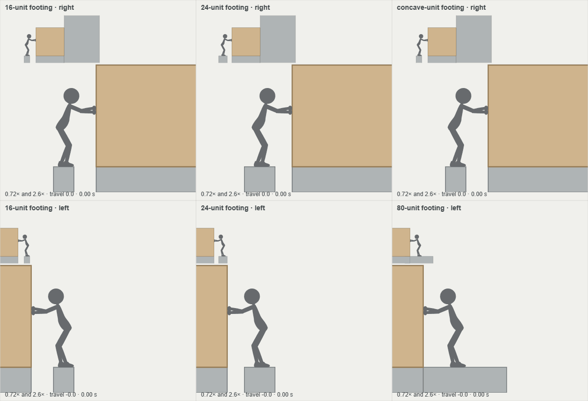

Logs: `.tmp/ujg-traversal-fixes/narrow-brace-unit.log`, `brace-capture.log`,
`brace-browser.log`, `brace-types.log`, `brace-lint.log` and `brace-build.log`.
Broader moving-push, slope/carrier and input-device acceptance remains open.
Authored levels and medal times are unchanged.

## Sixteenth implementation pass: retain the settled daylight background

October 8, 2026. The #60 investigation now retains the final terrain/backdrop
composition once a simple unlit daylight view has settled. The renderer copies
that immutable image, then replays its complete existing artwork and exposure
composition around the current foreground bounds. This preserves foreground
occlusion, material edges, exit opening/fading, and recovery/sliding artwork.
Worlds with lamps, changing mechanisms, other ambient artwork, climbables or
active foot thrust retain the complete original composition. Moving views use
the ordinary path until they settle.

The image occupies the existing unused correction surface while the immutable
readable/ambient corrections live in lamp/field storage. No additional surface
is allocated. Keys include view, size, structural identity and font readiness;
release clears the retained image. Inherited translucent drawing keeps the
ordinary path. Scratch sizing and its material tiles are prepared on the cold
frame, preserving the existing zero warm-resize assertion. A comparison flag
disables only background retention to measure it against the preceding cache.

All eleven affected development rendering checks pass. Warm moving-artwork
frames witness thirteen retained backgrounds with zero differing RGBA channels.
A new thirty-frame comparison covers wall text, rotated props and recovery
indicators, exit fading, camera/size changes, day/night, powered lamps and
release/rebuild. It also verifies inherited-alpha fallback and subsequent
opaque reuse. Every comparison preserves the full image and read-only player;
the existing surface budget remains unchanged. All 39 affected lighting tests,
types, changed-file lint and isolated build pass.

A paired native Canvas comparison of 145 steady frames measures 3335.7 ms
(24.7 ms median) with the preceding cache and 1586.2 ms (11.1 ms median) with
background retention, approximately 52% less time. Both sides resolve deferred
work equally; frequent pixel reads can affect Canvas backing, so this is a
local renderer measurement rather than gameplay FPS. The live production probe,
including the original head-drawing observer, retains all 125 frames at 2× CPU
throttling and witnesses all three caches. That two-second input sample takes
8.609 wall seconds, versus 12.875 with the preceding implementation.

All nine original production cases pass with the repository's two-worker
settings in 1.1 minutes. The two squeeze cases take 13.5 and 15.3 seconds.
At 2× CPU throttling, seven of nine pass: both pinned-ball approaches take
31.6/31.0 seconds within their original 60-second limits, and rope departures
take 29.4/28.6 seconds within 30 seconds. Both squeeze cases still exceed their
30-second limits. The normal trace stops during its diagnostic read; the
reversed trace stops during the second two-second held advance. No movement
assertion establishes a failure there;
the deadline cancels the remaining observation. **#60 remains open.** The
unchanged original controls, durations, frame cadence, assertions and deadlines
are retained throughout these runs.

Logs: `.tmp/ujg-traversal-fixes/background-all-browser.log`,
`background-alpha-browser.log`, `background-unit.log`, `background-types.log`,
`background-lint.log`, `background-build.log`, `background-paired.log`,
`background-live-slow.log`, `background-browser-gaps-project.log`,
`background-browser-gaps-slow.log` and `background-gap-traces-slow.jsonl`.

## Seventeenth implementation pass: prove passive wait scheduling

October 8, 2026. Passive settling now uses an aligned 48 ms helper where no
rendered transition is asserted. It first reaches the next native 16 ms RAF
boundary and uses native pacing for a partial remainder. Blind off-frame
batching can exceed UJG's 50 ms cap, and batching a partial tail can add a
physics step. Held inputs, short entry/exit checks, both squeeze two-second
holds, screenshots, assertions and original deadlines retain their cadence.
The shared fixtures preserve the original geometry and prop-order reversal.

All three permanent production scheduling comparisons pass in 115.4 seconds.
For each squeeze order, all five 240-sample diagnostic windows match exactly,
including times, input, root motion, contact state and local joints. Both held
animations retain all 125 drawn frames with identical timestamps and root/head
positions within 0.000001 units. The rope comparison collects every completed
fixed step, including samples outside the two-second diagnostic ring: all 606
samples match for each of jump and let-go through settling, climbing and
native-cadence departure. The longer deadlines belong only to these new paired
comparisons; the original cases' limits remain unchanged. Changed-file lint
passes. No production movement, artwork, authored level or medal is changed.

The first slower-CPU run with only squeeze passive waits passes eight of nine;
the normal/reversed squeeze cases take 29.7/29.5 seconds within 30. The rope
jump still reaches its limit; its trace attributes 18.469 seconds to the neutral
3.5-second wait and stops during a final diagnostic read. Applying the separately
proved rope wait reduces its following slower-CPU jump/let-go checks to
22.1/21.3 seconds. However, the first full repetition again times out both
squeeze cases at 30.8/31.0 seconds. Pacing equivalence is established; slower
performance still needs work. **#60 remains open.**

The two-worker production run completes the movement assertions in all nine
cases, but the right-bank water test then spends 90 seconds closing its custom
persistent Chromium context. Its last screenshot and every game assertion had
completed. The trace points to `helpers/folderTest.mjs:12`, rather than a failed
water movement outcome. This fixture creates a filesystem-handle profile for
all tests in the water file although only its authoring/save/reopen test needs
one. Preparation, active runtime and cleanup remain separate acceptance gaps.

Evidence: `.tmp/ujg-traversal-fixes/passive-clock-final.json`,
`passive-clock-permanent-results/`, `passive-lint.log`,
`passive-browser-gaps-slow.log`, `passive-gap-traces-slow.jsonl`,
`passive-browser-gaps-project.log`, `passive-gap-traces-project.jsonl` and
`passive-repeat-slow.log`. The completed repeat run passes 15 of 18 cases in
7.9 minutes. Its failures are the first normal squeeze and both reversed
squeezes; the second normal squeeze completes at approximately its 30-second
limit. All four water checks complete, including cleanup, in this serial slow
run. These are retained diagnostics, not a passing repeatability result.

## Eighteenth implementation pass: solve the athlete once per drawing

October 8, 2026. A synchronous render now shares one lazily solved athlete rig
between skin, shadows and emissions. The scope ends after that drawing, including
exceptions, so physics, diagnostic samples and the following frame still obtain
fresh poses. Nested drawing retains the outer snapshot. Inverted drawing shares
the normalized rig and restores the original player state. The comparison option
disables only this reuse; no physical or artistic pose is changed.

All 59 affected Node checks, types, changed-file lint and the isolated build pass.
All thirteen development rendering checks pass. The new Canvas and GPU comparisons
each compare eighty complete images across pressured gaps, blocked low/tall pushes
in both directions, crouching, inverted rope motion, water, flight and landing.
Daylight, night, lamps and full brightness retain zero differing RGBA channels,
with the player unchanged by drawing. The existing pixel checks now wait for the
actual game/lab UI before evaluating imported modules. Earlier preparation errors
destroyed their execution contexts during navigation; they were not image failures.
The successful run used a separately cached development server without a concurrent
production build.

A paired 145-frame native Canvas measurement takes 1533.8 ms (10.8 ms median)
without rig reuse and 1141.3 ms (8.1 ms median) with it, approximately 25.6% less
time. Both sides use settled daylight retention and resolve deferred work equally.
Frequent pixel reads can change Canvas backing, so this is a local drawing-cost
comparison. The production two-second squeeze sample at 2× CPU throttling retains
all 125 drawn frames and all three background/correction cache witnesses in
6.482 wall seconds, compared with the preceding 8.609 seconds.

The first full two-worker production run passes sixteen of seventeen checks.
All nine original traversal cases pass, including the squeeze cases at 26.5/26.0
seconds within their unchanged 30-second deadlines. The additional long water
test reaches its original 90-second deadline during its final state read, after
its intermediate movement/artwork assertions and screenshots. This run alone
does not establish repeatability or complete #60. Water gameplay is being checked
with the same Chromium launch variant as its original persistent fixture; only
authoring/save/reopen requires filesystem-handle profile restoration.

Evidence: `.tmp/ujg-traversal-fixes/render-pose-unit.log`,
`render-pose-ready-pixels.log`, `render-pose-ready-pixel-results/`,
`render-pose-final-lint.log`, `render-pose-build.log`,
`renderer-pose-paired.json`, `render-pose-live-slow.log`,
`render-pose-browser-full.log` and `render-pose-browser-full-channel.log`.
**#60 remains open** pending the normal and slower repeated browser runs.

### Follow-up: preparation and water fixture boundaries

The fresh normal run completes fifteen of seventeen cases. All nine water
gameplay checks pass with ordinary isolated contexts and the same `chromium`
launch variant as before. Its normal squeeze case spends 10.425 seconds in
fixture setup and 14.306 seconds waiting for the selected level card; the
deadline then interrupts a held-animation read. The reversed squeeze's two
native held advances take 5.214/4.462 seconds. These observations distinguish
preparation delay from an established movement failure.

The water authoring check retains the persistent filesystem-handle profile.
Its first save attempt fails the existing write-count poll while the editor
displays a lighting-preparation timeout. The fixture now waits for the actual
preview readiness after opening the file and before saving, as the other editor
checks do. Both fresh authoring repeats pass in 22.7/22.6 seconds, including
cleanup, without changing the save assertions or deadlines. The preceding
seventeen-case run required ending its verified stalled worker after every
case had finished and its browser had exited; it is retained as a failed run,
not a passing repeatability result.

Only authoring now uses the custom persistent context. Gameplay retains the
original Chromium variant, controls, simulation cadence, measurements and
limits. Evidence: `render-pose-browser-full-channel.log`,
`render-pose-browser-full-channel-traces.jsonl`,
`water-authoring-readiness.log`, `water-authoring-readiness-results/` and
`water-rest-lint.log` under `.tmp/ujg-traversal-fixes/`.

### Follow-up: first-frame rest across prepared supports

Two new permanent checks cover fresh and restarted ready frames on a 16-unit
ledge, both slope directions, a prepared crate, a ball and a carrier. Each
queries the final support geometry, verifies real planted ankles and distinct
relaxed arms, then waits ten simulated seconds without starting clocks or
changing the serialized world. Unsupported starts above each fixture remain
airborne without borrowed standing contacts. Both checks and changed-file lint
pass. This closes additional first-frame coverage gaps for #50; broader rest
contexts and ordinary-scale visual acceptance remain explicit.

## Nineteenth implementation pass: reuse validated contact outlines

October 8, 2026. Read-only terrain, foot, ledge and athlete queries now share
the existing validated world outline. In-place position, dimensions, polygon
and profile edits still invalidate that outline. The public authoring helper
continues to return independent editable arrays; collision decomposition no
longer reconstructs the same outline immediately after validating it.

Two permanent checks cover six shape classes in both mirror directions,
in-place edits, outline replacement and independence of authoring arrays.
Sixteen simulation scenarios retain all 9,600 complete fixed-step states
exactly, including contacts, footwork, joints, moving props and clocks. The
baseline and current capture files have identical SHA256 hashes. A native
paired comparison retains zero differing channels in six complete images.
Its 145 measured simulation/drawing frames take 2653.7 ms before and 2532.4 ms
after, approximately 4.6% less time; medians are 15.9/15.6 ms. This is modest
local timing evidence, with equal pixel reads on both sides, not an FPS claim.

The full UJG Node run passes 1,410 of 1,412 checks in 199.7 seconds. Both
failures occur while creating file symlinks in Windows security-test fixtures
(`EPERM`), before their symlink assertions. All movement and recorded route
checks pass. Types, changed-file lint and the isolated production build pass.
All thirteen development rendering comparisons pass in 1.4 minutes. The final
two-worker production repetition completes all eighteen original cases in
2.0 minutes. Normal/reversed squeeze times are 10.9/11.1 and 11.2/11.3 seconds
within the unchanged 30-second limits. The separate serial 2× CPU repetition
passes all eighteen in 6.4 minutes, with squeeze times of 23.1/27.4 and 25.5/23.0
seconds. Every trace in both final repetitions confirms the newly built
`UntitledJumpingGame-2mU9ehsq.js` bundle. The preceding normal run also passed
eighteen checks, but its first three loaded the preceding bundle because it
started before the build finished. It is retained as mixed-build diagnostics
and is not used for final fresh-build acceptance.

This completes #60's nine-case acceptance. The three mantle cases' main runtime
cost was full viewport composition and repeated contact/rig work. Rope failures
also included the proved passive-wait scheduling cost. The two squeeze cases
retain both native two-second holds, all 125 drawn frames per hold, every
joint/root assertion and their original deadlines. Water's loading/preparation
and persistent-context teardown failures were separate from its successful
movement assertions; gameplay now uses ordinary contexts while authoring alone
retains the filesystem-handle profile. The full water authoring readiness
repetition is recorded in the preceding pass. No deadline, active input trace,
short-transition cadence or movement assertion was relaxed. These checks
establish repeatable execution, not artistic acceptance for the other issues.

Evidence under `.tmp/ujg-traversal-fixes/`: `outline-all-node.log`,
`outline-baseline.json`, `outline-current.json`, `outline-baseline.log`,
`outline-current.log`, `renderer-outline-paired.json`, `outline-paired.log`,
`outline-types.log`, `outline-final-lint.log`, `outline-build.log`,
`outline-repeat-normal.log`, `outline-repeat-normal-results/`,
`outline-final-pixels.log`, `outline-final-pixel-results/`,
`outline-final-normal.log`, `outline-final-normal-results/`,
`outline-repeat-slow.log`, `outline-repeat-slow-results/` and
`outline-build-witnesses.jsonl`.

## Twentieth implementation pass: lower-floor shoe contact

October 8, 2026. Reviewing the complete moving-prop interruption for #49
exposed a second, later defect: after stepping onto a rolling 30-unit ball,
the next swing could immediately plant on the floor below it. The new ankle
position then pulled the entire torso down in one tick. An airborne walking
shoe now carries its actual position through the existing 80 ms swing release
and stays unloaded until its sole reaches the current walkable surface.
Slipping faces retain their separate slide-entry handoff. The first prototype
incorrectly treated a 70° face as a walking landing and failed an existing
entry-continuity check; restricting walking landings to grippable surfaces
restores that complete suite.

The real moving-ball comparison lowers the largest later head step from
25.295 to 4.478 world units per 1/120-second tick, in both directions. All
1,440 physical frames across 30/80-unit crates and balls in both directions
retain exactly the same root, velocity, facing, gravity, input/jump state and
moving props. Two new permanent checks cover actual moving-object interruption,
collision-safe recovery, the later descending-shoe contact, fixed leg lengths,
real planted ankles, current geometry and immediate fresh jump response.
The landing check fails on the preceding footwork with the original body drop.

These native clips retain the same four encounters, input, framing and real-time
playback at 1× and 2.6×. The loop boundary restarts each encounter. At roughly
0.55 seconds in the small-ball encounter, the revised shoe remains in flight;
the body loads the floor only as the descending sole reaches it. This is a
more credible step down than the preceding immediate squat.

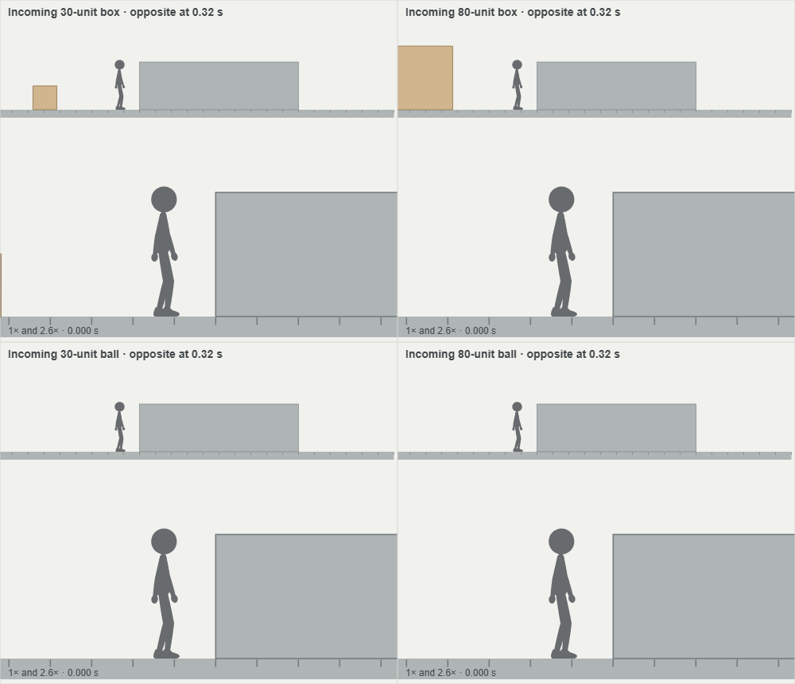

The earlier step-interruption head jumps still range from 9.565 to 14.901
units, and the short-crate incoming push still produces a later 12.480-unit
head change. **#49 remains open.** A separate step-exit prototype improved the
initial interruption but increased the subsequent short-crate contact to
19.880 units; it was removed despite passing its targeted assertions.
Further work must coordinate the outgoing step with reachable incoming
palms and the low working posture (#43/#48), preserving fixed bones, real
shoes and unchanged forces throughout the whole transition. This pass improves
lower-floor support transfer for #40/#56 without accepting their broader
animation matrices or the crowded stationary reversals described above.

The 71 affected Node checks pass. The full UJG selection passes 1,434 of
1,436 checks in 214.6 seconds, including all movement and recorded routes.
The two failures are Windows symlink-creation `EPERM` in the development-file
and publishing security fixtures. Types, changed-file lint and the isolated
production build pass. Authored levels and medal times remain unchanged.

All 43 affected production-browser checks pass in 3.4 minutes with ordinary
two-worker settings, including cleanup. They cover keyboard pushing/recontact,
turning, both tall-step cancellation inputs, moving recovery, narrow footing,
20/40-unit stairs, walking/fast/inverted steep slides, connected landings,
brief ball contacts and all nine original #60 cases. Normal/reversed squeeze
times are 19.1/19.8 seconds within unchanged 30-second limits. Every retained
trace confirms the new `UntitledJumpingGame-VgryFnw1.js` bundle.

Evidence under `.tmp/ujg-traversal-fixes/`: `lower-floor-grip-unit.log`,
`lower-floor-grip-all-node.log`, `lower-floor-baseline-unit.log`,
`lower-floor-grip-types.log`, `lower-floor-grip-lint.log`,
`lower-floor-grip-build.log`, `lower-floor-grip-pose.log`,
`lower-floor-physical-comparison.json`, `lower-floor-grip-capture.log`,
`lower-floor-grip-evidence.log`, `moving-ball-floor-contact-sheet.png` and
the rejected `step-exit-first.patch`, plus `lower-floor-browser.log`,
`lower-floor-browser-results/` and `lower-floor-build-witnesses.json`.

## Twenty-first diagnostic pass: preserve the whole pushing rig

October 8, 2026, following pushed commit `34a1d8b`. The crowded-push prototypes
remain outside the game source. Native review rejected two more approaches;
neither #48 nor #49 is complete. This pass adds the repeatable current-source
diagnostic `scripts/diagnose-jumping-contacts.mjs`, not an accepted animation fix.

Tracing the earlier small-ball palm failure established its cause. The two
`propPushHands` palms lie on the drawn analytic circle, while `clearLimb` checks
`handOutline` against `ballShape`'s circumscribed 64-sided collision polygon.
The back palm's samples did not hit an arm chord; one palm sample hit the narrow
polygon rim and moved the whole wrist by 0.064335 units. Removing hand padding
alone cannot resolve that difference. In an isolated candidate, checking only a
real loaded ball palm against its actual drawn circle restores the exact
1.6-unit contact offset while retaining rejection of genuine skin penetration.
Other nearby solids and the physical collision hull remain unchanged. This
requires an explicit visible-surface convention, not a larger contact tolerance.

That candidate passes all 108 affected checks, including the proposed sixteen
crowded reversals, but its interpolated waist/chest collapses. In the short,
crouched crate turn, the projected chest segment shrinks from 10.1 to **0.188**
units. Fixed arm/leg lengths and smooth head motion therefore do not establish
valid torso animation. Native frames show the body flattening below its head.

A subsequent candidate solves the turning pelvis and chest at their 6.5/10.1
lengths, retains the higher working hips and fits the incoming shoulders/palms.
Its revised 108-check selection passes with additional torso-length assertions.
However, complete native sequences still show abrupt shoulder motion: the small
standing ball case reaches **20.088 units per tick** despite its head remaining
below eight. The first deeper-hip variant also failed the existing leg-drive
assertion and was rejected before the higher-hip revision. Review the entire
silhouette and support transfer, not a single smoothed landmark.

The higher-hip revision also worsens the real moving short-crate contact at
tick 48: the preceding live head step is **12.480** units; the new working
posture produces **18.573**. Combining it with a retained interrupted-step
pose improves the whole larger-crate/ball sequences to maxima of 6.828, 4.478
and 6.666 units, but the short crate still jumps **17.363** units when its first
force contact begins. Both directions retain the same defect. An additional
later jump exposed contact ownership: a loaded incoming push must solve its
target in the mechanical incoming direction, rather than temporarily reflecting
that target according to the opposing root velocity. Correcting that target
does not resolve the earlier short-crate reach constraint.

In the rightward short-crate fixture, the retained outgoing head at tick 47 is
approximately `(583.803,588.359)` while the next incoming palms are near
`(564.976,628.311)` and `(565.118,625.311)`. Immediately fitting those much lower
palms to 10/9-unit arms and a proportionate neck forces a large body relocation.
The next repair must consider preparation during the returning step and the
actual incoming object's geometry, instead of waiting until the grounded shove
to start lowering the body. Preserve real shoes, unclipped skin and immediate
input/jump response. If a genuine body collision supplies the force, #43 already
allows showing that actual contact; do not invent a visible load unrelated to
the solver. Any unavoidable force-onset change needs its own explicit gameplay
contract and validation, as required by #43.

The native crowded comparisons contain all 365 states of each of eight
rightward encounters: settled brace, opposite hold, two-tick reversals, return
and release, at 1× and 2.6×. Both diagnostic posture variants preserve all
1,440 physical frames of the eight moving-step fixtures exactly. The higher-hip
variant also preserves all 2,920 physical frames of the native crowded matrix.
Comparisons include root, velocity, facing, gravity, crouch, jump/input state
and complete moving props. Equal physical traces do not excuse poorer art.

The committed diagnostic reproduces all 24 live cases, including the additional
35.152-unit head jump on a later short-crate reversal. All 24 fresh jumps depart;
maximum bone-length error is below `9e-15`, walking-ankle error is zero, and no
visible walking support lacks its real foot contact. The script and its lint
check pass. These measurements report the defects; they are not acceptance.
No production animation, authored level, medal time or browser check was changed
in this pass.

Local evidence under `.tmp/ujg-traversal-fixes/`: `posture-contact-trace.log`,
`posture-visible-ball-all.log`, `posture-fixed-spine-v3-all.log`,
`posture-fixed-spine-v3-analysis.jsonl`, `posture-fixed-spine-v3-*-native.json`,
`posture-fixed-spine-v3-*-frames/`, `posture-moving-step-detail.jsonl`,
`posture-fixed-spine-step-v2-moving.log`, `posture-physical-comparison.json`,
`contact-diagnostic-live.json` and `contact-diagnostic-lint.log`. Diagnostic
bundles apply their candidate transforms without editing the game source.

## Twenty-second implementation pass: prepare the returning step

October 8, 2026. A returning tall step now anticipates an exposed approaching
prop while its physical root retraces the existing collision-safe path. The
query uses the prop's actual palms and the first opposing body-sweep contact.
An intervening solid rejects it. This preparation supplies neither force nor
foot support. The body lowers and turns through an unloaded reach before the
incoming low shove needs its palms, instead of waiting until force onset.

Both interruption owners retain the actual outgoing step rig: prop transport
captures it before clearing the step, and the final player sweep uses a lazy
snapshot from the preceding tick. A loaded incoming push fits the torso to
reachable wrists, reconstructs the pelvis/chest at their 6.5/10.1 lengths, and
keeps the mechanical incoming direction, actual palms and walking ankles.
Returning torso pitches interpolate as angles so opposing chest positions
cannot collapse the body. Preparation palms reflect with gravity and are
copied independently in the outgoing snapshot; pose queries remain read-only.

The complete eight-case moving-prop matrix now has maximum head steps of
5.451–7.494 world units per 1/120-second tick, versus 12.480–14.901 before this
pass. Maximum shoulder steps are 5.659–7.023, versus 11.887–14.229. The normal
30-unit crate sequence improves from 12.480 to 6.904; its reflected sequence
improves from 12.485 to 6.825. No tracked joint's complete-sequence maximum
increases by more than one unit. The pelvis/chest remain proportionate, maximum
neck length is 8.340, bone error is below `9e-15`, walking-ankle error is zero
and force-palm error is below `2e-13`. These are regression measurements, not
standalone proof of natural animation.

Reviewing skin exposed two additional defects. A fading contact rotated an
unloaded palm into a tumbling crate; free hands now clear their actual outline
after that blend. An established flat ledge grip placed the 1.6-unit palm
half-height only 1.3 units above the top. Its center now sits 1.6 units above
the surface. Loaded grips retain their exact positions; only initial unloaded
step reaches use free-limb clearance. The first general-clearance prototype
detached loaded lip grips and was rejected. A prototype that also raised the
wrist broke initial ledge reach and was likewise removed.

These current-source native clips retain all four encounters, input, framing,
1×/2.6× scale and real-time playback. The loop boundary resets each encounter.
The short-crate return now lowers into its working brace before the incoming
contact. The small-ball case retains the preceding pass's unloaded step down
to the lower floor. The later large-crate arm acquisition is still abrupt.

**#49 remains open with #43/#48.** In the rightward 80-unit crate sequence,
ticks 65–69 remain airborne with no pushing preparation. At tick 70, ground
contact and the first loaded palms appear together; the back wrist changes
about 22.167 units. The reflected case reaches 21.674 at tick 72. These later
arm maxima already existed and are not worsened by this pass, but they still
read as abrupt contact acquisition. `anticipatePush` currently rejects an
airborne player and gaps at or below 38, so the free rig has no preceding reach
at this close falling contact. Investigate that presentation/contact handoff
using the same complete trace, preserving first-force palms, genuine support,
skin clearance, fixed bones and unchanged forces. Do not accept an improved
head trace as completion of the whole silhouette. The crowded stationary
reversals in #48 retain their separate live defect.

Three new permanent regressions cover the eight normal moving encounters with
full head/proportion/bone/palm/hand-skin checks, actual walking ankle ownership,
real interruption and fresh jumps. Eight additional reversed encounters check
head continuity, actual preparation/interruption, gravity reflection/read-only
queries and fresh jumps. The wall test rejects preparation through an
intervening solid without changing player or prop physics. The 187 affected
candidate checks pass. The full current UJG selection passes 1,437 of 1,439
checks across the main suite and `jumping-*.test.mjs`; the two failures are the
previously recorded Windows symlink-creation `EPERM` security fixtures. All
movement and recorded-route checks pass. Types, changed-file lint, diff checks
and the isolated production build pass. Authored levels and medals are unchanged.

All 43 affected production-browser checks pass in 2.7 minutes with ordinary
two-worker settings and their original inputs, assertions and deadlines,
including all nine original #60 cases and cleanup. The two squeeze checks take
14.0/14.1 seconds within their unchanged 30-second limits. Every retained trace
confirms `UntitledJumpingGame-DZgncrZq.js`. All 1,440 current-source moving-prop
physical frames and 720 native-capture frames match their respective baselines
exactly, including root, velocity, facing, gravity, crouch, jump/input state and
complete props. Recorded routes and simulated reversed encounters do not
complete collection-wide enjoyment or physical-device acceptance.

Evidence under `.tmp/ujg-traversal-fixes/`: `return-live-all-node.log`,
`return-live-main-node.log`, `return-live-new-tests.log`, `return-live-types.log`,
`return-live-lint.log`, `return-live-build.log`, `return-live-browser.log`,
`return-live-browser-results/`, `return-live-build-witnesses.json`,
`return-live-contact-diagnostic.json`, `return-live-physical-comparison.json`,
`return-live-native-physical-comparison.json`, `return-live-native.json`,
`return-live-frames/` and `return-preparation-joint-comparison.json`.

## Twenty-third implementation pass: finish the incoming reach

October 8, 2026, following pushed commit `1dc31ec`. A close descending approach
can now prepare an exposed prop before the first grounded shove. Preparation
retains zero effort/load and never supplies force or support. Rising/active and
fresh jumps, water, grips and recovery retain their existing owners. Ordinary
free reaches cannot replace an existing slide/brace balance. An interrupted
step already retains its outgoing rig and coordinates its incoming hands through
that transfer. The full crowded bot/box/ball regression caught a 3.276-unit torso
hop when this distinction was absent; it passes with the original three-unit
limit after the ownership correction.

Returning preparation begins at the preceding gentle rate, then finishes its
reach more quickly as the body approaches the floor. A uniformly faster blend
was rejected because it worsened the initial head turn to 8.068–11.535 units.
The accepted easing keeps the original eight-unit head reference. A loaded
handoff uses the actual incoming contact direction: in the inverted short-crate
encounter, that contact can arrive one tick before the canceled climb relinquishes
mechanical facing. The former facing-based target left the force palms detached.

Palm fitting also retains reachable real planted ankles. The first falling-reach
candidate passed the arm checks but lifted a planted large-ball shoe by 0.172
units after the torso adjustment; the retained solver fits both constraints.
Final blended wall palms clear their actual skin without adding padding to a
flush loaded wall. Expanding the inverted matrix found the preceding 0.098-unit
wall-palm graze. Checking both shoes also found the small-crate handoff's unloaded
trailing shoe cutting 0.381–1.450 units into the floor/ceiling. That shoe now clears
its final outline during the grounded handoff while planted ankles remain fixed.
All sixteen normal/reversed encounters retain clear sampled hand and shoe skin.

The first falling-reach prototype reduced first-force wrist travel but moved the
large-crate snap to the preceding unloaded frame: 27.294/27.501 units at tick 69.
It was rejected after reviewing the complete native sequence. The turn had
finished while the return was still airborne, discarding its incoming reach
owner through the remaining one-tick slips. Retaining that preparation until
actual footing or release removes the arm drop and reacquisition. The permanent
normal/reversed regressions now bound every wrist frame, including unloaded
preparation, rather than checking only the first force-bearing sample.

An ordinary walking descent beside a ball exposed a related handoff: a free
incoming reach disappeared when the brief slide balance took over. The existing
production test failed its unchanged four-unit joint limit. Slide entry now
captures that actual outgoing reach lazily and transfers the whole rig. The
new simulation regression covers running and walking from the complete approach
through slide entry/release and the lower landing. Maximum entry changes fall
from 18.396 units running and 17.768 units walking to 1.272/1.287 units. The motor,
prop forces and slide balance remain unchanged.

The matched clips below preserve all four complete normal encounters, input,
framing, 1×/2.6× scale and real-time playback. The preceding capture uses
`1dc31ec`. The loop boundary resets each encounter. The reach now precedes the
incoming shove, including the larger tumbling crate's later contact. The native
reverse-field matrix also retains all eight encounters and their later release.
These findings address the reported acquisition defects; the opposed stationary
brace/repeated-turn defect in #48 remains a separate outstanding review.

Across the complete sixteen-case return matrix, first-force wrist maxima are
4.063–4.799 units for normal crates, 2.912 for the large normal ball, 4.115–7.923
for reversed crates and 3.994 for the large reversed ball. The small balls use
actual curved support and have no force-bearing pushing episode. Normal large
crates now have maximum whole-sequence wrist changes of 5.479/5.563 units,
compared with the preceding 21.674/22.167-unit contact snaps. All sixteen
whole-sequence wrist maxima stay below ten units; head maxima remain below eight,
with the largest at 7.494. Loaded torso segments retain their 6.5/10.1-unit
lengths; maximum neck length is 8.721, limb-length error is below 1e-13, planted
ankle error is zero, and force-palm error is below 1e-12. These are regression
bounds, alongside the complete matched native review, not general thresholds
for accepting natural animation.

All 2,880 normal/reversed simulation physical frames match `1dc31ec` exactly,
including root, velocity, facing, gravity/crouch/jump state and complete props.
All 2,160 native-browser physical frames match their respective same-browser
baselines; comparing Node and Chromium floating-point traces is not used as
proof. The four real crowded bot/box/ball scenes retain 2,640 identical physical
frames and their original torso-continuity limit. Both hand and shoe sampled
skin matrices have no penetration above 0.02 units.

The complete current UJG run passes 1,439 of 1,441 checks. The two failures remain
Windows symlink-creation `EPERM` fixtures, before their security assertions; every
movement and recorded-route check passes. Types, changed-file lint and the
isolated production build pass. Built-in and local authored levels and medal
times are unchanged. The individual/combined cancellation matrix also adds
progress 0 and 0.8 alongside 0.1/0.45/0.97, preserving its geometry-based
commitment assertions.

The earlier browser run reproduced the ball-slip pose discontinuity, which is
fixed above. Its following run passed that check but had one 40-unit-stair
startup failure: the game remained in its loading dialog before the first level
card and any traversal input. Neither test's original deadline, input or
assertion was changed. Final-source browser evidence is recorded below.

All 43 final production-browser checks pass in 2.5 minutes with their ordinary
two-worker settings and original inputs, assertions and deadlines. Every retained
trace confirms `UntitledJumpingGame-lP3MOaI6.js`, including all nine original #60
cases. Both squeeze checks retain their original 30-second deadlines. The final
run's complete ball descent passes with the four-unit joint limit unchanged.

Local evidence under `.tmp/ujg-traversal-fixes/`: `air-retained-all-node.log`,
`air-retained-focused.log`, `air-retained-types.log`, `air-retained-lint.log`,
`air-retained-build.log`, `air-retained-browser.log`,
`air-retained-browser-results/`, `air-retained-build-witnesses.json`,
`air-live-comparison.json`, `air-retained-comparison.log`,
`air-live-native-physical-comparison.json`, `air-live-native.json`,
`air-live-inverted-native.json`, `air-retained-evidence.log`,
`air-retained-contact-diagnostic.json`, `air-retained-shoes.log` and
`air-retained-inverted.log`. Baseline/native captures remain distinct. The earlier
`air-live-browser-results/` and `air-final-browser-results/` retain the failed
intermediate runs; the current matched clips were refreshed after the final
reach-ownership correction. #48 still reproduces its separate 35.152-unit
crowded repeated-reversal head jump.

**#43 and #49 remain open pending their complete acceptance audit.** The known
returning-step acquisition is corrected; that does not establish the broader
crowded pushing/reversal contract in #48 or all movement contexts. Review actual
whole-body skin, support and full normal-speed transitions against the original
issue checklist before closing, and retain the recorded failure/prototype
evidence. Hardware feel, camera adequacy and collection-wide current-control
enjoyment remain separate outstanding work.

## Whole-outline acceptance audit: remaining arm and heel intersections

October 8, 2026, against `31bb697`. The previous hand-outline and sole-sample
checks pass, but inspecting the shared drawn contours exposes three remaining
clearance cases in the sixteen normal/reversed moving-step encounters. These
findings keep #43 and #49 open. They are separate from #48's much larger crowded
reversal discontinuity.

Reproduce with `movingStepPropFixture(side,kind,size)` from
`tests/helpers/jumpingStepProps.mjs`, for both sides, boxes/balls of size 30/80,
and both gravity frames. Set the prop's initial VX to `side * 480`, then advance
180 ordinary `stepRun` ticks with movement `side` for ticks 0–37, `-side` for
38–149, and neutral thereafter. For the reversed matrix, use the same ceiling
fixture as `tests/jumping-step-return-gravity.test.mjs`: spawn Y 100, ceiling
height 100, prop Y `100 + size`, and the always-on reverse field. Record the
actual `traceAthlete` contours against each solved terrain/prop shape; loaded
ball artwork uses its visible circle. Separate heel and toe contours when
identifying parts: treating them as one contour mislabels later arms as torso.
The initial diagnostic made that labeling mistake; the corrected findings below
identify no torso or head overlap in this fixture.

1. **Foreground forearm at the tall-step corner.** All sixteen encounters
   show up to 0.280153 units of forearm intersection with the step. The normal
   witness is tick 33, with step time 0.066667 / duration 0.34 (progress 0.196).
   At side +1, the root is `(579.061971,643.145134)`, the step begins at
   `(600,590)`, and the offending contour point is `(600.280153,590.306736)`.
   This is the established ledge arm just after the `< 0.18` free-reach
   clearance branch in `prepareReturningStepPose`, before the cancellation
   input. The mirrored witness is tick 34. Correct the ledge wrist/forearm
   geometry or use a constrained final solve that retains its lip palm; do not
   extend a free-arm retraction over a loaded grip or shift the physical root.
   Review acquisition and release at the branch boundary to avoid substituting
   another discontinuity.
2. **Loaded rear forearm against the rotating large crate.** In reversed
   gravity, tick 59 intersects the 80-unit crate by 1.295444 units on side -1
   and 0.759580 on side +1. The side -1 witness also has 0.041220 upper-arm and
   0.045309 elbow overlap. It is grounded, with a real planted front foot and
   force-bearing palms, and has no mantle, slide or dry-turn owner. The
   rear wrist and palm are already correctly fitted to the crate's current
   face; the elbow bend projects through its moving corner. Search feasible
   three-dimensional elbow bends while holding both wrist and loaded palm
   fixed. Use the actual polygon and visible ball circle consistently, and
   retain bone lengths, torso proportions and real planted ankles.
3. **Planted heel on the small ball.** Normal side ±1 has a 0.056858-unit rear
   heel intersection at tick 59; reversed side ±1 has a 0.105808-unit front
   heel intersection at tick 61. These are actual planted feet. The current
   `FOOT_CONTACT` samples miss material between the straight sole's endpoints
   over the convex crown. The drawn quadratic from `(-2.4,0.4)` through `(-3,2.5)` to
   `(-1.8,2.8)` includes `(-2.2875,2.5375)` at t=0.75, which is absent from
   those samples too, but adding that point alone does not fix the measured
   intersection. Fit support to the complete heel/sole geometry in footwork;
   the renderer must continue to use the resulting real ankle. Do not clear
   the artwork by lifting a planted ankle away from its contact owner.

An experimental unconditional `clearLimb` call removed the rotating-crate
overlap by folding the elbow through depth, but retracted a loaded palm in the
reversed side -1 80-unit ball at tick 56. Using the visible ball circle for
the arm capsule checks as well did not resolve that contact regression.
Both variants were rejected; neither is in the retained implementation.
The original exact force-palm assertion remains unchanged. After restoring
`31bb697` source, all 33 focused return, contact and presentation tests pass.

Acceptance must check the full shared arm and shoe curves throughout all
2,880 ticks, including the loaded frames and the 0.18 acquisition boundary,
with no visible penetration above 0.02 units. The exploratory shadow outlines
are flattened at 0.2 units, so use a more accurate curve sampler for permanent
clearance coverage. Retain whole-transition wrist/head continuity, exact
force-bearing palms, fixed three-dimensional bones, real planted ankles,
read-only rendering and identical physical root/prop traces. Review matched
real-time footage at gameplay scale and enlarged scale. Pause/resume and
restart during an actual returning step also remain part of #49 acceptance.

Local evidence: `.tmp/ujg-traversal-fixes/audit-return-outlines.mjs`,
`return-outline-restored-audit.log`, `return-outline-audit.json`,
`return-outline-frame33.json`, `return-outline-frame59.json`,
`return-outline-arm-tests.log`, `return-outline-circle-tests.log`,
`return-outline-restored-tests.log` and
`return-outline-rejected-arm-clearance.patch`. The corrected baseline has
4–16 intersecting frames per encounter. The larger crate case is a visible
elbow/forearm defect; the sub-unit heel and ledge cases need precise contact
repair without compromising the supported motion already established.

## Returning-step acceptance complete

October 8, 2026. The remaining returning-step contact fixes are implemented on
`codex/ujg-traversal-fixes`. This completes #49's original acceptance; #43 retains
its wider pushing-contact review, and #48 retains the separate crowded reversal.
The user's direction is to prioritise visible, consequential defects and finish
verified items instead of pursuing unlimited polish.

Loaded prop arms now search an elbow bend with the wrist and palm held fixed.
The candidate uses the real crate polygon or visible ball circle. An unavailable
bend retains the loaded contact instead of retracting the palm. The ledge wrist
tucks above the corner only within its available reach; the palm stays on the
lip. Free initial reaches retain their own clearance before that grip is loaded.

The earlier heel diagnosis was incomplete: a straight sole can cross a convex
ball crown while both endpoints remain clear. Footwork now samples that material
at intervals no greater than half a unit, along with the missing curved-heel
sample. The renderer retains the resulting real ankle. Foot clearance resolves
the deepest overlap rather than spending its pass budget on successive shallow
samples. A coupled 55-degree slope regression required budgeting the final
cleared slide-entry/turn rig; slowed turns also slow their added depth bend.
The original five-unit joint limit, fixed bones, skin and control assertions
remain unchanged.

The new permanent `tests/jumping-return-skin.test.mjs` checks the complete drawn
arm, shoe, torso, neck and head contours through all 2,880 real moving-prop frames:
both directions, 30/80-unit boxes/balls, normal and reversed gravity. Its adaptive
curve tolerance is 0.0025 units; every contour clears the unchanged 0.02-unit
penetration limit. The preceding source fails this test at the initial rear-palm
acquisition. Existing tests retain exact force palms, actual planted ankles,
fixed three-dimensional bones, torso proportions and whole-sequence head/wrist
continuity. All 2,880 matched native-browser frames preserve the complete
physical player and prop traces exactly. The reversed large-crate rear-elbow
maximum improves from 10.105 to 7.292 units on side -1; no joint's whole-sequence
maximum worsens by more than 0.308 units.

The matched [before](images/jumping-return-skin-before.gif) and
[current](images/jumping-return-skin-current.gif) clips use identical inputs,
framing and real-time playback at 1x and 2.6x. Review of acquisition, return,
incoming crate contact, ball support/departure and grounded recovery shows the
established motion intact. The crate elbow now stays outside its corner and
the lip forearm remains above the edge. The sole adjustment is subtle at normal
scale and removes the enlarged-view intersection without introducing a new gait.
The small-ball character eventually walks out of this fixed framing; subsequent
simulation continuity/support is checked by the complete traces and regressions.

The full UJG selection passes 1,440/1,442 tests; the two failures are existing
Windows symlink-creation EPERM fixtures, before their security assertions. All
movement and recorded routes pass. Types, changed-file lint, diff checks and the
isolated production build pass. All 45 affected browser cases complete with
original controls, assertions and deadlines: the first two-worker run passes 44
and stops one water case in **Loading game**, before any traversal. Rerunning
only the two original water-bank cases with ordinary two-worker settings passes
both in 18.4 seconds. The loading failure and its trace are retained. Successful
traces load `UntitledJumpingGame-8AG2_cCJ.js`.

New ordinary-keyboard tests pause an actual returning 60-unit step with a queued
jump, then resume or restart. Both clear held/queued input, reach ordinary support,
and accept one fresh jump; restart restores the initial rig. Existing step tests
cover individual opposite/detach/drop/descend and combined cancellation at
0/0.1/0.45/0.8/0.97 progress, geometry-based commitment, blocked return,
20/40/60/61-unit distinctions, narrow treads and buffered jumps. Together with
the moving/inverted skin, support and visual evidence, these satisfy #49.

Local evidence is under `.tmp/ujg-traversal-fixes/`: `return-skin-accepted-all-node.log`,
`return-skin-slide-turn-tests.log`, `return-skin-native-comparison.json`, native
frames/contact sheets/filmstrips, `return-skin-browser.log`,
`return-skin-water-browser.log`, and their retained traces. Authored levels,
local collections and medal thresholds are unchanged.

## Crowded dry-turn acceptance complete

October 8, 2026. This completes #48's dry-turn repair, including the separately
reproduced stationary opposing braces. A real outgoing push now qualifies for
the turn snapshot even without walking velocity. Its whole preceding rig
releases and reaches toward the incoming blocked face instead of mirroring
across the gap. Pelvis, chest and neck angles transfer through a proportionate
trunk; arms keep their fixed lengths. Final clearance is included in the
five-unit-per-STEP three-dimensional joint budget, so a tall crate cannot hide
an elbow jump behind an otherwise smooth head trace.

**Deliberate blocked-contact presentation contract.** Earlier diagnostics
required every mechanical pressure tick to have both incoming palms already
fixed, even when switching instantly across a 51-unit gap between stationary
objects. With fixed arms and the outgoing torso, that forced the rejected
shoulder/head relocation. The accepted stationary transfer instead shows an
unloaded release/reach while the motor selects the new pressure immediately.
It is permitted only below one unit/second of prop speed. It does not claim
that mechanical pressure vanishes during that reach. Moving-object contacts,
returning-step handoffs, and the completed blocked brace retain their exact
incoming palms. Existing first-force palm assertions for moving encounters
remain unchanged. This distinction is explicit in the physics document,
debug signal and diagnostic report; it is not a hidden relaxation of those
moving-contact checks.

The new permanent opposed-brace regression runs 5,824 ordinary ticks across
both directions, boxes/balls of sizes 30/80, and standing/crouched input. It
includes the first reversal, two-tick repeated reversals, full release and a
fresh jump. Every body/limb joint stays within five world units including
depth, all limb lengths remain fixed, real planted ankle and shoe-material
ownership are retained, and pelvis/chest proportions do not collapse. The
renderer's complete drawn skin stays outside current solids within the
existing 0.02-unit tolerance. During the visual reach, each blocked object's
translation remains below 0.02 units/tick; established brace palms are exact.
The same test fails the preceding `a39eb37` on the very first reversal.

Matched native Chrome captures retain all 2,920 player and full prop physical
frames exactly against `a39eb37`. Across the eight filmed standing/crouched
box/ball scenes, whole-sequence head maxima fall from 13.158–35.152 units to
1.742–3.024. Maximum joint travel including depth is below five units. Maximum
prop translation during a reaching tick is 0.001020 units. These measurements
support the reviewed whole-body action; they do not substitute for its visual
judgment. The release, supported turn, incoming brace and settled rest were
reviewed at 1x and 2.6x, with matched geometry, inputs and real-time playback.
The original running/walking/partial-input, slope, inverted, ledge and airborne
turn checks and matched dry-turn clips remain part of #48's evidence.

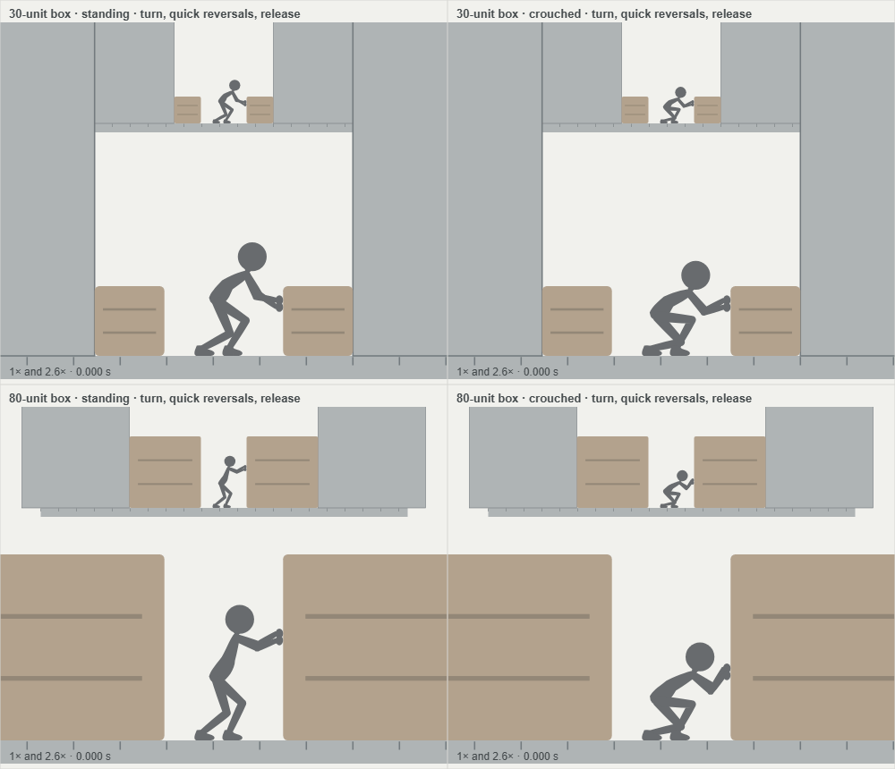

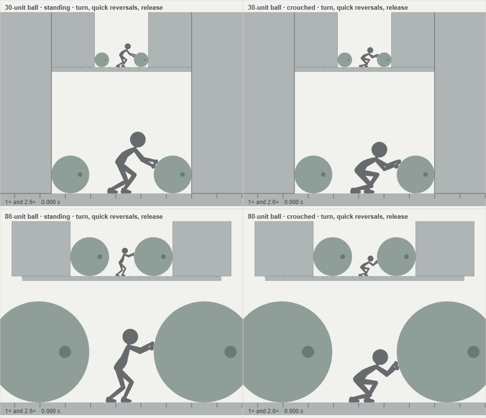

The complete UJG suite passes 1,441/1,443 checks. Its two failures are the existing
Windows symlink-creation EPERM fixtures, before their security assertions;
all movement and recorded routes pass. Types, changed-file lint and the isolated
production build pass. A new normal-keyboard browser case exercises the actual
crowded reversal, brief reversals, incoming palms, release and immediate fresh
jump. Final production-browser results are recorded below.

Local evidence under `.tmp/ujg-traversal-fixes/`: `crowd-reaching-regression.log`,
`crowd-reaching-baseline-failure.log`, `crowd-reaching-all-node.log`,
`crowd-reaching-native-comparison.json`, complete before/current native states,
real-time clips and phase sheets, `crowd-reaching-final-types.log`,
`crowd-reaching-final-lint.log`, `crowd-reaching-build.log` and
`crowd-reaching-browser.log`. Built-in/local levels and medal thresholds are
preserved. #43's wider onset review, the remaining issue-specific acceptance,
real-device feel and collection-wide route enjoyment retain their own scope;
#48 is not a claim of universal animation perfection.

Final production-browser acceptance: 45/46 pass the ordinary two-worker run;
the left water-bank case stops at the initial level-card wait before traversal
and its error context shows the loading screen. Both unchanged water-bank cases
pass the focused two-worker rerun in 17.7 seconds. All 46 distinct affected cases,
including the new crowded keyboard turn, therefore complete on the final source.
Every successful case trace loads `UntitledJumpingGame-Ctw4kdZb.js`. The initial
failed trace is retained; inputs, assertions, deadlines and worker count are
unchanged. Evidence includes `crowd-reaching-water-browser.log` and
`crowd-reaching-build-witnesses.json` alongside the full browser results.

## Airborne acceptance complete

October 8, 2026. The fifth-pass implementation and matched before/current flight
recordings satisfy #55's six original acceptance criteria. The selected character
language remains a controlled, braced fall: one arm opens for balance and the
other folds below the chest, consistent with the game's existing air steering
and foot thrust. The tighter fold was rejected because its palms merged with
the head. No further artistic tuning is required to accept this change.

At ordinary gameplay scale the full-action recordings show takeoff extension,
a gathered apex, open descent, rearward arm preparation before actual contact,
and the distinct sustained fall. Both directions use the same geometry, input,
framing and playback; enlarged views check bends and contacts. The previously
published `jumping-flights-fifth-*-baseline/current.gif` recordings and the
variant comparison above remain the visual evidence. The new current-build
keyboard screenshots confirm the gathered apex and supported settled landing
with the actual camera and lighting.

`tests/jumping-airborne-presentation.test.mjs` covers sixteen actual
tap/hold/running/drop trajectories across both directions and gravity frames,
fixed limbs, whole-flight and first-support continuity, planted landing,
reachable pre-contact preparation, slope/concave support, gaps, ceilings and
walls. Applied-force and neutral-drift checks keep the jets and balance honest;
read-only queries cannot invent support, a grip or a jump charge. The remaining
buffered/coyote, air-momentum, wall/rope launch, low-ceiling, water and gravity
contracts pass in the full UJG run already recorded above. Historical artistic
forward-arm assertions were replaced by meaningful phase-specific expectations,
with the original contact, continuity and limb-safety coverage retained.

All four unchanged normal-keyboard flight cases pass on the final `a274819`
production build in 10.3 seconds with two workers. They cover tap/hold in both
directions, the original 45–60/150–220-unit height ranges, phase balance,
pre-contact preparation, fixed first landing and whole-flight joint continuity.
Every trace loads `UntitledJumpingGame-Ctw4kdZb.js`. Evidence is retained in
`.tmp/ujg-traversal-fixes/flight-acceptance-browser.log`, its complete trace and
screenshot directory, and `flight-acceptance-build-witnesses.json`. This closes
#55's animation work; hardware feel, encounter teaching, route enjoyment and
the remaining clearance/recovery issues retain their separate scope. No new
gameplay or authored-level change was needed for this acceptance audit.

## Recovery-turn acceptance complete

October 8, 2026. This completes #47's six original criteria together with the
earlier moving/stationary recovery implementation and matched footage. The final
audit reproduced a remaining first-press defect: after a stationary landing,
steering opposite the resting facing mirrored the prone figure before the
moving spring captured its source. At recovery stages 0.05/0.3/0.6/0.8 seconds,
the first head displacement was 34.161/31.847/25.007/13.811 world units. The
original reviewed version also has this defect.

The first moving spring now takes the preceding complete rendered rig captured
before mechanical facing changes. It expresses that rig in the new local frame;
the existing fixed-length transfer performs the turn and gathering. Steering
still responds immediately. Ordinary motor speed, contact selection, physical
root, jump semantics and the complete stationary get-up sequence are preserved.
Carrier travel alone continues to leave recovery stationary. The HUD remains
Recovering and running footsteps wait for the visible locomotion gait.

Permanent coverage in `tests/jumping-recovery-turn.test.mjs` exercises 80 actual
flat, uphill, downhill and crouched-passage recoveries, both facings and gravity
frames, movement introduced at the four stationary stages, repeated early turns,
release and a completed supported gait. Sloped impacts retain their real
tangential motion rather than erasing velocity to manufacture a stationary
fixture. Another 32 sequences interrupt the transfer with fresh jumps. Checks
retain fixed 3D limb lengths, read-only pose queries, actual claimed support
ankles, complete rendered floor/roof clearance, honest audio/state and exact
same-input motor/jump fields. Existing regressions retain held-before-landing,
buffered jump, polygon support and carrier cases.

Across the 80-case audit, maximum head displacement is 5.606 world units per
1/120-second tick; maximum whole-joint displacement is 7.212 including actual
root travel. After root translation, maximum final rig change is 5.065, including
depth and the final clearance correction. Maximum shared drawn-skin overlap is
0.00862 units, below the 0.02 tolerance. The permanent regression fails on the
previous release source and passes on the final source. These bounds establish
continuity and contact safety; the matched native sequence supplies the visual
evaluation.

The clips show the first opposite press, early repeated turns/release, a crouched
passage and a ceiling recovery, at 0.72× gameplay scale and 2.6×. Inputs, geometry,
camera, cadence and real-time playback match; the loop boundary resets the
encounter. Review of the full phase sequences shows a gathered spring carrying
the incoming momentum into the stride, a continuous turn rather than a mirrored
prone body, and a clean return to rest. The preceding moving/stationary footage
above retains the unchanged complete hands/knees/feet get-up.

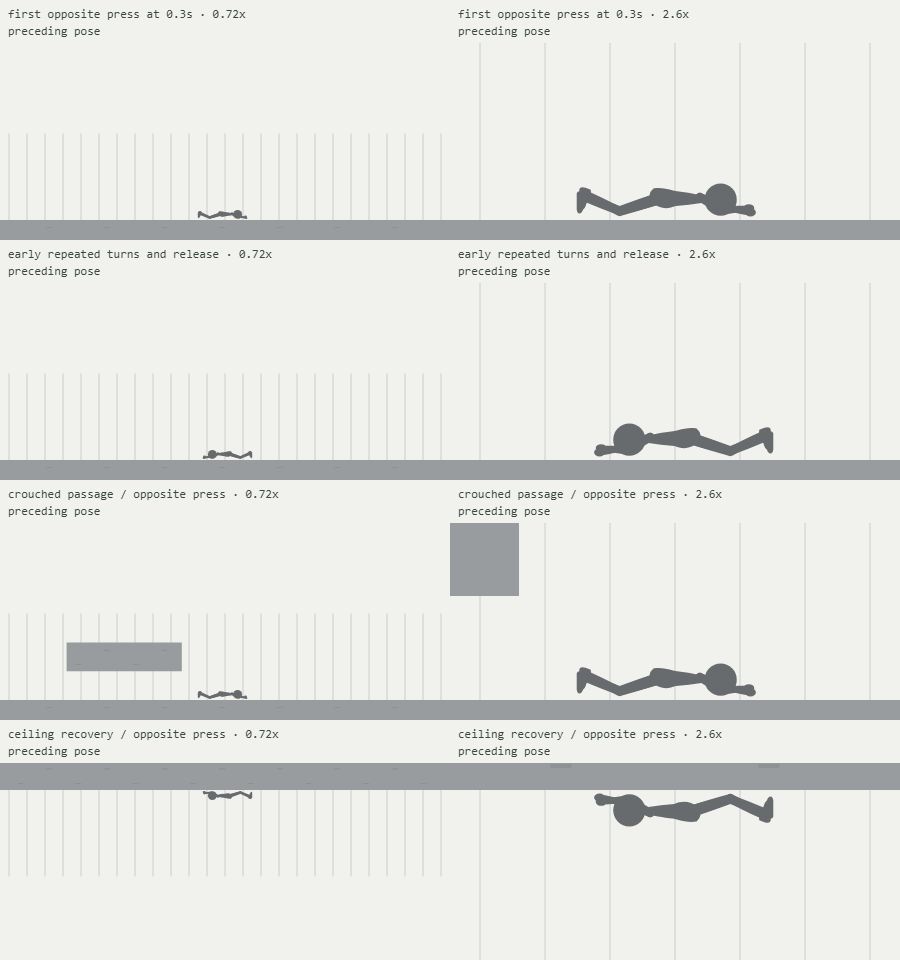

The four complete native captures retain exact physical fields in all 696
matched frames. The permanent normal-keyboard browser test walks off a valid
high platform, releases before impact, waits into the actual stationary get-up,
reverses twice, reaches a supported ordinary stride and jumps again. It passes
on the final fresh production build `UntitledJumpingGame-pql3nYby.js`; the same
test fails on the preceding release source. Thirty focused recovery/fall/turn
checks, type checks, changed-file lint and the isolated production build pass.
The full UJG selection passes 1,421 of 1,423 checks; the two failures are Windows
permission errors creating symlinks in unrelated file-security fixtures. Actual
device feel, the wider clearance issues and complete-route judgments retain
their own acceptance. Authored maps, local collections and medal times are
preserved.

## Push onset acceptance complete

October 9, 2026. This completes #43's five original criteria using the earlier
contact-onset implementation, final contact/turn/return ownership repairs and
the [broader push acceptance](#push-motion-stance-and-effort-acceptance-complete).
Exposed approaches prepare the arms without
moving an object or claiming support; the selected loaded palms then meet their
surface on the force-bearing tick while body loading eases independently. A
still blocked incoming brace can release and reach continuously without moving
its object. Turning into a moving object retains first-force palms. No arbitrary
input or force delay is introduced.

The original matched `jumping-pushes-second-baseline/current.gif` recordings
include a running approach and fresh low/tall box/ball encounters. The complete
motion comparison adds real changing tilted faces, slopes and moving
support in both directions. The ordinary, low and 100-unit prop checks now
retain palm error below 0.5 units on every loaded tick, stricter than requiring
contact only after the first 0.5 units of object travel. Existing running-approach
tests prove preparation before force; thin intervening walls reject the reach,
and releasing, active jumps, catch/recovery owners and an object behind the
input direction cannot advertise a physical shove.

`tests/jumping-dry-turn.test.mjs` retains exact first-force palms for both
directions and 30/80-unit boxes/balls during a reversal, fixed support legs and
head clearance. The accepted crowded-turn and interrupted-step matrices retain
complete skin, contact ownership, release/recontact and fresh-jump continuity.
Their native full-action recordings remain part of this audit, rather than
accepting an isolated final wrist coordinate as proof of a natural reach.

The permanent ordinary-keyboard first-shove test now runs both directions and
repeats the first 200 ms after a pause/restart. Each attempt must really move
the player and produce more than five loaded samples; every visible palm stays
within the original 0.5-unit surface tolerance. Both production cases pass on
`UntitledJumpingGame-up4IpwZx.js` in 2.5/2.2 seconds, including fresh/restarted
screenshots and complete traces. Changed-file lint passes. Existing first-force,
running approach and final-contact checks passed in the 63-check push selection;
the dry-turn matrix also passes the final full UJG run and hosted release checks.
This acceptance audit adds input coverage and evidence only. Earlier records
retain the reproduction, unchanged physical traces and rejected prototypes.
Authored maps and medal times are preserved. Low-object posture, the remaining
clearance issues and actual device/camera/route judgments retain their separate
acceptance.

## Production available for iPhone playtesting

October 8, 2026. PR #61 is merged and deployed at
[arcade.dreamlarge.com/untitled-jumping-game](https://arcade.dreamlarge.com/untitled-jumping-game).
[Production validation and deployment](https://github.com/nmsimons/arcade/actions/runs/37894251684)
passed for merge `192b681a86d9b178bd2d9d0ee755ddcda3527c7e`, including full
gameplay/save checks, lint, build and all three browser groups. The separate
desktop validation and Windows/macOS/Linux packaging also passed.

Live entry JavaScript, CSS and UJG JavaScript match the successful validated
artifact byte-for-byte by SHA-256. A fresh live browser run completed ordinary
keyboard movement/jumping, pause/help navigation and a native touchscreen low
tap. Landscape mobile emulation at 852×393 shows the Controls heading and Back
button in the viewport, with accurate tap/flick and hold instructions, and no
runtime exceptions. The release UJG asset is `UntitledJumpingGame-C2YKJk5x.js`.

The user has an iPhone and controller available and confirmed the phone is on
the same Wi-Fi. Device model, iOS/browser version and controller model are not
yet recorded; actual comfort, simultaneous fingers, interruption recovery and
route feel remain unverified. #57 stays open for that record. Emulation and the
passing WebKit checks do not substitute for the physical-device test. The
recovery-turn follow-up was released separately after this deployment, as
recorded below.

### Recovery follow-up deployed and verified

October 9, 2026. [PR #62](https://github.com/nmsimons/arcade/pull/62) is merged and
live at the same production URL. All validation/build and three browser groups,
deployment, and separate desktop checks passed for merge
`e3e66a673880077b8ab9bfa740ef6a554eb12034` in
[release run 37898991731](https://github.com/nmsimons/arcade/actions/runs/37898991731).
Fresh live keyboard movement/jumping, pause/help navigation and native touch
jumping pass with no runtime exceptions. Live entry JavaScript, CSS and
`UntitledJumpingGame-C0MeIHoc.js` match that exact validated artifact by SHA-256.
The landscape Controls view retains its visible heading and Back button.
This verifies #47's recovery-turn follow-up in production. The later #50 quiet
crouch change was released separately in PR #63 as recorded below; physical
iPhone and controller feel remain open in #57.

## Idle acceptance complete

October 9, 2026. This completes #50's six original criteria. The earlier prepared
support stance and relaxed standing arms now have their complete rest audit. It
reproduced one remaining defect: quiet crouching folded the two hands within
one world unit of each other. The rear forearm now relaxes beside the knee while
the front arm stays forward for balance. The adjustment fades with movement,
airborne posture and pushing; it changes neither the physical root nor contacts.

The matched recordings below use the original reviewed source `4a66908` and the
final current source, identical real inputs and prepared geometry, 0.72× and
2.6× views, and real-time playback. Each includes the ready frame, first input,
settling and sustained quiet rest on flat ground, a 16-unit ledge, both slope
directions, a box, a ball, a genuinely moving carrier, crouch and reversed
gravity. Gravity activates through the real first-input sequence rather than
being installed into a frozen fixture. The stationary ready and settled poses
read as the same character. Quiet arms are distinct, elbows remain relaxed,
soles do not shuffle, and carrier travel moves the still rider with its support.

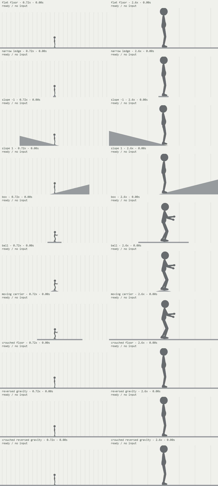

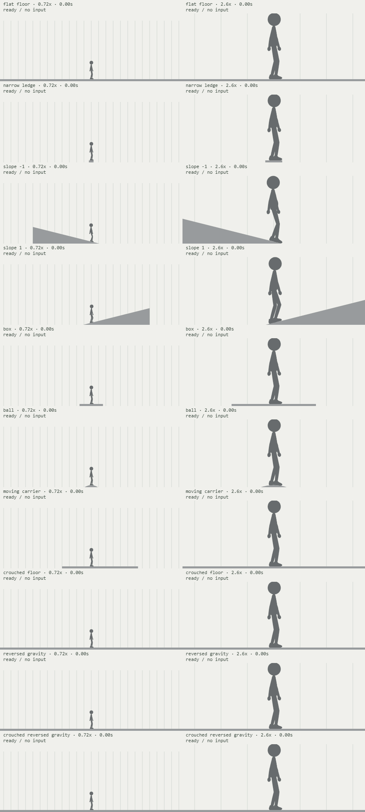

Separately acquired wall bracing, free hanging, ladder holding, rope suspension
and floating/sculling show their real support throughout five seconds of rest
in both directions. Wall feet brace the face, free-hanging feet remain unbraced,
ladder limbs retain different contacts, suspended feet claim no standing
support, and floating retains water motion. No additional animation change was
needed for those states.

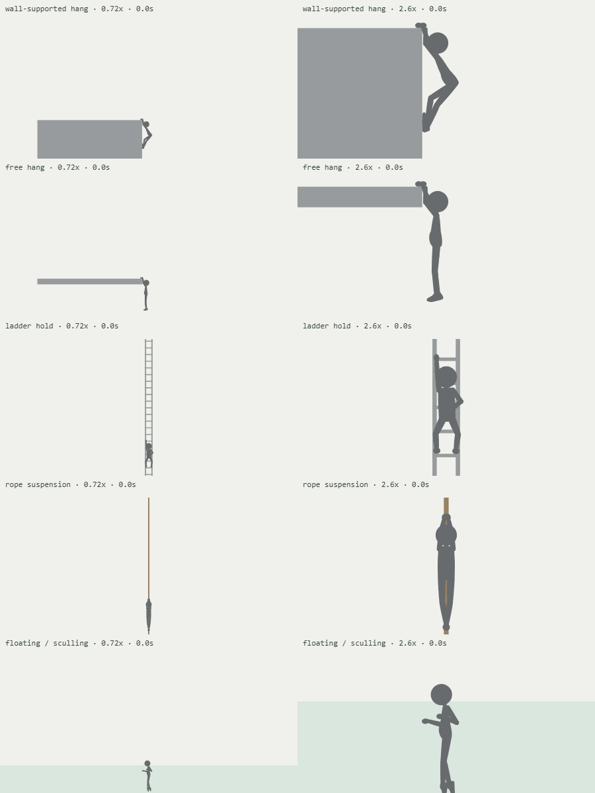

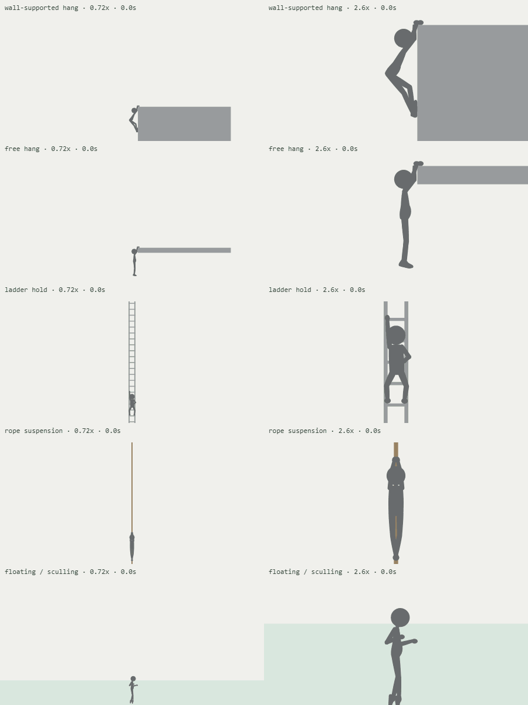

Permanent `tests/jumping-initial-rest.test.mjs` coverage checks twenty actual
started contexts for ten seconds each: zero locomotion gait, planted soles,
exact final motor ankles and support-relative anchors, read-only pose queries,
distinct quiet hands and immediately available fresh jumps. The carrier fixture
now uses the supported always-powered horizontal definition and really travels
over 100 units. Initial-world tests keep all elapsed clocks and prepared objects
unchanged for 1,200 neutral ticks, reproduce restart, and retain airborne rigs
for unsupported starts. The new quiet-crouch assertion fails against the
preceding `56662c0` athlete source.

Two normal-keyboard production-browser cases cover both directions, ready
clock/stance, movement/settling, ten seconds of crouched rest, standing, pause
restart and a fresh jump. Both pass on `UntitledJumpingGame-up4IpwZx.js`.
The native rendered-silhouette check passes eight standing/crouched views at
0.60× and 0.72×, verifying exposed raster pixels from each arm rather than wrist
coordinates alone. Final UJG coverage passes 1,422 of 1,424 checks; the only two
failures are the existing Windows symlink-permission fixtures. The separate
22-check general movement suite, types, changed-file lint and isolated build
also pass. Checkpoint/reset, anti-shuffle and contact regressions remain intact.
Authored maps, local collections and medal times are preserved; actual device
feel and the wider camera/route review retain their separate acceptance.

### Idle follow-up deployed and verified

October 9, 2026. [PR #63](https://github.com/nmsimons/arcade/pull/63) is merged
and live at the same production URL. Validation/build, all three browser groups
and deployment passed for merge `cb57d1157d2c160dc3281cde29ade2de9a08cb9a` in
[release run 37903308117](https://github.com/nmsimons/arcade/actions/runs/37903308117).
Separate desktop validation and all three platform packages also passed.
The live entry JavaScript, CSS and `UntitledJumpingGame-CrHsS8Sp.js` match that
exact validated artifact by SHA-256. Fresh live keyboard movement/jumping,
native touch jumping and pause/Controls navigation pass without runtime
exceptions; the landscape mobile Controls heading and Back button remain visible.
This verifies the quiet-crouch fix in production. Actual iPhone/controller feel
remains open in #57.

## Push motion, stance and effort acceptance complete

October 9, 2026. This completes #40, #41 and #42 with the earlier implementation,
footing/recontact repairs and matched recordings. No further gameplay or
animation change was needed for this final audit. The body follows the real
working step instead of a free-running clock: one leg stays loaded as the other
advances, the pelvis rises through the supporting leg's drive, the chest/head
follow with smaller delayed motion, and the next plant transfers support.
The resulting motion is restrained at ordinary scale; it gives a slow shove
weight without borrowing the sprint's bounce.

A complete ordinary rightward crate step in the native recording demonstrates
the relationship directly. Values below are local world units, not pixels.

| Time | Actual support | Pelvis Y | Chest Y | Head Y |
| --- | --- | --- | --- | --- |
| 1.333 s | Front foot begins advancing; back foot planted | -26.657 | -44.270 | -51.545 |
| 1.467 s | Front step at 59%; back foot still planted | -27.273 | -44.660 | -51.828 |
| 1.567 s | Front foot plants; both shoes supported | -26.739 | -44.348 | -51.624 |
| 1.633 s | Back foot begins advancing; front foot planted | -26.514 | -44.003 | -51.236 |

The final twenty-six initialized motor encounters cover both directions,
creeping/ordinary crates, 30/80-unit boxes and 30/80/100-unit balls, actual 90-unit/second ball
travel, uphill/downhill travel, crouched uphill pushing, horizontal carriage
and a vertical carrier beside a fixed blocking wall. The blocked carrier really
travels over 100 units while horizontal locomotion stays blocked. Carrier
starts test prepared dynamic support; these are motor fixtures, not authored
routes or claims that the level editor permits a dynamic-only spawn.

At least one real foot supports every working tick; both legs advance during
moving pushes. Creep causes fewer than four steps in four seconds, including
initial stance establishment. The faster ball uses more steps than an ordinary
crate. Selected palms meet their surface offsets, all 3D rig lengths remain
fixed, final loaded ankles retain their motor contacts, and the upper body
clears actual tilted-box faces, drawn ball circles, terrain and mechanisms.
Ten further seconds of blocked effort keep both anchors fixed relative to
their real support and leave the travel balance still. Earlier narrow/concave
footing recordings retain their supported seven/eight-unit bases, quiet brief
recontact and ordinary full-release settling. Existing release/turn/jump
footage and regressions retain their responsive departures.

The paired full-action recordings use the original reviewed `4a66908` source
and current source, identical input/geometry/framing and four-second real-time
playback, at 0.72× and 2.6× in both directions. The motion comparison includes
whole repeated steps on slopes and moving supports. The effort comparison
shows partial blocked pressure, full moving pressure and full blocked pressure;
the last two no longer collapse into the same unsupported-looking image.
The body loads into a wider firm base under opposition and stays more upright
under light pressure. The loop boundary resets the encounter.

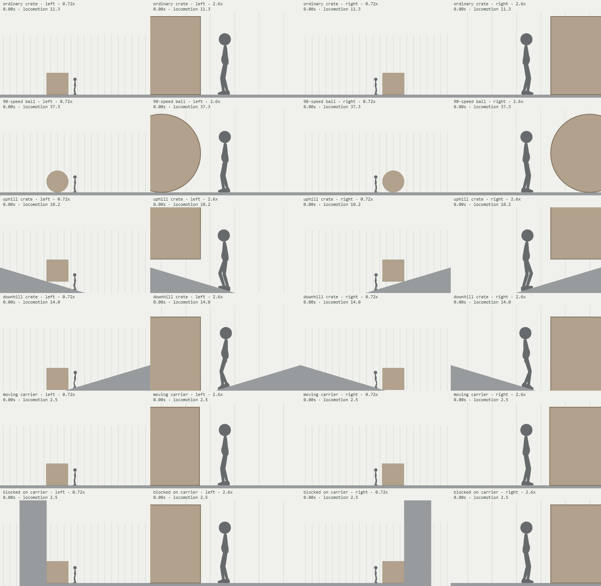

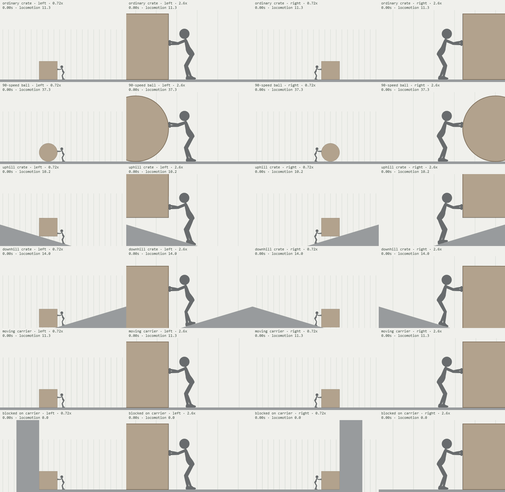

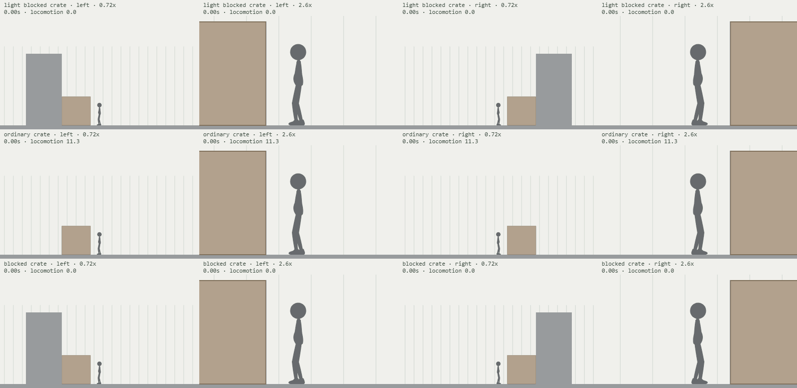

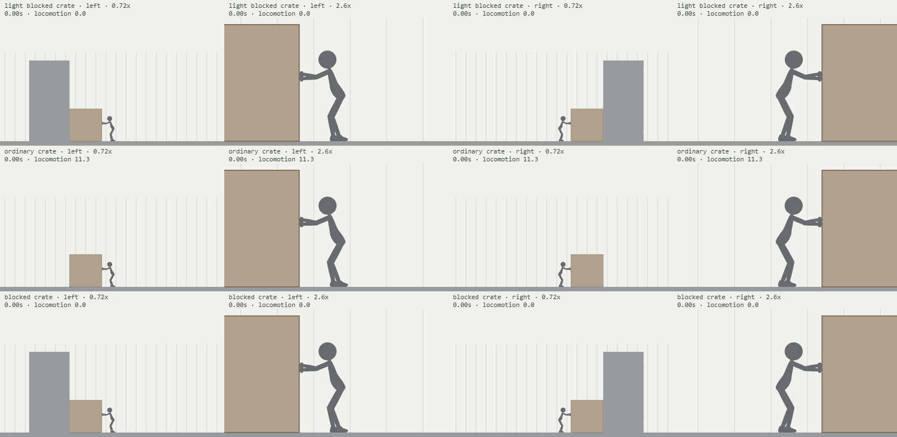

Six further actual passive ball/robot/carrier cases displace the player by over
20 units with zero horizontal input and no voluntary shove load. These retain
real imposed motion rather than zeroing velocity to manufacture rest. The
standing/carrier and crowded contact footage above supplies the complementary
visual evidence. New permanent coverage is in
`tests/jumping-push-acceptance.test.mjs`, sharing fixtures with the native audit.
All 63 focused push/animation/terrain/prop checks pass, including the existing
material-point, anti-shuffle, uphill, release and continuity assertions. The
final added upper-body checks and changed-file lint pass. The final production
motion/browser evidence above and successful PR #63 hosted browser groups
retain the normal-control cases. Earlier implementation records retain their
matched physical traces; this acceptance audit changes only tests and evidence.
#44–#46's wider posture/clearance matrices and actual device, camera and route
acceptance retain their separate scope. Authored maps and medal times are
preserved.

## Low-object working gait acceptance complete

October 9, 2026. This completes #44's five original criteria, including the
earlier replacement of the deep automatic squat with a supported working hinge.
The expanded review caught a remaining reach defect on downhill 30-unit props:
the real palms can sit below the existing chest's fixed-length arm reach.
On the preceding `f23a7e5` source, the ordinary downhill ball retains up to
5.52 units of visible hand error throughout the four-second encounter. A tipping
crate also loses visible contact on some force-bearing frames. Crouching reduces
the error after settling but does not fix the first force-bearing frames.

The grounded low posture now continues hinging the chest toward the lowest actual wrist
target. The pelvis retains its supported working height, the chest retains its
10.1-unit segment, and the ordinary reach correction solves both fixed-length
arms against the established palms. This changes presentation only: contact
selection, player root, prop forces, gravity and crouch hull are preserved.
The new permanent regression fails against the preceding athlete source and
passes with the fix, retaining the original 0.5-unit palm-error limit.

The matched native recordings below compare `f23a7e5` with the final source,
using identical geometry, input, framing, 0.72×/2.6× scale and four-second
real-time playback. Rows show flat low crate/ball travel, downhill crate/ball
travel, then their explicitly crouched variants. Both directions include the
first shove, complete alternating cycles and changing crate tilt. The working
body reads as reaching from bent driving legs; explicit crouch remains visibly
lower. The corrected downhill chest brings the hands onto the surface without
collapsing the hips. Additional native uphill, blocked and tall-object samples
at one and three seconds retain credible knees, reachable palms and a still
blocked brace. Earlier [second-pass recordings](#second-implementation-pass)
retain the comparison against the original deep squat.

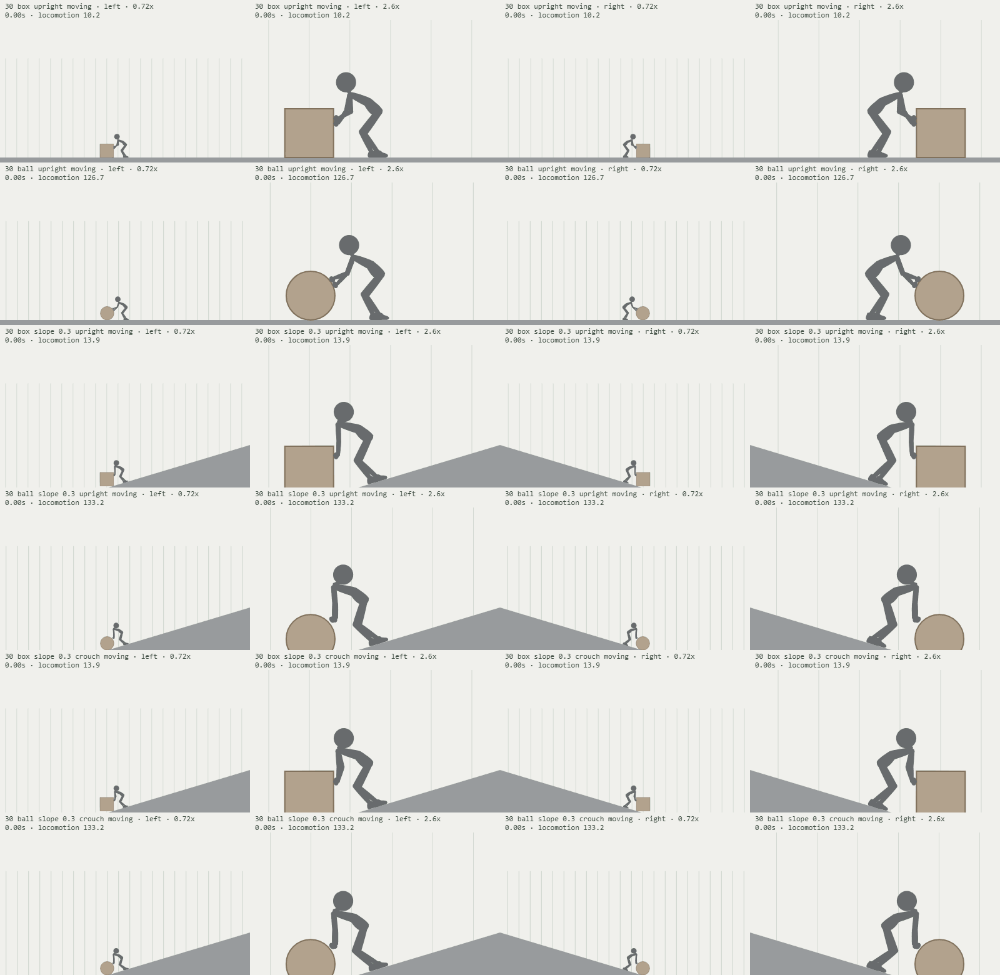

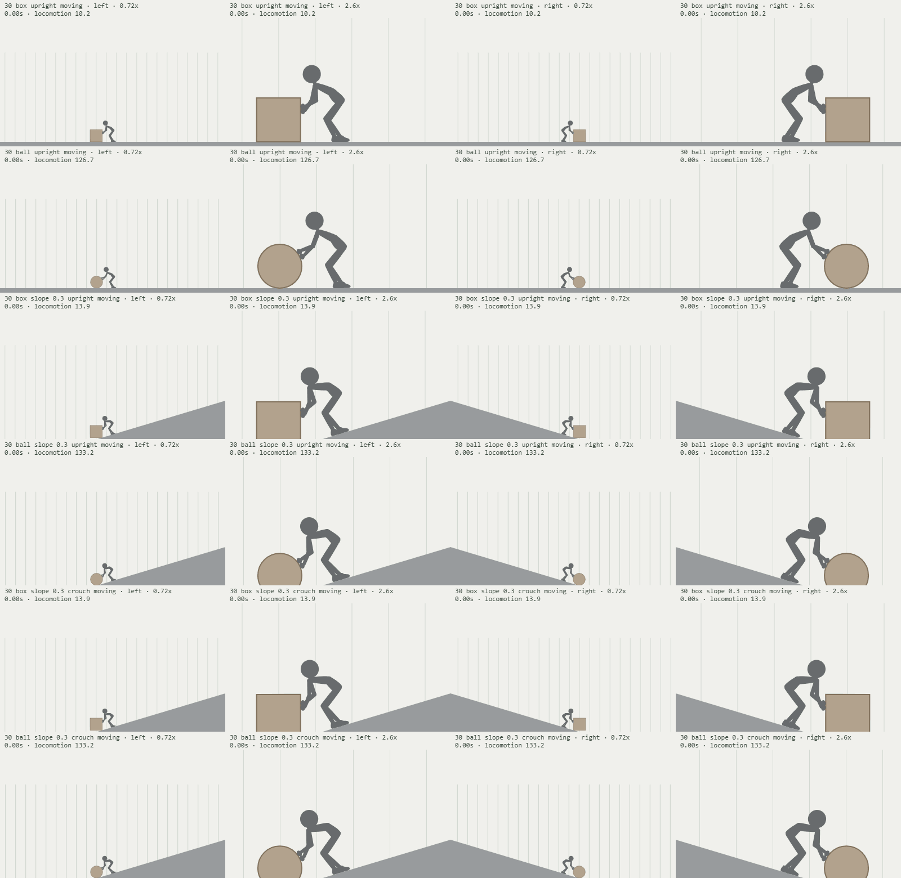

`tests/helpers/jumpingPushScenarios.mjs` supplies 72 real initialized encounters
in both directions: boxes/balls of size 30 and 80 plus size-100 balls, each
upright/crouched and moving/blocked on flat ground; low boxes/balls additionally
cover both slope directions across the same posture/blockage combinations.
`tests/jumping-push-acceptance.test.mjs` checks four seconds of real support,
fixed limbs, exact planted motor ankles, knee/head/spine/elbow clearance,
continuous pelvis height, actual force-bearing palms, full passing strides
from both legs, settled blockage and immediate fresh-jump escape. Tipping crates
can physically depart/reacquire contact; the test requires sustained actual
pushing and checks every force-bearing palm without inventing permanent contact.
Blocked balls retain their small initial solver settling before the stationary
brace check. Existing creep, ten-second anti-shuffle and carrier checks remain.

Four added ordinary-keyboard production-browser cases cover downhill box/ball
travel in both directions, crouch entry/exit and restart. Together with the two
existing crouched-brace cases and moving-body transfer case, all seven pass.
The 83 focused movement/animation/support/ceiling checks pass; the final expanded
three-group push run passes after adding fresh jump escape to every encounter.
Existing 40-unit ceiling regressions preserve real crouch clearance. Types,
changed-file lint and the isolated production build pass on
`UntitledJumpingGame-C_A4H9KC.js`.

All 3,456 recorded before/current samples have identical complete player state
and prop state, proving that this final reach correction preserves the actual
trajectories. Authored maps, local collections and medal times are preserved.
#45/#46 retain their wider transition/inverted/body-clearance acceptance;
actual iPhone/controller, camera and route review remain separately open.

The first full hosted run caught an airborne returning-step regression from
applying the extra hinge to unloaded air preparation. The correction is limited
to grounded working posture. The original reversed-gravity returning-rig
regression passes with its unchanged proportion, contact and continuity limits;
the nineteen related push/presentation/return checks and separate returning-pose
suite pass. The grounded native evidence above remains identical.
The final full local run passes 2,040 of 2,042 checks. Its only failures are the
two known Windows symlink-permission fixtures; the returning-gravity regression
and all gameplay checks pass. Final types and changed-file lint pass.

### Push acceptance follow-up deployed

[PR #64](https://github.com/nmsimons/arcade/pull/64) is merged and deployed for
`4ffbfdbdd20ebbdba7886e1f2a1255f2b47c8bb3` in
[release run 37907363935](https://github.com/nmsimons/arcade/actions/runs/37907363935).
All validation/build, browser groups, deployment and desktop checks pass.
The production entry JavaScript, CSS and `UntitledJumpingGame-CrHsS8Sp.js` match
the validated artifact by SHA-256; keyboard movement/jumping, native touch and
Controls navigation pass without exceptions. This release contains the #40–#43
acceptance tests and evidence. The later low-downhill reach adjustment above
awaits its own release in PR #65.

## Crouched pushing clearance acceptance complete

October 9, 2026. This completes #45's original five criteria. The exact reported
blocked 80-unit crate fails the final head-radius regression on `4a66908` and
passes with the earlier lowered working contacts and final head clearance.
The broader audit found two remaining defects on the preceding `597ecab`:
the rendered forearm enters a moving tilted crate by 2.58 world units, and
the outline enters the drawn ball under reversed gravity by 0.85 units in a
40-unit opening. Checking bone centers alone misses the former.

The supported trunk now fits genuinely unreachable working wrists together
with the fixed-length arms. Elbows fold around the exposed face, and the chest
retreats where the forearm chord would cut a corner. The actual pelvis/ankle
constraints remain part of that fit. Clearance uses the loaded ball in the
pose's reflected frame, including its actual drawn circle; contact snapshots
otherwise remain in world coordinates. The head stays its original size.

A tipping face can move a low crouched grip outside the established reach.
The presentation contact now follows the nearest available height instead of
switching straight to the standing-height grip. When real force contact ends,
the unloaded reach eases its height on the current surface. The original motor
face, force selection, obstruction tests and force-bearing palm offsets remain
unchanged. This removes the visible contact-height/body snap without delaying
controls or using interpolated palms inside the object.

The permanent coverage in `tests/jumping-crouched-push-acceptance.test.mjs`
includes the exact reported crate, the newly reproduced tilted forearm, and
72 actual five-second encounters. The latter cover both directions, 30/80-unit
boxes, 30/100-unit balls, moving/blocked objects, both initial box tilts,
normal uphill/downhill travel, 40-unit openings, and actual gravity-plate
reversal. Reversed props settle onto the ceiling through the ordinary motor;
the fixture does not set an inverted flag. Passive reverse slope props roll
away during that setup, so existing mirrored slope/rig checks cover that axis.

The test samples the final exported skin paths, including rounded belly,
elbows, palms and soles, against visible polygons and ball circles. Its .02-unit
geometry tolerance accommodates sub-.005 sole sampling at slope creases.
All crouch/stand/release transition frames are checked, alongside the whole
working/resting cycle. Fixed 3D limb lengths, exact planted motor ankles,
force-bearing palms, supported trunk continuity, read-only rendering and fresh
jump escape outside the ceiling remain covered. The tilted-outline regression
fails on `597ecab`. Initial force fixes wrists to their real contact; the native
and browser review below covers that arm handoff in addition to the numerical
continuity checks during sustained loaded/unloaded phases.

The paired native recordings compare `597ecab` and the fix with identical
geometry, inputs, framing, 0.72×/2.6× scales and five-second real-time playback.
Rows show blocked crouch entry/exit, a full tipping-crate encounter and a ball
passage, followed by the same gravity-reversed contexts. Both directions include
approach, crouch entry, changing faces, departure and settled rest. The head and
arms remain outside the crate while the legs keep driving; the chest and hands
follow its tipping face instead of switching to an overhead clamp. Confined
ball work retains its lower supported posture. All 900 paired samples have
identical physical player state, props, mechanisms and terrain. The loop boundary
restarts the encounter.

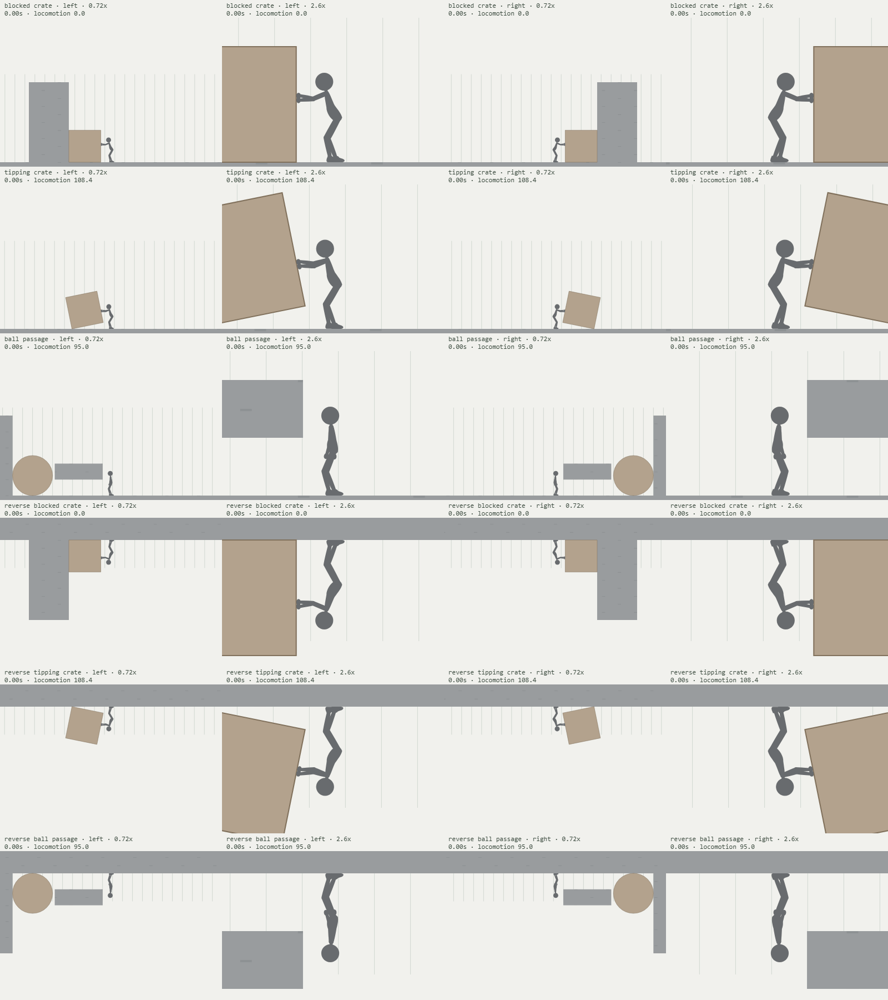

Four additional normal-keyboard production-browser cases cover both directions
on naturally tilted 80-unit crates and actual reversed-gravity ball passages,
including crouch entry/exit. These and the two reported blocked-crate cases pass.
The reversed browser fixture explicitly retains its starting floor within the
authored room bounds; it loads through the ordinary level parser and gravity
plate, with no injected pose. The 62 focused animation/prop/ceiling checks and
eight push/anticipation/return checks pass. The full repository run passes
2,043/2,045; only the two existing Windows symlink-permission fixtures fail.
Types, changed-file lint and the isolated production build pass on
`UntitledJumpingGame-DbmkKKVL.js`. Built-in/local maps and medal times are
preserved. Production deployment and the user's actual iPhone/controller feel
remain separate records.

### Low working reach deployed

[PR #65](https://github.com/nmsimons/arcade/pull/65), merge
`e2709c5639f5408957908b9c5eb6ac661ec22635`, is deployed in
[release run 37912963345](https://github.com/nmsimons/arcade/actions/runs/37912963345).
All validation/build, browser groups, deployment and desktop checks pass.
Fresh live keyboard movement/jumping, native touch and Controls navigation pass
without exceptions. The live entry JavaScript, CSS and
`UntitledJumpingGame-BS0Y6Q-W.js` match the validated artifact by SHA-256.
This releases the grounded downhill reach fix and completes #44's production
record. The crouched clearance follow-up is pushed in
[PR #66](https://github.com/nmsimons/arcade/pull/66), with its hosted checks
running separately. The user's iPhone/controller feel record remains open in #57.

### Crouched clearance deployed

[PR #66](https://github.com/nmsimons/arcade/pull/66), merge
`784d6ba48dbf47af31d0a50edbf081e856099a42`, is live after
[release run 37917852765](https://github.com/nmsimons/arcade/actions/runs/37917852765).
Validation/build, all three browser groups, deployment and desktop checks pass.
Live entry JavaScript, CSS and `UntitledJumpingGame-4HhkB7mU.js` match that
validated artifact by SHA-256. Ordinary keyboard movement/jumping, native touch
and landscape Controls/Back checks pass without exceptions. #45 is closed.
The user's phone is an iPhone on the same Wi-Fi; its actual comfort and
controller feel remain unverified in #57.

## Prone clearance acceptance complete

October 9, 2026. This completes #46's six criteria while preserving the ordinary
physical hull. The exact 6.2-radius head-circle reproduction fails on original
`4a66908`. The preceding `6d6930c` still fails the new full-skin and continuity
checks: a rear knee cap enters a wall by 0.126 units, a concave catch unfolds a
depth-folded arm into the wall, and a wall/floor seam can leave a palm embedded.
The broader ordinary-control trace also exposed an abrupt change of clearance
side at a crate corner and a prone-to-slide handoff on a ball.

The final presentation addresses these together:

- Prone catches transfer the entire fixed-length 3D rig. A six-unit depth arc
  takes regripping wrists past the shoulder without flipping the elbow. The
  final body, hands, legs and shoes clear the actual neighboring solids.
- A tight front wrist tucks horizontally around the lip when it cannot spare
  the full vertical cap clearance; its established top-surface palm remains.
- Leg clearance uses the drawn upper/shin radii and complete prone shoe skin.
  An unanchored hand retracts toward its clear shoulder when separating from a
  wall would place it inside the adjoining floor.
- A dry fall retains its established presentation clearance side around a
  convex corner, including free arms. The offset relaxes at 240 units/second
  when space opens. A nearby alternative along the retained axis is bounded
  to 32 units; otherwise ordinary geometric separation applies. The offset is
  advanced during simulation; drawing remains read-only. A moving recovery
  already contains that offset and never applies it twice.
- Prone flight is a valid outgoing source for the existing slide transfer,
  including a slide contact acquired one tick before the fall pose releases.
  Ledge departure now budgets its final cleared joints through the same
  600-unit/second transfer used for crowded and sliding turns. Steering,
  departure impulses, contacts and inherited motion remain immediate.

`jumping-prone-clearance-acceptance.test.mjs` samples the actual exported drawn
outline, including curves, caps, palms and shoes. Its 28 initialized sequences
exercise walls on either side, corners, an overhead face beyond the ordinary
hull, a concave undercut, a tilted box and a ball, in both facing directions and
both gravity frames. Those are isolated presentation regressions, not a claim
that reverse gravity was acquired through input. Existing live gravity-plate,
mirrored recovery and rope-catch coverage supplements them.

Twelve separately parsed playable traces start with a real Shift + direction
walk-off and release, then a deliberate X departure. They encounter a wall,
undercut, player-only force field, moving gate, actual crate and actual ball in
both directions. All reach sustained complete prone flight. The moving gate
starts at y1800, is 600 units tall and uses the supported reversed switch rule;
it is genuinely moving during the encounter. The undercut and moving gate catch
the incoming fall and retain deliberate departure. Per-step checks preserve
10/9-unit arm bones and 15/14.5-unit leg bones in three dimensions. World joint
travel stays below actual root travel plus six units; a caught moving lip also
includes its measured transport. Full drawn-skin penetration stays below 0.02
units through approach, catches, departure, prop/slide contact and floor
recovery. Rendering cannot alter player state or invent a grip.

The paired five-second recordings use identical geometry, input, framing,
0.72×/2.6× scales and real-time playback, comparing all jumping modules from
`6d6930c` with the final implementation. Both directions show the complete
walk-off, prone approach, contact, catch/drift, release and recovery sequence.
The reviewed normal-size and enlarged phases retain a readable folded arm,
clear head and hands, continuous ledge reach and the established braced fall.
The crate corner keeps its clearance side rather than kicking the body
sideways; ball contact gathers through the outgoing rig into its real slide.
All 900 paired samples have identical physical player roots/velocities,
contacts controlling the catch, props, mechanisms and terrain.

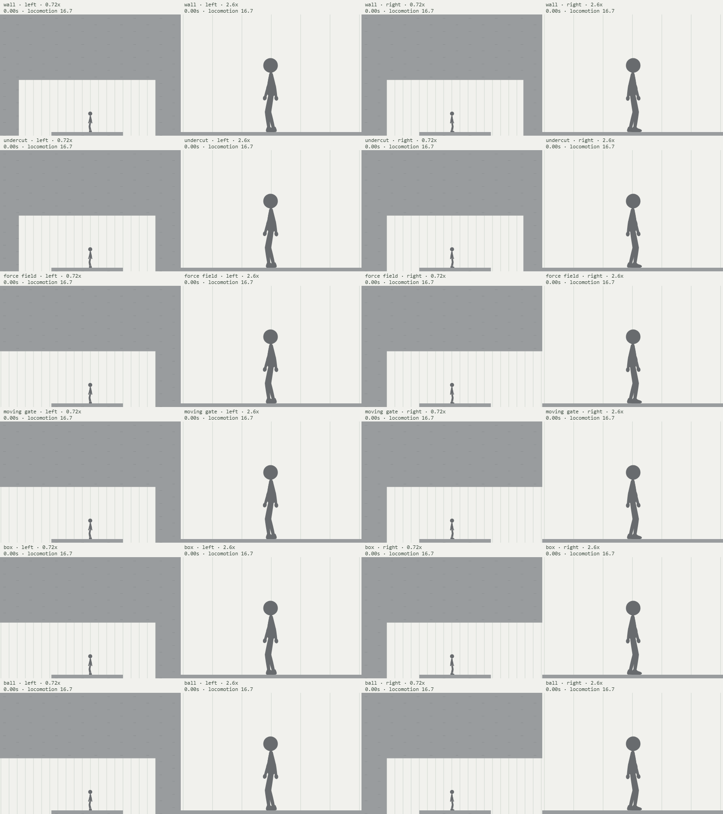

Four new ordinary-keyboard production-browser cases pass wall recovery and
concave catch/drop in both directions, followed by a fresh responsive Jump.
The six existing normal-input fall/landing, real upward gravity lift,
weightless ball drift and touching-ball cases also pass. The first combined
run passed nine and hit the old landing case's original 30-second deadline
during heavy parallel checks. Its isolated repeat passes with that same
deadline and assertions. Water transitions, remembered prone rope catches,
stationary recovery and the existing slide/dry-turn checks retain their
coverage. The full suite passes 2,046/2,048; only the two existing Windows
symlink-permission fixtures fail. The additional overhead matrix passes in its
final focused run. Types, changed-file lint and the isolated production build
pass on `UntitledJumpingGame-qtjHYISv.js`. Hosted checks and release follow
separately. Authored maps, local collections and medals are preserved.

### Separate ordinary catch finding for #52

The gate matrix also exposed a distinct ordinary, not-yet-prone catch that
remains part of #52's broader catch/departure acceptance. Reproduce with
`proneDropLevel('moving gate', direction)` but set the reversed gate to
`y:950,h:800,travel:800`; retain its 20-unit width and Shift + direction for
168 ticks, followed by neutral input. In both directions the early catch at
tick 229 admits approximately 0.215 units of drawn skin; the overlap reaches
3.926 units at tick 236. The later fully prone gate encounter is clear.

Investigate the ordinary catch's projected arm reconstruction and its moving
lip frame. Preserve the established grip/catch timing and transport, retain
the full outgoing bend plane, and clear the final forearm/palm around the
current moving lip without shifting a force-bearing anchor. Success requires
every catch frame to clear within 0.02 units in both directions and gravity
frames, fixed 3D bones, continuous wrists/elbows, unchanged root/velocity and
grip transport, then normal pull-up, fresh Jump and explicit drop. Add the exact
parsed fixture and a matched native sequence to #52's existing binding matrix.
