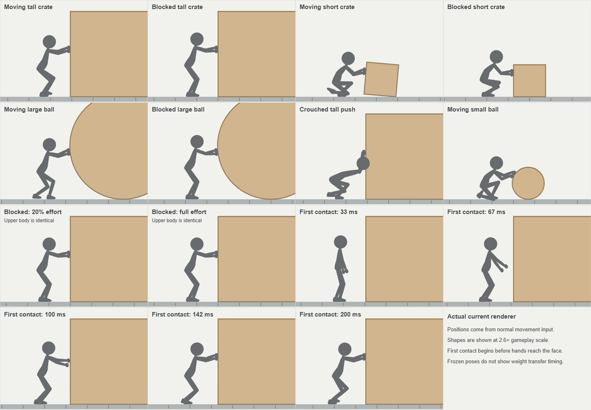
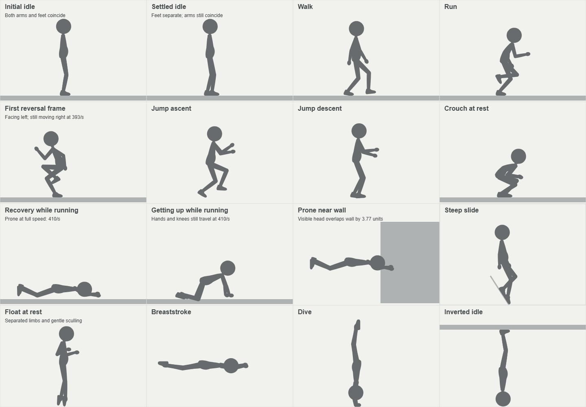

# UJG traversal review

Reviewed October 7, 2026. This inventory covers the current movement controller, input bindings, athlete animation, and interactions with terrain, mechanisms, props, ropes, water, gravity, and force fields. It evaluates predictability, player agency, visible weight, and readable contact. Passing an assertion establishes a behavior; it does not establish that the behavior looks or feels good.

Implementation and evaluation work is logged in [the detailed issue inventory](jumping-traversal-issues.md) and [GitHub tracker #39](https://github.com/nmsimons/arcade/issues/39). The issues include reproducible starting states, source locations, implementation constraints, and visual and automated success criteria.

The contact model is more convincing than the athlete's presentation in several important states. Walking, planted feet, ordinary landing absorption, climbing supports, and swimming have substantial physical reasoning behind them. The biggest weaknesses are pushing without convincing weight transfer, visible bodies entering obstacles in particular poses, a prone figure moving at running speed, an abrupt running turn, a flat idle silhouette, and automatic actions whose control contract is difficult to infer. Improving those would do more for natural traversal than adding another movement mechanic or changing the jump constants wholesale.

## Pushing: why it feels unnatural

**Pushing is a high-priority animation weakness.** It establishes where hands and feet belong more successfully than it communicates how the person produces force. The current image often reads as a squat figure attached to an object, moving its feet underneath an almost fixed upper body. That is especially apparent beside the motionless blocked version of the same pose.

This 1.5-second loop uses current athlete drawing and states generated by sustained normal movement input. Neutral object artwork and floor markers make contact and travel easier to compare; the camera follows each player. The loop boundary is a replay reset, not an in-game transition.

### The torso does not participate in the steps

In a sampled moving tall-crate push, the feet alternate, but the stride phase remains exactly zero throughout another second of travel. The pelvis height changes by only 0.011 units and shoulder X by 0.0013 units. The foot controller takes its short-step branch and returns before advancing stride; the ordinary torso wave still reads that frozen stride. Foot repositioning and occasional clearance corrections can move the body, but there is no deliberate cycle of loading the supporting leg, driving from it, and transferring weight to the next leg.

This explains the detached, mechanical quality better than changing the arms alone. Give pushing its own support-driven body phase: a planted rear foot extends as the pelvis travels, the chest follows with a small delay, and the next foot catches the load. Keep both palms fixed while they are supporting the push. The motion should be subtle and tied to actual progress, not a periodic bob imposed on a stationary shove.

### The blocked stance never develops a strong base

In the blocked tall-crate sample, the feet remain at approximately +2 and -2 units from the root after three seconds of full input. The nominal rear brace target is -10, but its eight-unit correction is below the 12-unit repositioning threshold used during effort. Starting from the ordinary stance therefore never establishes the intended wider base. The arms are extended while both feet remain close together and both knees bend in the same direction.

Stopping the feet when blocked is correct. The natural improvement is one deliberate stance-setting step when contact becomes established, followed by a stable lead leg and a rear leg that visibly supplies force. Separate initial stance establishment from the distance threshold that prevents a creeping push from shuffling indefinitely.

### Effort is largely missing from the visible upper body

For the same settled, blocked crate, input at 20% and at 100% produces identical hip and shoulder coordinates. Dry pushing's torso lean and dip use the contact blend amount; they do not use the stored effort. Once the 0.14-second blend finishes, a tentative press and a committed shove have substantially the same silhouette. A blocked shove becomes visually frozen despite continued player effort.

Represent both intent and resistance. Mild input should retain a more upright stance and softer elbows; a resisted full shove should lower the center of mass, firm the rear leg, and show a little shoulder/elbow compression. Unobstructed rolling should relax as the object gains speed. Use actual travel and opposition to inform this, rather than assigning every large object an invented weight category. The physics currently applies a velocity-seeking shove; object size alone does not define a realistic weight contract.

### The object starts moving before the hands arrive

From a normal-control start beside a reachable 80-unit crate, the object moves 2.45 units in the first 67 ms while the visible front palm remains approximately 16.4 units from its target. At 100 ms the crate has moved 4.13 units and the palm is still about 6.36 units away. The palm finally reaches its target around 142 ms. The contact solver begins applying force before the animation's reaching blend has completed.

This weakens cause and effect even though the final hands fit correctly. Begin reaching during the approach so the hands establish visible contact by the time the shove takes effect. Let body loading follow the palms, rather than fading the entire push pose in as one event. Preserve immediate control response; adding an arbitrary delay before pushing would create a different feel problem.

### Low objects need a better working posture

The rig correctly lowers hand targets for short boxes and balls, preserves limb lengths, and bends from the hips. At 30-unit object height, however, the sampled moving pose sinks into a deep squat with folded legs and very little clearance during each step. The 14-unit short-step rule and small foot lift make this read as crouch shuffling. Short tilted boxes also move the hands as they tumble, which should be absorbed through elbows and shoulders while the load-bearing foot stays credible.

Use a staggered stance and enough hip hinge to reach the contact. Let the rear leg extend during the drive, and let the advancing foot move clearly past its planted partner. Keep the center of mass low enough for reach without treating every low push as a fully crouched locomotion pose. Ball rolling can use a lighter advancing gait; a tipping crate should show more adjustment and balance.

### Crouched pushing can visibly enter the crate

**Reproduced contact defect.** Pushing a blocked 80-unit crate while crouched places the rendered head about 3.76 units inside its visible face. The physical body remains outside. The crouched shoulders sit much lower, but the prop hands still target the ordinary 43-unit height. The later shoulder-reach lean moves the head forward after its earlier clearance clamp. The resulting silhouette looks like reaching upward while driving the head into the crate.

Choose contacts that suit the crouched shoulder height, then check the final head and torso after all reach adjustments. Cover both directions, tilted boxes, balls, overhead clearance, slopes, and reversed gravity. This is a concrete correctness issue within the broader animation critique.

### Cases to judge separately

| Case | What a natural animation needs to communicate |
| --- | --- |
| First contact | Reach, palms meeting the face, then body loading; no visible force from an empty gap. |
| Ordinary moving crate | Rear-leg drive and a supported weight transfer while hands remain fixed. |
| Slowly creeping or resistant crate | Deliberate small advances with a firm stance, without feet churning. |
| Fully blocked object | One stance adjustment, then readable sustained effort with stationary soles. |
| Release and recontact | Unload shoulders before returning to ordinary arms; follow a coasting object's actual position during release. |
| Push then jump | Hands release cleanly and the leg drive becomes takeoff; retain responsive jump escape. |
| Reverse or back away | Release the palms before the body turns; no mirrored hand contact on the wrong side. |
| Short or tilted box | Hip hinge, contact-height adjustment, elbow accommodation, credible balance while it tips. |
| Ball | Surface-normal palms and a lighter advancing gait; hands adjust without following the material rotation. |
| Crouch or low ceiling | Reachable low contacts and final body clearance, rather than raised arms and a penetrating head. |
| Slope, loose footing, moving carrier | Effort follows actual traction and opposition; carried travel does not invent stepping. |
| Water or reversed gravity | Use their real supporting contacts and existing physical frame; avoid reusing the dry shuffle indiscriminately. |

The final palm geometry, stable object selection, fixed limb lengths, travel-based stepping, and clean jump departure are valuable foundations. The existing regression checks establish those safeguards, but their pass criteria do not judge a convincing force-producing action. Preserve them while improving the stance, loading sequence, and support-driven body motion.

Sources: [pushing rig and reach clearance](../src/games/jumping/athlete.ts), [short steps and brace threshold](../src/games/jumping/footwork.ts), [contact blend and motor](../src/games/jumping/playerContacts.ts), [hand geometry](../src/games/jumping/propGeometry.ts), [applied prop forces](../src/games/jumping/propPhysics.ts), [current animation checks](../tests/jumping-animation.test.mjs), [normal-control push check](../tests/browser/jumpingMotion.spec.mjs).

## Findings in priority order

### Prone movement does not respect the visible body

**High priority, reproduced.** A player at x=500 beside a wall starting at x=520 retains a fully prone fall pose. The ordinary collision hull is clear, but the visible head reaches x=523.77, including its radius. The head penetrates the wall by 3.77 world units; the extended hands penetrate farther. There is no wall brace in this state. The problem is in the rendered silhouette's clearance, not a failed physical sweep.

The prone rig extends roughly 35 units behind and 30 units ahead of the foot root, while ordinary movement retains the standing hull. This discrepancy also makes visible body size a poor guide to clearance: horizontal posture does not imply that a short opening is traversable. Keeping the existing physics hull is a deliberate contract, but the pose still needs to clear nearby surfaces and communicate the space that remains occupied.

Use presentation clearance and a natural folded or braced pose near obstacles, as swimming already does. Preserve limb lengths, stable contacts, and the physical root. Check both directions, corners, ceilings, props, moving supports, and inverted gravity. A floor-only prone landing check does not cover this problem.

Sources: [prone pose](../src/games/jumping/athlete.ts), [body hull policy](../src/games/jumping/playerContacts.ts), [free fall contract](jumping-physics.md#motion-continuity-and-diagnostics).

### Full speed travel contradicts the get up animation

**High priority, reproduced.** After a high fall, holding movement translates the player at 410 units per second throughout the 0.95-second recovery. At 0.2 seconds into recovery the player has traveled 82 units and is still prone; the visible feet are not planted. The status says Running while the image shows a figure lying on the floor. Hands and knees subsequently travel at the same speed during the get up sequence.

This is a visible loss of weight and support. It is not resolved by having a smooth interpolation between the recovery key poses. Physical footwork continues underneath a different rendered rig, so movement and even footstep cues can tell a different story from the visible limbs.

Keep immediate movement and jump responsiveness. On meaningful resolved ground travel, transition promptly from recovery into a supported moving stance; keep the full get up sequence for a stationary player. Avoid making the player wait nearly a second for controls. Verify the transition under held movement, late movement, reversal, a buffered jump, and a moving carrier.

Sources: [fall recovery and ordinary motor](../src/games/jumping/model.ts), [recovery rig](../src/games/jumping/athlete.ts), [footstep selection](../src/games/jumping/audioState.ts).

### Running reversal flips the body before momentum reverses

**Medium priority, reproduced; the tuning choice needs playtesting.** The first opposite-input tick at a full run changes facing to the opposite direction while velocity is still +393.33. In the sampled sequence the visible head shifts about 16.1 units backward in one 1/120-second step. The figure briefly performs a mirrored running pose while traveling backward relative to its facing.

Changing intended direction immediately is useful. Mirroring the whole torso immediately is a separate presentation choice, and it weakens the sense of braking and weight transfer. Swimming already gathers, brakes, turns, and extends, providing a better reference for communicating reversal.

Keep the motor responsive but give dry locomotion a brief braking or turning pose. Preserve planted feet and separate visual orientation from input intent through the turn. Test at walk speed, full speed, partial stick input, on slopes, while pushing, in midair, and near a ledge. Do not reduce control responsiveness simply to make the image look smoother.

Sources: [facing and steering](../src/games/jumping/model.ts), [ground foot anchors](../src/games/jumping/footwork.ts), [swimming heading blend](../src/games/jumping/athlete.ts).

### Automatic tall steps take away the ability to reconsider

**Medium priority, reproduced.** A 60-unit terrain step begins after sustained forward pressure and completes over 0.34 seconds. Once it starts, holding the opposite direction and Drop together still carries the player from x=74.5, y=0 to x=120, y=-60. That step completes on top. Ordinary step mantles do not use the return-to-hang path available during a ledge pull-up.

A brief commitment is reasonable for a small footstep. The larger hand-assisted climb is a consequential automatic action, particularly beside machinery or a ledge. The difference between an interruptible pull-up and a committed automatic climb is difficult to read from their similar poses. Height thresholds also change behavior abruptly: a 60-unit obstacle can auto-climb; a 61-unit obstacle requires a jump.

Keep one-tile steps fluid. For taller steps, provide a collision-safe cancellation or return before the body passes the commitment point, or make that commitment visibly unmistakable. Jump should retain its existing queue. Review repeated stairs for rhythm rather than judging only whether each riser is eventually cleared.

Sources: [automatic step selection](../src/games/jumping/stepUp.ts), [step input handling](../src/games/jumping/model.ts), [hand-assisted step rig](../src/games/jumping/athlete.ts).

### The idle pose is stable but visually underdeveloped

**Medium priority, reproduced and inspected in the renderer.** Before the first input, both arms coincide exactly and both legs coincide exactly. Puzzle runs intentionally do not advance movement before their first input, so this pose stays unchanged. After movement stops, the feet settle approximately two units either side of the root, but the two arms still coincide. At normal display scale the initial figure reads as a head, torso, one arm, and one leg; the settled figure remains stiff and thin.

Stillness is desirable. Persistent planted feet and a final stance that does not shuffle are worth retaining. The missing ingredient is balance and silhouette, not continuous motion for its own sake.

Initialize the same supported stance used after settling. Give the arms a small asymmetry, slightly relaxed elbows, and a readable distribution of weight. If a subtle chest or head movement improves the character, keep it presentation-only and keep soles stationary. Quiet hanging, ladder holding, wall bracing, water floating, and standing on a carrier should each read as a distinct kind of rest. Water's separated limbs and gentle sculling are a useful example of purposeful idle behavior.

Sources: [initial player state](../src/games/jumping/model.ts), [level initialization](../src/games/jumping/level.ts), [run start policy](../src/games/jumping/challenge.ts), [idle rig](../src/games/jumping/athlete.ts).

### Contextual controls need a clearer contract

**Medium priority, design evaluation supported by implementation.** Down means crouch, lower over an edge, descend a ladder or rope, and dive. Up means look, acquire a ladder or rope, pull up, transfer to a ledge, or return upright in water. Those mappings economize on controls, but the player needs to predict which action wins before holding a direction near a boundary.

Several details deserve explicit teaching:

- Down near a reachable lip starts lowering instead of staying in a crouch. Lowering ends in a drop-locked hang; releasing Down and pressing again drops. Holding Down all the way through does not immediately fall.
- Jump from a ledge always launches away at 260 units per second, including while holding toward the platform. The probe retained facing toward the lip while moving away. Up is the pull-up action. This is a valid convention, but it is not the same directional steering contract as an ordinary jump.
- Catching a rope or ledge consumes a held Jump. Another departure requires release and a fresh press. Reliable and safe, but easy to mistake for an unresponsive button without a clear catch cue.
- Horizontal swimming pushes a loose float; Up requests its ledge. Terrain pool banks can catch automatically. The distinction protects swimming, but looks like an exception unless the object interaction is demonstrated.
- Up in water releases the dive motor and returns the body upright; it does not add upward propulsion. The controls label Swim up can suggest a powered ascent that is not present.
- Normal keyboard/controller Down also requests crouch. The upright underwater floor hold shown by simulation-only `descend` input is not independently selectable through those bindings. Treat it as an internal transition or give it a deliberate player-facing control; do not count a rendered pose sheet as proof that a player can choose it.

Prefer short demonstrations at the first relevant location and unmistakable contact poses. A controls reference is useful, but it should not carry the entire teaching burden. These are design decisions to resolve, not automatically implementation bugs.

Sources: [movement state priorities](../src/games/jumping/model.ts), [input mapping](../src/games/jumping/input.ts), [touch mapping](../src/games/jumping/touchInput.ts), [current controls reference](../src/games/jumping/JumpingDialogs.tsx).

## Movement inventory and evaluation

### Ground and air movement

| Case | Current behavior | Critical evaluation |
| --- | --- | --- |
| Initial rest | World movement waits for first meaningful input in puzzle runs. | Fair starting clock; the initial silhouette needs the settled stance. Unsupported starting poses can remain frozen until input. |
| Idle after travel | Braking finishes; feet take short recovery steps and then remain still. | Strong contact discipline. Keep this while improving the arms and balance. |
| Walk | Shift selects 125 units per second; partial stick selects intermediate speed. | Useful precision option. Teaching must reveal that keyboard movement otherwise runs. |
| Run and acceleration | Top speed 410; flat-ground acceleration 2000. | From rest, full speed takes about 0.205 seconds. Responsive, but physical animation should show the startup effort. |
| Stop | Flat braking 2800; neutral air steering 300. | Ground stop is about 0.146 seconds and 30 units from full speed. Airborne release takes about 1.37 seconds to remove 410 units per second, before other contacts. Different stopping distances need to be readable. |
| Reverse | Motor decelerates; facing changes immediately on dry ground or in air. | The body flip is more abrupt than the momentum change. Add a visible braking turn. |
| Crouch and crouch walk | Height 40 instead of 62; speed capped at 125; standing waits for overhead clearance. | Natural safety rule. Near-edge descent competes with the crouch intention. |
| Look up | Unused Up produces a quiet head glance. | Appropriate restrained acknowledgment, provided it cannot be confused with taking a grip. |
| Reach | Simulation accepts a separate reach input. Current ordinary keyboard/controller bindings do not expose it. | Inventory it as an internal capability, not a taught player action. Automatic ledge reach is the player-facing behavior. |
| Tap jump | Fresh press starts upward at 400 immediately. | Clear and responsive; no charge delay. |
| Held jump | Adds bounded lift during 0.18 seconds; roughly 50-unit tap and 203-unit full height. | Good expressive control. Fourfold height range makes reliable intermediate holds and obstacle teaching important. |
| Jump buffering | Ground/wall press buffer 0.13 seconds; no hold-to-repeat. | Forgiving without unexpected bunny hopping. Preserve fresh-press semantics. |
| Coyote jump | 0.1 seconds after support loss. | Supports natural intent around edges. It should remain invisible assistance rather than require explanation. |
| Running takeoff and air steering | Momentum survives takeoff; air acceleration is 300. | Gives a meaningful running shortcut. Weak midair reversal is a commitment players need to feel before a long gap. |
| Ceiling hit | Solid sweep stops ascent; held lift cannot restart. | Intuitive and dependable. Review the drawn head as well as the hull at low clearances. |
| Ordinary falling and landing | Legs gather; impact changes knee flex and recovery depth; movement remains available. | Strong weight cues. Airborne arms stay forward across ascent, apex, and descent, making the silhouette less expressive than the ground gait. |
| Sustained fall | After 0.9 seconds, blends prone over 0.28 seconds. | Distinctive but communicates gliding or diving more than an uncontrolled fall. Decide whether that is the intended character language. Clearance is currently deficient. |
| Long-fall landing | Prone landing followed by 0.95-second get up. | Good stationary idea; full-speed movement during the sequence breaks support and weight. |
| Foot boosters | Small jets visualize applied air steering and held lift, including braking. | Helps explain assisted air movement. Its visual language should agree with the athlete and prone flight; otherwise the player reads several different movement fantasies. |
| Reset and checkpoints | Legacy playground supports safe checkpoint/fall reset; puzzle rooms are enclosed and use restart. | Distinguish movement recovery from level restart. Do not imply death or a universal checkpoint system. |

### Terrain and grips

| Case | Current behavior | Critical evaluation |
| --- | --- | --- |
| Gentle slope | Traction follows the surface; uphill speed tapers as grip is consumed. | Convincing relationship between incline and effort. Pose lean and foot contact should make the slowdown understandable. |
| Grip limit and steep slope | Shared friction holds through about 46.4 degrees; steeper faces slide. | Physically reasoned, but slopes near the threshold can look nearly identical. Teach the limit with geometry and pose. |
| Crests and slope bases | Actual surface momentum survives departure; crease contacts resolve together. | Prevents sticky or oscillating transitions. Review downhill landings for continuity, not just retained support. |
| Steep sliding | Gravity/friction drive slip; soles align with the plane; slide blends in and out. | Good support reading. Upright relaxed arms at fast slip may understate the difficulty; consider speed-dependent balance effort. |
| Short terrain step | Automatic footstep up to 20 units, supported path and both soles checked. | Useful fluency. Repeated steps should preserve cadence and avoid a stop-start staircase rhythm. |
| Larger terrain step | Over 20 through 60 units requires firm sustained input for 0.2 seconds, then a 0.34-second step; above 40 uses hands/knee. | Useful assisted access, but current commitment cannot be reconsidered and threshold changes are sharp. |
| Ledge approach and catch | Exposed lips only; automatic reaching and catching; catch blends into hang. | Forgiving and visually teachable. Automatic catches can also intercept an intended pass; Drop/cooldowns provide escape but need testing from first encounter. |
| Hanging at rest | Hands hold the corner; feet brace only when a face exists below. | An important natural distinction between a wall-supported hold and a free hang. Do not invent braced feet beneath thin platforms. |
| Pull-up | Up queues a climb; normal duration 0.82 seconds; standing or crouched landing selected. | Intentional and readable. Props can slow progress or open a compact landing; visible effort should explain the delay. |
| Obstructed pull-up | Shared collision advances only the fitting part of the curve; can retarget nearer the lip. | Good recovery and avoids frozen full-frame jumps. Returning to the lip must remain smooth when the obstruction changes. |
| Return from pull-up | Down/Drop can reverse into a retained hang. | Strong player agency; the inconsistency with tall automatic steps should be resolved. |
| Lowering from top | Near-edge Down searches a safe path, then hangs or transfers to a nearby climbable. | Useful deliberate descent, but conflicts with crouch at the same location. |
| Ledge jump and drop | Jump forces an outward leap; Drop adds a small downward/outward release and catch cooldown. | Safe separation. Forced outward direction needs to be taught and the backward-facing launch deserves visual review. |
| Wall brace | Actual exposed vertical or canted face; hands/feet select reachable contacts. | Good use of environmental geometry. A small contact cue can communicate when a fresh wall jump is available. |
| Wall jump | Vertical and faces within 30 degrees of vertical; base lift 500, held budget 600, outward kick 300; 0.12-second outward control phase. | Good deterministic escape. Brief steering protection is justified, but feels like a temporary control override and should be evident in the kick pose. |
| Inset, joined and polygon corners | Exposed geometry rather than bounds; hidden seams are not extra lips or walls. | Essential for a world that appears to behave as drawn. Include tiny shelves and overhangs in visual review. |

### Ladders and ropes

| Case | Current behavior | Critical evaluation |
| --- | --- | --- |
| Ladder acquisition | Up/Down requests a reachable unobstructed ladder; ladders do not catch automatically in ordinary flight. | Sensible deliberate action, but differs from ropes despite shared artwork and vertical control. |
| Ladder ascent and descent | Climb speeds are 85 up and 105 down; contacts follow hand/foot progress. | Credible deliberate access. Slightly faster descent is reasonable; repeated animation should not imply sliding feet. |
| Ladder rest | Progress stops and the grip pose holds. | Quiet is appropriate. Review joint balance and separation rather than adding timed climbing motion. |
| Ladder endpoints | Upper exit uses a safe ledge transfer; bottom can step onto support; Jump/Drop detach. | Connected access should feel continuous. A blocked exit needs a clear held pose rather than an unexplained release. |
| Rope catch | Automatic airborne acquisition near the hands; swept catch, inherited motion and cooldown. | Forgiving and expressive. A 25-unit catch tolerance can feel magnetic; inspect reach and timing around adjacent ropes. |
| Rope climb and free-end exit | Hand-over-hand constraints; Up/Down follow visible vertical direction; climbing off end preserves motion. | Good physical continuity and natural exit. Nearly horizontal spans retain material direction, which needs playtesting at the ambiguous orientation. |
| Rope rest and swing | Holds below the hands; left/right pumps and leans; release uses real rope momentum. | One of the richest movement systems. Make effort, phase, and the useful release moment readable in the body. |
| Rappel and wall push | Feet brace on a real wall; moving away gives a leg push; holding away does not pin the rope. | Convincing interaction and a clear reason to use the environment. Blend wall-to-slope changes without fake foot support. |
| Rope anchor and window transfer | Up can transfer to a lip or scramble onto a supported slope through a clear path. | Good continuous route. Obstructed paths should communicate rejection without looking like input loss. |
| Rope contact with gates | Entire spans and bends remain clear, not only particle endpoints. | Necessary to make moving obstacles trustworthy. Visually inspect tension and stopping at narrow openings. |
| Gravity reversal while gripping | Retained hand grip; 0.45-second body rotation checked along the arc; release retains real momentum. | Strong natural logic. A blocked turn should show effort or contact clearly while still allowing climb or release. |

### Props mechanisms and fields

| Case | Current behavior | Critical evaluation |
| --- | --- | --- |
| Push box or ball | Nearest reachable face wins; shared forces and hand targets; one object receives the shove. | Strong causal model. Low objects, tilted boxes, and changing ball normals need distinct body effort. |
| Blocked shove | Feet stop; the pose retains established hand contacts. | Good avoidance of treadmill animation, but initial brace widening can be suppressed by its threshold; upper-body effort is almost absent. See the dedicated pushing assessment. |
| Stand on prop | Weight/traction do not invent a lateral shove; feet follow actual transport and tilt. | Natural rest. Ball riding should communicate precarious support even when it is stable enough to stand. |
| Prop squeeze and chains | Body loads can displace props; loads wake chains; displacement sweeps against other solids. | Preserves useful escape and believable transmitted forces. Successful escape alone does not establish a stable visible rig throughout a squeeze. |
| Moving platform or gate rider | Swept carrying; blocked passenger may be left behind; stacked crate riders participate. | Convincing conveyor/unloading behavior. Avoid walking in place while being carried. |
| Elevator obstruction | Safe displacement attempted; trapped contact becomes trip endpoint and normal reversal; original range retried next trip. | Recoverable and nonpunitive. Stopping/reversal must be visually connected to the blocker. |
| Closing gate obstruction | Reopens and waits for the full closing path to clear for 0.6 seconds. | Understandable safety behavior. A distant blocker within that path may need an authored sight line or hint. |
| Shovebot rider and impact | Wheel/chassis support, limited shoe traction, phase-dependent motion, collision-safe displacement; no lip grabs. | Real traction is preferable to rigid attachment. Charge speed is 540, faster than player running; body balance should communicate slipping or impending departure. |
| Shovebot sight and settling | Facing and cover govern aggression; chassis settles when support changes; EMP pauses both. | Readable cause/effect if eye, windup, and facing remain clear. Avoid making the same idle bot look either frozen or attentive without distinction. |
| Reduced gravity and zero gravity | Area-weighted fields; neutral zero-g drag; normal momentum exchanged with unsupported props. | Coherent physical movement. Zero-g half-life about 1.16 seconds makes release deliberately floaty; the player needs visual drift cues. |
| Reversed gravity | Gravity-facing floor/ceiling contact sets orientation; reflected walk, crouch, jump, wall and slope rules. | Good reuse of known actions. Ceiling landing should visibly establish feet before the new control frame feels available. |
| Water entry and rest | Posture-dependent buoyancy, upright neck-depth float, tiny physical bob, gentle sculling. | Most developed idle behavior. Clearance and camera anchoring must expose rather than hide actual bobbing. |
| Swim start stop and reverse | Gather, rotate, breaststroke, glide; phase follows resolved distance; resistance damps momentum. | More natural than dry reversal. Stroke pace must communicate the slow 110-unit horizontal speed, not promise an explosive kick. |
| Dive and floor approach | Down targets 100-unit descent; pitch follows resolved motion; feet gather near bottom. | Good anticipation of support. Normal bindings reach a crouched hold rather than independently selecting upright floor standing. |
| Water rise and surface jump | Buoyancy supplies passive ascent capped near 85; a fresh jump launches from settled surface. | Dependable escape if taught. Up's wording currently suggests more propulsion than it supplies. |
| Water prop and bank contact | Body supplies forces; hands meet actual float faces; terrain banks catch automatically; loose prop grip needs Up. | Rich and physically consistent, but the automatic/manual grip distinction is a learning cost. |
| Field overlap power and EMP | Area averaging prevents center-threshold kicks; live power can remove support, buoyancy, or motor resistance. | Good continuity. Abrupt logical changes still need visible cause so falling or loss of buoyancy is explainable. |
| Force field | Solid for player; props/ropes pass through; supports and wall jumps work, lip grabs do not; activation waits for occupied body to clear. | Useful puzzle rule with an unfamiliar solidity contract. Teach it through one clear encounter before a timing-critical route. |
| Plates and switches | Physical load separate from latched/toggle activation; mounted/ceiling plates follow actual supports. | Clear local press/release cues help the player understand whether to keep weight on a mechanism. |
| Collectibles and EMP | Contact collects coins/clocks/EMP; EMP immediately pauses powered mechanisms and suppresses fields for five seconds. | Movement is unchanged by clock scoring effects, but EMP can radically alter a route. Its automatic activation deserves special teaching near moving supports. |
| Goal entry | Grounded doorway contact commits a short 0.85-second exit; score locks at entry and movement finalization is shared. | Sensible authored completion. Entry removes control, so the threshold and open door must be unmistakable. |

Terrain materials currently change appearance only: stone, earth, chalk, and steel share grip. Carried EMPs, boost gadgets, grappling tools, and remote-control cars in [the gadget proposal](jumping-carried-gadgets.md) are deferred designs, not current traversal capabilities.

## Input and presentation checks

Keyboard uses A/D or Left/Right, Shift to walk, Space tap/hold, W/S or Up/Down for context, X to detach, and Escape to pause. Controller uses left stick/D-pad, A/Cross, B/Circle, and Menu. Analog horizontal speed is useful; vertical stick thresholds should be tested with real diagonal thumb motion, because unintended Down can crouch or lower near an edge.

Touch has a different temporal contract: tap on release for low jump, upward flick on release for full jump, a 150 ms hold for walking, a 24 CSS-pixel horizontal swipe for running, and a vertical endpoint hold of 120 ms for continuous Up/Down. Stable finger ownership prevents accidental reassignment. The cost is recognition delay, gesture ambiguity, and screen occlusion. Touch offers explicit low/full jumps rather than the keyboard's continuously variable held height. Test actual phone feel before claiming parity with keyboard traversal.

Jump queues survive quick keyboard taps between frames; cancellation, pause, blur, hidden pages, orientation changes, and controller disconnection clear input. Those are good safeguards. Still test the first press after resume and the transition between devices: a correct reset can feel like an ignored button if the player must release an already-held control.

The ground rig's strengths are persistent world-space foot contacts, heel/toe roll, safe knee bends, resolved-travel cadence, and speed-dependent landing absorption. The main visual weakness is that mathematical continuity does not guarantee a readable action: identical arms at rest, mirrored sprinting while braking, and moving get up poses all satisfy many existing invariants. Review silhouettes at normal gameplay scale as well as enlarged rigs. Night contrast and the camera's lack of horizontal look-ahead also affect the time a player has to read a fast approach; compare that against the approximately 30-unit ground stopping distance and much longer airborne commitment.

## Evidence and limits

The full UJG Node test selection completed with no movement or animation assertion failures. Five failures were outside traversal: the local new built-in level lacks an explicit medal-audit entry; three development-file checks failed around sandbox Git configuration; one asset security check could not create a symlink. Those do not validate or invalidate natural movement.

The findings above include direct simulation probes for idle overlap, recovery travel, turning, ledge launch, automatic-step commitment, prone wall clearance, pushing effort, contact onset, stance establishment, torso phase, and crouched-push clearance. The pose sheets and pushing loop use the current Canvas athlete renderer. These are reproducible observations of the implementation; priorities and proposed changes are design judgments.

Focused browser checks against an isolated fresh production build completed with 29 passes out of 38 selected cases. Eight cases exceeded their whole-test time limits while advancing or rendering simulated play; another failed to leave Loading levels before its setup deadline. Those nine remain unverified, rather than being counted as successes or established movement defects. They cover a tight mantle, repeated pinned-ball climbs, reverse-gravity rope sequences, pressured-gap animation, and water-bank exits. The broad development browser attempt was unreliable around loading/preparation and was stopped. The isolated build also validated the 24 indexed built-in levels.

A sustained manual feel session, a physical controller, and an actual phone were not completed. Precise analog comfort, touch gesture feel, animation timing at normal play speed, and enjoyment across complete routes remain playtest questions. Current tap/hold medal times also need the audit already identified in [the physics contract](jumping-physics.md#variable-height-jumps); historical recorded impulses do not establish current-control fluency.

## Recommended next work

1. Correct final body clearance in crouched pushing and prone movement, and the moving recovery pose, while preserving responsive controls and the physical root.
2. Rework pushing around stance establishment, hands-before-load timing, visible effort, and weight transfer linked to real support. Judge moving, creeping, and blocked versions side by side.
3. Give initial and settled idle the same supported stance and a readable relaxed arm silhouette.
4. Add dry braking/turn presentation that follows momentum and preserves planted feet.
5. Resolve cancellation of tall automatic steps and document the context priorities for Down, Up, and ledge Jump.
6. Run a deliberate feel review through complete routes: precision walk, full-speed approach/stop/turn, low and held jumps, missed grips, blocked climbs, repeated stairs, rope releases, moving cargo, a water exit, and a gravity reversal. Compare first encounter with practiced use.

For each item, acceptance should include a player-visible transition and normal-control recovery, not only a finite pose, an unpenetrated hull, or a successful final position. The aim is that the visible body explains the motion and the player's intended action remains predictable.
